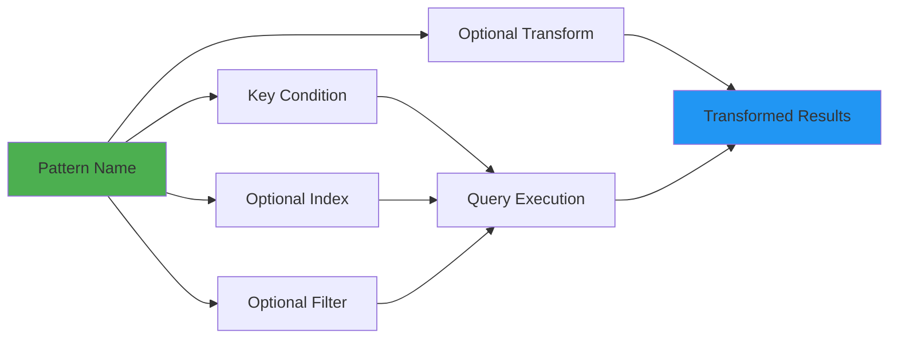

# Access Patterns

This guide covers how to define and use access patterns in ddb-lib. Access patterns provide a type-safe, reusable way to encapsulate common query operations with clear parameter types and optional result transformations.

## Overview

Access patterns solve several problems:

- **Reusability** - Define queries once, use them everywhere
- **Type Safety** - Strongly typed parameters and results
- **Maintainability** - Centralize query logic in one place
- **Documentation** - Self-documenting query patterns
- **Validation** - Automatic validation of multi-attribute keys

## Access Pattern Structure



## Defining Access Patterns

### Basic Pattern

Define a simple access pattern with partition key only:

```typescript
import { TableClient } from '@ddb-lib/client'
import { DynamoDBClient } from '@aws-sdk/client-dynamodb'
import type { AccessPatternDefinitions } from '@ddb-lib/client'

interface User {
  pk: string
  sk: string
  userId: string
  name: string
  email: string
  status: 'ACTIVE' | 'INACTIVE'
}

const accessPatterns: AccessPatternDefinitions<User> = {
  getUserById: {
    keyCondition: (params: { userId: string }) => ({
      pk: `USER#${params.userId}`
    })
  }
}

const client = new TableClient<User>({
  tableName: 'my-table',
  client: new DynamoDBClient({ region: 'us-east-1' }),
  accessPatterns
})

// Execute the pattern
const users = await client.executePattern('getUserById', {
  userId: '123'
})
```

### Pattern with Sort Key

Add sort key conditions for more specific queries:

```typescript
const accessPatterns: AccessPatternDefinitions<User> = {
  getUserOrders: {
    keyCondition: (params: { userId: string }) => ({
      pk: `USER#${params.userId}`,
      sk: { beginsWith: 'ORDER#' }
    })
  },
  
  getUserOrdersAfterDate: {
    keyCondition: (params: { userId: string; afterDate: string }) => ({
      pk: `USER#${params.userId}`,
      sk: { gte: `ORDER#${params.afterDate}` }
    })
  },
  
  getUserOrdersInRange: {
    keyCondition: (params: { userId: string; startDate: string; endDate: string }) => ({
      pk: `USER#${params.userId}`,
      sk: {
        between: [`ORDER#${params.startDate}`, `ORDER#${params.endDate}`]
      }
    })
  }
}

// Execute patterns
const allOrders = await client.executePattern('getUserOrders', {
  userId: '123'
})

const recentOrders = await client.executePattern('getUserOrdersAfterDate', {
  userId: '123',
  afterDate: '2024-01-01'
})

const rangeOrders = await client.executePattern('getUserOrdersInRange', {
  userId: '123',
  startDate: '2024-01-01',
  endDate: '2024-12-31'
})
```

### Pattern with GSI

Query a Global Secondary Index:

```typescript
const accessPatterns: AccessPatternDefinitions<User> = {
  getUsersByEmail: {
    index: 'EmailIndex',
    keyCondition: (params: { email: string }) => ({
      pk: params.email
    })
  },
  
  getActiveUsers: {
    index: 'StatusIndex',
    keyCondition: (params: { status: string }) => ({
      pk: `STATUS#${params.status}`,
      sk: { beginsWith: 'USER#' }
    })
  }
}

// Execute GSI patterns
const usersByEmail = await client.executePattern('getUsersByEmail', {
  email: 'alice@example.com'
})

const activeUsers = await client.executePattern('getActiveUsers', {
  status: 'ACTIVE'
})
```

### Pattern with Filter

Add filter expressions for additional filtering:

```typescript
const accessPatterns: AccessPatternDefinitions<User> = {
  getHighValueOrders: {
    keyCondition: (params: { userId: string }) => ({
      pk: `USER#${params.userId}`,
      sk: { beginsWith: 'ORDER#' }
    }),
    filter: (params: { minAmount: number }) => ({
      total: { gte: params.minAmount },
      status: { eq: 'COMPLETED' }
    })
  }
}

// Execute with filter
const highValueOrders = await client.executePattern('getHighValueOrders', {
  userId: '123',
  minAmount: 100
})
```

**Note:** Filters are applied after the query, so they don't reduce RCU consumption. Consider using GSIs with the filter criteria in the key instead.

### Pattern with Transform

Transform query results into a different shape:

```typescript
interface Order {
  pk: string
  sk: string
  orderId: string
  userId: string
  total: number
  items: any[]
  createdAt: string
}

interface OrderSummary {
  orderId: string
  total: number
  itemCount: number
  createdAt: string
}

const accessPatterns: AccessPatternDefinitions<Order> = {
  getUserOrderSummaries: {
    keyCondition: (params: { userId: string }) => ({
      pk: `USER#${params.userId}`,
      sk: { beginsWith: 'ORDER#' }
    }),
    transform: (orders: Order[]): OrderSummary[] => {
      return orders.map(order => ({
        orderId: order.orderId,
        total: order.total,
        itemCount: order.items.length,
        createdAt: order.createdAt
      }))
    }
  }
}

// Returns OrderSummary[] instead of Order[]
const summaries = await client.executePattern('getUserOrderSummaries', {
  userId: '123'
})

// TypeScript knows this is OrderSummary[]
summaries.forEach(summary => {
  console.log(`Order ${summary.orderId}: $${summary.total} (${summary.itemCount} items)`)
})
```

## Multi-Attribute Keys

Access patterns support multi-attribute composite keys with automatic validation.

### Multi-Attribute Partition Key

```typescript
import { multiTenantKey } from '@ddb-lib/core'

const accessPatterns: AccessPatternDefinitions<any> = {
  getUsersByTenant: {
    index: 'TenantIndex',
    gsiConfig: {
      indexName: 'TenantIndex',
      partitionKey: ['tenantId', 'customerId'],
      sortKey: 'userId'
    },
    keyCondition: (params: { tenantId: string; customerId: string }) => ({
      multiPk: multiTenantKey(params.tenantId, params.customerId)
    })
  }
}

// Execute with multi-attribute key
const users = await client.executePattern('getUsersByTenant', {
  tenantId: 'TENANT-123',
  customerId: 'CUSTOMER-456'
})
```

### Multi-Attribute Sort Key

```typescript
import { locationMultiKey } from '@ddb-lib/core'

const accessPatterns: AccessPatternDefinitions<any> = {
  getUsersByLocation: {
    index: 'LocationIndex',
    gsiConfig: {
      indexName: 'LocationIndex',
      partitionKey: 'tenantId',
      sortKey: ['country', 'state', 'city']
    },
    keyCondition: (params: { tenantId: string; country: string; state?: string }) => ({
      pk: params.tenantId,
      multiSk: params.state
        ? locationMultiKey(params.country, params.state)
        : [params.country]
    })
  }
}

// Query by country only
const usersInUSA = await client.executePattern('getUsersByLocation', {
  tenantId: 'TENANT-123',
  country: 'USA'
})

// Query by country and state
const usersInCA = await client.executePattern('getUsersByLocation', {
  tenantId: 'TENANT-123',
  country: 'USA',
  state: 'CA'
})
```

### Time-Series Pattern

```typescript
import { timeSeriesMultiKey } from '@ddb-lib/core'

const accessPatterns: AccessPatternDefinitions<any> = {
  getEventsByCategory: {
    index: 'EventIndex',
    gsiConfig: {
      indexName: 'EventIndex',
      partitionKey: 'category',
      sortKey: ['timestamp', 'subcategory']
    },
    keyCondition: (params: {
      category: string
      startTime: Date
      endTime: Date
      subcategory?: string
    }) => ({
      pk: params.category,
      multiSk: {
        between: [
          timeSeriesMultiKey(params.category, params.startTime, params.subcategory),
          timeSeriesMultiKey(params.category, params.endTime, params.subcategory)
        ]
      }
    })
  }
}

// Query events in time range
const events = await client.executePattern('getEventsByCategory', {
  category: 'ERROR',
  startTime: new Date('2024-12-01'),
  endTime: new Date('2024-12-31'),
  subcategory: 'DATABASE'
})
```

## Type Safety

Access patterns provide full type safety for parameters and results.

### Parameter Type Checking

```typescript
const accessPatterns: AccessPatternDefinitions<User> = {
  getUserOrders: {
    keyCondition: (params: { userId: string; minDate: string }) => ({
      pk: `USER#${params.userId}`,
      sk: { gte: `ORDER#${params.minDate}` }
    })
  }
}

const client = new TableClient<User>({
  tableName: 'my-table',
  client: new DynamoDBClient({ region: 'us-east-1' }),
  accessPatterns
})

// ✅ Correct: All required parameters
await client.executePattern('getUserOrders', {
  userId: '123',
  minDate: '2024-01-01'
})

// ❌ TypeScript error: Missing minDate
await client.executePattern('getUserOrders', {
  userId: '123'
})

// ❌ TypeScript error: Wrong parameter type
await client.executePattern('getUserOrders', {
  userId: 123,  // Should be string
  minDate: '2024-01-01'
})

// ❌ TypeScript error: Pattern doesn't exist
await client.executePattern('nonExistentPattern', {
  userId: '123'
})
```

### Result Type Inference

```typescript
interface Order {
  orderId: string
  total: number
  status: string
}

interface OrderSummary {
  orderId: string
  total: number
}

const accessPatterns: AccessPatternDefinitions<Order> = {
  // Returns Order[]
  getAllOrders: {
    keyCondition: (params: { userId: string }) => ({
      pk: `USER#${params.userId}`
    })
  },
  
  // Returns OrderSummary[]
  getOrderSummaries: {
    keyCondition: (params: { userId: string }) => ({
      pk: `USER#${params.userId}`
    }),
    transform: (orders: Order[]): OrderSummary[] => {
      return orders.map(o => ({ orderId: o.orderId, total: o.total }))
    }
  }
}

// TypeScript infers: Order[]
const orders = await client.executePattern('getAllOrders', { userId: '123' })
orders[0].status  // ✅ OK

// TypeScript infers: OrderSummary[]
const summaries = await client.executePattern('getOrderSummaries', { userId: '123' })
summaries[0].orderId  // ✅ OK
summaries[0].status   // ❌ TypeScript error: Property doesn't exist
```

## Common Patterns

### User and Related Data

```typescript
const accessPatterns: AccessPatternDefinitions<any> = {
  getUserProfile: {
    keyCondition: (params: { userId: string }) => ({
      pk: `USER#${params.userId}`,
      sk: 'PROFILE'
    })
  },
  
  getUserOrders: {
    keyCondition: (params: { userId: string }) => ({
      pk: `USER#${params.userId}`,
      sk: { beginsWith: 'ORDER#' }
    })
  },
  
  getUserSettings: {
    keyCondition: (params: { userId: string }) => ({
      pk: `USER#${params.userId}`,
      sk: 'SETTINGS'
    })
  }
}
```

### Status-Based Queries

```typescript
const accessPatterns: AccessPatternDefinitions<any> = {
  getPendingOrders: {
    index: 'StatusIndex',
    keyCondition: () => ({
      pk: 'STATUS#PENDING',
      sk: { beginsWith: 'ORDER#' }
    })
  },
  
  getActiveUsers: {
    index: 'StatusIndex',
    keyCondition: () => ({
      pk: 'STATUS#ACTIVE',
      sk: { beginsWith: 'USER#' }
    })
  }
}
```

### Time-Based Queries

```typescript
import { PatternHelpers } from '@ddb-lib/core'

const accessPatterns: AccessPatternDefinitions<any> = {
  getRecentEvents: {
    keyCondition: (params: { sensorId: string; hours: number }) => {
      const now = new Date()
      const startTime = new Date(now.getTime() - params.hours * 60 * 60 * 1000)
      
      return {
        pk: `SENSOR#${params.sensorId}`,
        sk: { gte: PatternHelpers.timeSeriesKey(startTime, 'hour') }
      }
    }
  },
  
  getEventsInRange: {
    keyCondition: (params: { sensorId: string; start: Date; end: Date }) => ({
      pk: `SENSOR#${params.sensorId}`,
      sk: {
        between: [
          PatternHelpers.timeSeriesKey(params.start, 'day'),
          PatternHelpers.timeSeriesKey(params.end, 'day')
        ]
      }
    })
  }
}
```

### Hierarchical Queries

```typescript
import { PatternHelpers } from '@ddb-lib/core'

const accessPatterns: AccessPatternDefinitions<any> = {
  getOrgTeams: {
    keyCondition: (params: { orgId: string }) => ({
      pk: PatternHelpers.entityKey('ORG', params.orgId),
      sk: { beginsWith: 'TEAM#' }
    })
  },
  
  getTeamMembers: {
    keyCondition: (params: { orgId: string; teamId: string }) => ({
      pk: PatternHelpers.compositeKey(['ORG', params.orgId, 'TEAM', params.teamId]),
      sk: { beginsWith: 'MEMBER#' }
    })
  }
}
```

## Best Practices

### 1. Name Patterns Descriptively

```typescript
// ❌ Bad: Vague names
const accessPatterns = {
  pattern1: { ... },
  getData: { ... },
  query: { ... }
}

// ✅ Good: Clear, descriptive names
const accessPatterns = {
  getUserById: { ... },
  getUserOrdersByDate: { ... },
  getActiveUsersByEmail: { ... }
}
```

### 2. Use Type-Safe Parameters

```typescript
// ❌ Bad: Untyped parameters
keyCondition: (params: any) => ({ ... })

// ✅ Good: Strongly typed parameters
keyCondition: (params: { userId: string; startDate: string }) => ({ ... })
```

### 3. Document Complex Patterns

```typescript
const accessPatterns: AccessPatternDefinitions<Order> = {
  /**
   * Get orders for a user within a date range, filtered by status
   * @param userId - User identifier
   * @param startDate - Start date (ISO format)
   * @param endDate - End date (ISO format)
   * @param status - Order status to filter by
   */
  getUserOrdersByDateAndStatus: {
    keyCondition: (params: {
      userId: string
      startDate: string
      endDate: string
    }) => ({
      pk: `USER#${params.userId}`,
      sk: {
        between: [`ORDER#${params.startDate}`, `ORDER#${params.endDate}`]
      }
    }),
    filter: (params: { status: string }) => ({
      status: { eq: params.status }
    })
  }
}
```

### 4. Avoid Filters When Possible

```typescript
// ❌ Bad: Filter after query (wastes RCU)
const accessPatterns = {
  getActiveOrders: {
    keyCondition: (params: { userId: string }) => ({
      pk: `USER#${params.userId}`,
      sk: { beginsWith: 'ORDER#' }
    }),
    filter: () => ({
      status: { eq: 'ACTIVE' }
    })
  }
}

// ✅ Good: Include in key (efficient)
const accessPatterns = {
  getActiveOrders: {
    keyCondition: (params: { userId: string }) => ({
      pk: `USER#${params.userId}`,
      sk: { beginsWith: 'ORDER#ACTIVE#' }
    })
  }
}
```

### 5. Use Transforms for Data Shaping

```typescript
// ✅ Good: Transform at query time
const accessPatterns: AccessPatternDefinitions<Order> = {
  getUserOrderTotals: {
    keyCondition: (params: { userId: string }) => ({
      pk: `USER#${params.userId}`,
      sk: { beginsWith: 'ORDER#' }
    }),
    transform: (orders: Order[]) => {
      return {
        totalOrders: orders.length,
        totalAmount: orders.reduce((sum, o) => sum + o.total, 0),
        averageAmount: orders.reduce((sum, o) => sum + o.total, 0) / orders.length
      }
    }
  }
}
```

### 6. Validate Multi-Attribute Keys

```typescript
// ✅ Good: Provide GSI config for validation
const accessPatterns: AccessPatternDefinitions<any> = {
  getUsersByTenant: {
    index: 'TenantIndex',
    gsiConfig: {
      indexName: 'TenantIndex',
      partitionKey: ['tenantId', 'customerId'],
      sortKey: 'userId'
    },
    keyCondition: (params: { tenantId: string; customerId: string }) => ({
      multiPk: multiTenantKey(params.tenantId, params.customerId)
    })
  }
}
// Library validates key structure matches GSI config
```

## Error Handling

```typescript
try {
  const results = await client.executePattern('getUserOrders', {
    userId: '123'
  })
} catch (error) {
  if (error.message.includes('Access pattern') && error.message.includes('not found')) {
    console.error('Pattern not defined')
  } else if (error.name === 'ValidationException') {
    console.error('Invalid query parameters')
  } else if (error.name === 'ResourceNotFoundException') {
    console.error('Table or index not found')
  } else {
    console.error('Query failed:', error)
  }
}
```

## Monitoring Access Patterns

Track which patterns are used and their performance:

```typescript
const client = new TableClient({
  tableName: 'my-table',
  client: new DynamoDBClient({ region: 'us-east-1' }),
  accessPatterns,
  statsConfig: {
    enabled: true,
    sampleRate: 1.0
  }
})

// Execute patterns
await client.executePattern('getUserOrders', { userId: '123' })
await client.executePattern('getActiveUsers', {})

// Get statistics by pattern
const stats = client.getStats()
console.log('Access pattern usage:', stats.accessPatterns)

// Example output:
// {
//   getUserOrders: { count: 150, avgLatency: 25, totalRCU: 300 },
//   getActiveUsers: { count: 50, avgLatency: 45, totalRCU: 500 }
// }
```

## Next Steps

- Learn about [Monitoring](/guides/monitoring/) to track pattern performance
- Explore [Multi-Attribute Keys](/guides/multi-attribute-keys/) for advanced key patterns
- Review [Best Practices](/best-practices/) for query optimization
- See [Examples](/examples/) for complete access pattern implementations

