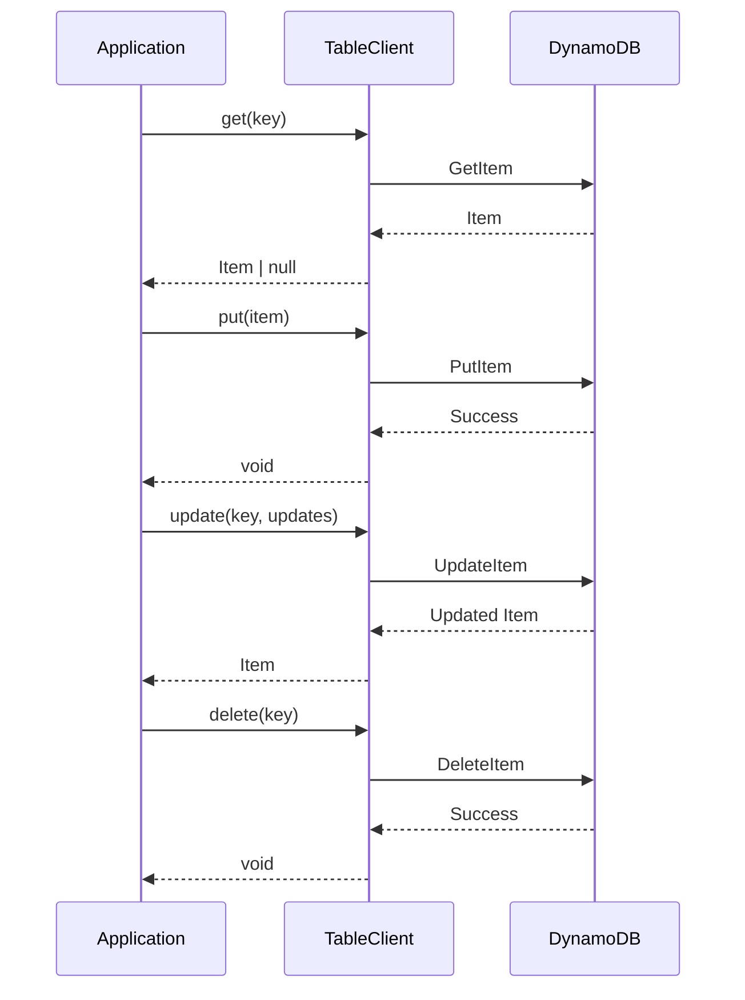

# Core Operations

This guide covers the four fundamental CRUD operations in DynamoDB: Get, Put, Update, and Delete. These operations form the foundation of all DynamoDB interactions.

## Overview

The `TableClient` provides simple, type-safe methods for all core operations:

- **Get** - Retrieve a single item by its key
- **Put** - Create or replace an item
- **Update** - Modify specific attributes of an item
- **Delete** - Remove an item from the table

All operations support:
- Conditional expressions for safe concurrent updates
- Projection expressions to retrieve only needed attributes
- Automatic retry with exponential backoff
- Statistics collection for monitoring

## Operation Flow



## Get Operation

Retrieve a single item by its partition key (and sort key if applicable).

### Basic Get

```typescript
import { TableClient } from '@ddb-lib/client'
import { DynamoDBClient } from '@aws-sdk/client-dynamodb'

const client = new TableClient({
  tableName: 'my-table',
  client: new DynamoDBClient({ region: 'us-east-1' })
})

// Get an item by key
const item = await client.get({
  pk: 'USER#123',
  sk: 'PROFILE'
})

if (item) {
  console.log('Found user:', item)
} else {
  console.log('User not found')
}
```

### Get with Projection

Retrieve only specific attributes to reduce data transfer and costs:

```typescript
// Get only name and email fields
const item = await client.get(
  { pk: 'USER#123', sk: 'PROFILE' },
  {
    projectionExpression: ['name', 'email', 'status']
  }
)

// Item will only contain: { pk, sk, name, email, status }
```

### Consistent Read

By default, DynamoDB uses eventually consistent reads. For strongly consistent reads:

```typescript
const item = await client.get(
  { pk: 'USER#123', sk: 'PROFILE' },
  {
    consistentRead: true  // Ensures latest data
  }
)
```

**When to use consistent reads:**
- ✅ After a write when you need to read the latest value immediately
- ✅ When data consistency is critical (financial transactions, inventory)
- ❌ For most read operations (eventually consistent is faster and cheaper)

### Get with Pattern Helpers

Use pattern helpers to construct keys safely:

```typescript
import { PatternHelpers } from '@ddb-lib/core'

const userId = '123'
const key = {
  pk: PatternHelpers.entityKey('USER', userId),
  sk: 'PROFILE'
}

const user = await client.get(key)
```

## Put Operation

Create a new item or completely replace an existing item.

### Basic Put

```typescript
interface User {
  pk: string
  sk: string
  userId: string
  name: string
  email: string
  status: 'ACTIVE' | 'INACTIVE'
  createdAt: string
}

const client = new TableClient<User>({
  tableName: 'my-table',
  client: new DynamoDBClient({ region: 'us-east-1' })
})

// Create a new user
await client.put({
  pk: 'USER#123',
  sk: 'PROFILE',
  userId: '123',
  name: 'Alice Johnson',
  email: 'alice@example.com',
  status: 'ACTIVE',
  createdAt: new Date().toISOString()
})
```

### Conditional Put (Create If Not Exists)

Prevent overwriting existing items:

```typescript
try {
  await client.put(
    {
      pk: 'USER#123',
      sk: 'PROFILE',
      userId: '123',
      name: 'Alice Johnson',
      email: 'alice@example.com',
      status: 'ACTIVE',
      createdAt: new Date().toISOString()
    },
    {
      // Only create if pk doesn't exist
      condition: {
        pk: { attributeNotExists: true }
      }
    }
  )
  console.log('User created successfully')
} catch (error) {
  if (error.name === 'ConditionalCheckFailedException') {
    console.log('User already exists')
  }
}
```

### Put with Multiple Conditions

Combine multiple conditions for complex logic:

```typescript
await client.put(
  {
    pk: 'ORDER#456',
    sk: 'DETAILS',
    orderId: '456',
    status: 'PENDING',
    total: 99.99,
    updatedAt: new Date().toISOString()
  },
  {
    condition: {
      // Create if doesn't exist OR if status is DRAFT
      or: [
        { pk: { attributeNotExists: true } },
        { status: { eq: 'DRAFT' } }
      ]
    }
  }
)
```

### Put with Return Values

Get the old item back when replacing:

```typescript
const result = await client.put(
  {
    pk: 'CONFIG#app',
    sk: 'SETTINGS',
    theme: 'dark',
    language: 'en'
  },
  {
    returnValues: 'ALL_OLD'  // Returns the previous item
  }
)

// result contains the old item (if it existed)
```

## Update Operation

Modify specific attributes without replacing the entire item.

### Basic Update

```typescript
// Update specific fields
const updated = await client.update(
  { pk: 'USER#123', sk: 'PROFILE' },
  {
    email: 'alice.new@example.com',
    updatedAt: new Date().toISOString()
  }
)

console.log('Updated user:', updated)
```

**Update vs Put:**
- **Update** - Modifies only specified attributes, keeps others unchanged
- **Put** - Replaces the entire item, removes unspecified attributes

### Update with Conditions

Ensure safe concurrent updates:

```typescript
// Update only if current status is PENDING
await client.update(
  { pk: 'ORDER#456', sk: 'DETAILS' },
  {
    status: 'PROCESSING',
    processedAt: new Date().toISOString()
  },
  {
    condition: {
      status: { eq: 'PENDING' }
    }
  }
)
```

### Optimistic Locking with Versions

Prevent lost updates in concurrent scenarios:

```typescript
import { PatternHelpers } from '@ddb-lib/core'

// Read current item
const item = await client.get({ pk: 'ACCOUNT#789', sk: 'BALANCE' })

if (!item) {
  throw new Error('Account not found')
}

// Update with version check
try {
  await client.update(
    { pk: 'ACCOUNT#789', sk: 'BALANCE' },
    {
      balance: item.balance + 100,
      version: PatternHelpers.incrementVersion(item.version)
    },
    {
      // Only update if version hasn't changed
      condition: {
        version: { eq: item.version }
      }
    }
  )
  console.log('Balance updated successfully')
} catch (error) {
  if (error.name === 'ConditionalCheckFailedException') {
    console.log('Version conflict - item was modified by another process')
    // Retry the operation
  }
}
```

### Update Return Values

Control what data is returned:

```typescript
// Return all attributes after update (default)
const updated = await client.update(
  { pk: 'USER#123', sk: 'PROFILE' },
  { lastLogin: new Date().toISOString() },
  { returnValues: 'ALL_NEW' }
)

// Return only updated attributes
const updated = await client.update(
  { pk: 'USER#123', sk: 'PROFILE' },
  { lastLogin: new Date().toISOString() },
  { returnValues: 'UPDATED_NEW' }
)

// Return old values before update
const old = await client.update(
  { pk: 'USER#123', sk: 'PROFILE' },
  { status: 'INACTIVE' },
  { returnValues: 'ALL_OLD' }
)
```

## Delete Operation

Remove an item from the table.

### Basic Delete

```typescript
// Delete an item
await client.delete({
  pk: 'USER#123',
  sk: 'PROFILE'
})

console.log('User deleted')
```

### Conditional Delete

Only delete if certain conditions are met:

```typescript
try {
  await client.delete(
    { pk: 'USER#123', sk: 'PROFILE' },
    {
      // Only delete if status is INACTIVE
      condition: {
        status: { eq: 'INACTIVE' }
      }
    }
  )
  console.log('Inactive user deleted')
} catch (error) {
  if (error.name === 'ConditionalCheckFailedException') {
    console.log('User is not inactive, cannot delete')
  }
}
```

### Delete with Return Values

Get the deleted item back:

```typescript
const deleted = await client.delete(
  { pk: 'USER#123', sk: 'PROFILE' },
  {
    returnValues: 'ALL_OLD'
  }
)

if (deleted) {
  console.log('Deleted user:', deleted)
  // Archive or log the deleted data
}
```

### Safe Delete Pattern

Verify item exists before deleting:

```typescript
// Delete only if item exists
await client.delete(
  { pk: 'USER#123', sk: 'PROFILE' },
  {
    condition: {
      pk: { attributeExists: true }
    }
  }
)
```

## Error Handling

All operations can throw errors that should be handled:

```typescript
import { ConditionalCheckError, ValidationError } from '@ddb-lib/client'

try {
  await client.put(item, { condition: { pk: { attributeNotExists: true } } })
} catch (error) {
  if (error instanceof ConditionalCheckError) {
    console.log('Condition failed:', error.message)
    console.log('Failed condition:', error.condition)
  } else if (error instanceof ValidationError) {
    console.log('Validation failed:', error.message)
  } else if (error.name === 'ProvisionedThroughputExceededException') {
    console.log('Throttled - retry with backoff')
  } else {
    console.error('Unexpected error:', error)
  }
}
```

## Performance Considerations

### Projection Expressions

Always use projection expressions when you don't need all attributes:

```typescript
// ❌ Bad: Retrieves entire item (wastes bandwidth and RCU)
const item = await client.get({ pk: 'USER#123', sk: 'PROFILE' })
const name = item.name

// ✅ Good: Retrieves only needed attribute
const item = await client.get(
  { pk: 'USER#123', sk: 'PROFILE' },
  { projectionExpression: ['name'] }
)
```

### Batch Operations

For multiple items, use batch operations instead of individual operations:

```typescript
// ❌ Bad: Multiple individual operations
for (const key of keys) {
  await client.get(key)  // Slow and expensive
}

// ✅ Good: Single batch operation
const items = await client.batchGet(keys)  // Fast and efficient
```

See the [Batch Operations Guide](/guides/batch-operations/) for details.

### Update vs Put

Use update when modifying a few attributes:

```typescript
// ❌ Bad: Get entire item, modify, then put back
const item = await client.get(key)
item.email = 'new@example.com'
await client.put(item)  // Replaces entire item

// ✅ Good: Update only the changed attribute
await client.update(key, { email: 'new@example.com' })
```

## Common Patterns

### Upsert (Create or Update)

```typescript
// Put without condition = upsert
await client.put({
  pk: 'CONFIG#app',
  sk: 'SETTINGS',
  theme: 'dark',
  updatedAt: new Date().toISOString()
})
// Creates if doesn't exist, replaces if exists
```

### Increment Counter

```typescript
// Atomic counter increment
await client.update(
  { pk: 'STATS#views', sk: 'PAGE#home' },
  {
    count: (item.count || 0) + 1,
    lastViewed: new Date().toISOString()
  }
)
```

### Soft Delete

```typescript
// Mark as deleted instead of removing
await client.update(
  { pk: 'USER#123', sk: 'PROFILE' },
  {
    status: 'DELETED',
    deletedAt: new Date().toISOString()
  }
)
```

### TTL (Time To Live)

```typescript
import { PatternHelpers } from '@ddb-lib/core'

// Item expires in 30 days
const expiresAt = new Date()
expiresAt.setDate(expiresAt.getDate() + 30)

await client.put({
  pk: 'SESSION#abc123',
  sk: 'DATA',
  userId: '123',
  ttl: PatternHelpers.ttlTimestamp(expiresAt)
})
```

## Next Steps

- Learn about [Query and Scan](/guides/query-and-scan/) operations
- Explore [Batch Operations](/guides/batch-operations/) for bulk operations
- Understand [Transactions](/guides/transactions/) for atomic multi-item operations
- Review [Best Practices](/best-practices/) for optimization tips

