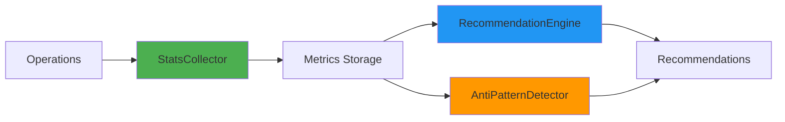

# Monitoring and Statistics

This guide covers how to use ddb-lib's built-in monitoring capabilities to track performance, detect anti-patterns, and optimize your DynamoDB usage. The stats system helps you understand how your application uses DynamoDB and provides actionable recommendations.

## Overview

The monitoring system consists of three components:

- **StatsCollector** - Collects operation metrics (latency, capacity, item counts)
- **RecommendationEngine** - Analyzes patterns and suggests optimizations
- **AntiPatternDetector** - Identifies common DynamoDB anti-patterns



## Enabling Statistics

Enable stats collection when creating the TableClient:

```typescript
import { TableClient } from '@ddb-lib/client'
import { DynamoDBClient } from '@aws-sdk/client-dynamodb'

const client = new TableClient({
  tableName: 'my-table',
  client: new DynamoDBClient({ region: 'us-east-1' }),
  statsConfig: {
    enabled: true,
    sampleRate: 1.0,  // Collect 100% of operations
    thresholds: {
      slowQueryMs: 1000,  // Queries slower than 1s
      highRCU: 100,       // Operations using >100 RCU
      highWCU: 100        // Operations using >100 WCU
    }
  }
})
```

### Configuration Options

| Option | Type | Default | Description |
|--------|------|---------|-------------|
| `enabled` | boolean | required | Enable/disable stats collection |
| `sampleRate` | number | 1.0 | Sample rate (0.0-1.0) for collection |
| `thresholds.slowQueryMs` | number | 1000 | Threshold for slow queries (ms) |
| `thresholds.highRCU` | number | 100 | Threshold for high RCU consumption |
| `thresholds.highWCU` | number | 100 | Threshold for high WCU consumption |

### Sample Rate

Use sampling to reduce overhead in high-traffic applications:

```typescript
statsConfig: {
  enabled: true,
  sampleRate: 0.1  // Collect 10% of operations
}
```

**When to use sampling:**
- ✅ High-traffic applications (>1000 ops/sec)
- ✅ Production environments with tight latency requirements
- ❌ Development and testing (use 1.0 for complete data)
- ❌ Low-traffic applications (<100 ops/sec)

## Collecting Statistics

Statistics are automatically collected for all operations:

```typescript
// Perform operations
await client.get({ pk: 'USER#123', sk: 'PROFILE' })
await client.query({
  keyCondition: {
    pk: 'USER#123',
    sk: { beginsWith: 'ORDER#' }
  }
})
await client.put({
  pk: 'USER#456',
  sk: 'PROFILE',
  name: 'Alice',
  email: 'alice@example.com'
})

// Get aggregated statistics
const stats = client.getStats()
console.log('Operation stats:', stats)
```

## Understanding Statistics

### Operation Statistics

View metrics by operation type:

```typescript
const stats = client.getStats()

// Get operation
console.log('Get operations:', stats.operations.get)
// {
//   count: 150,
//   totalLatencyMs: 3750,
//   avgLatencyMs: 25,
//   totalRCU: 150,
//   totalWCU: 0
// }

// Query operations
console.log('Query operations:', stats.operations.query)
// {
//   count: 50,
//   totalLatencyMs: 2250,
//   avgLatencyMs: 45,
//   totalRCU: 500,
//   totalWCU: 0
// }

// Put operations
console.log('Put operations:', stats.operations.put)
// {
//   count: 100,
//   totalLatencyMs: 2000,
//   avgLatencyMs: 20,
//   totalRCU: 0,
//   totalWCU: 100
// }
```

### Access Pattern Statistics

Track performance by access pattern:

```typescript
const stats = client.getStats()

console.log('Access patterns:', stats.accessPatterns)
// {
//   getUserOrders: {
//     count: 50,
//     avgLatencyMs: 45,
//     avgItemsReturned: 12.5
//   },
//   getUserProfile: {
//     count: 150,
//     avgLatencyMs: 25,
//     avgItemsReturned: 1
//   }
// }
```

## Getting Recommendations

The recommendation engine analyzes your usage patterns and suggests optimizations:

```typescript
// Get recommendations
const recommendations = client.getRecommendations()

for (const rec of recommendations) {
  console.log(`[${rec.severity}] ${rec.message}`)
  console.log(`  Details: ${rec.details}`)
  if (rec.suggestedAction) {
    console.log(`  Action: ${rec.suggestedAction}`)
  }
  if (rec.estimatedImpact) {
    console.log(`  Impact:`, rec.estimatedImpact)
  }
}
```

### Recommendation Types

#### 1. Batch Opportunities

Detects multiple individual operations that could be batched:

```
[info] Batch get opportunity detected
  Details: Detected 15 individual get operations within a 1000ms window.
  Action: Use batchGet() to retrieve multiple items in a single request.
  Impact: Reduce 15 requests to 1 batch request
```

#### 2. Projection Opportunities

Identifies operations fetching full items when only some attributes are needed:

```
[info] Consider using projection expressions for query operations
  Details: Only 30% of query operations use projection expressions.
  Action: Add projectionExpression to query operations to fetch only needed attributes.
  Impact: Reduced data transfer and RCU consumption
```

#### 3. Client-Side Filtering

Detects inefficient queries with low return rates:

```
[warning] Potential client-side filtering detected in getUserOrders
  Details: Query operations have 15% efficiency (50 operations, 42 with low efficiency).
  Action: Add a FilterExpression to your query to filter items on the server side.
  Impact: Up to 85% reduction in RCU consumption
```

#### 4. Sequential Writes

Identifies sequential write operations that could be batched:

```
[info] Sequential write operations detected
  Details: Detected 20 sequential write operations within a 1000ms window.
  Action: Use batchWrite() to combine multiple put and delete operations.
  Impact: Reduce 20 requests to 1 batch request
```

#### 5. Read-Before-Write Pattern

Detects get followed by put on the same key:

```
[info] Read-before-write pattern detected
  Details: Detected 5 instances of get followed by put on key 'USER#123'.
  Action: Use update() instead of get() + put().
  Impact: 50% reduction in operations (eliminate get)
```

#### 6. Slow Operations

Identifies operations exceeding latency thresholds:

```
[warning] 25 slow operations detected
  Details: Found 25 operations exceeding 1000ms threshold (avg: 1500ms).
  Action: Review slow operations for optimization opportunities.
  Impact: Improved response times
```

#### 7. High Capacity Usage

Detects operations consuming excessive capacity:

```
[warning] 10 operations with high RCU consumption
  Details: Found 10 operations exceeding 100 RCU threshold.
  Action: Use projection expressions to reduce data transfer.
  Impact: Lower read capacity costs
```

## Anti-Pattern Detection

The anti-pattern detector identifies common DynamoDB mistakes:

```typescript
import { AntiPatternDetector } from '@ddb-lib/stats'

// Get the stats collector from the client
const statsCollector = client['statsCollector']  // Internal access
const detector = new AntiPatternDetector(statsCollector)

// Detect hot partitions
const hotPartitions = detector.detectHotPartitions()
for (const partition of hotPartitions) {
  console.log(`Hot partition: ${partition.partitionKey}`)
  console.log(`  Access count: ${partition.accessCount}`)
  console.log(`  Percentage: ${(partition.percentageOfTotal * 100).toFixed(1)}%`)
  console.log(`  Recommendation: ${partition.recommendation}`)
}

// Detect inefficient scans
const inefficientScans = detector.detectInefficientScans()
for (const scan of inefficientScans) {
  console.log(`Inefficient scan: ${scan.operation}`)
  console.log(`  Scanned: ${scan.scannedCount}, Returned: ${scan.returnedCount}`)
  console.log(`  Efficiency: ${(scan.efficiency * 100).toFixed(1)}%`)
  console.log(`  Recommendation: ${scan.recommendation}`)
}

// Get all anti-pattern recommendations
const antiPatterns = detector.generateRecommendations()
for (const rec of antiPatterns) {
  console.log(`[${rec.severity}] ${rec.message}`)
}
```

### Hot Partition Detection

Identifies partitions receiving >10% of traffic:

```typescript
const hotPartitions = detector.detectHotPartitions()

// Example output:
// {
//   partitionKey: 'STATUS#ACTIVE',
//   accessCount: 850,
//   percentageOfTotal: 0.85,  // 85% of traffic!
//   recommendation: 'Consider write sharding or better key distribution'
// }
```

### Inefficient Scan Detection

Finds scans with <20% efficiency:

```typescript
const inefficientScans = detector.detectInefficientScans()

// Example output:
// {
//   operation: 'scan on my-table',
//   scannedCount: 10000,
//   returnedCount: 50,
//   efficiency: 0.005,  // 0.5% efficiency!
//   recommendation: 'Consider using a query with an appropriate index'
// }
```

### Unused Index Detection

Identifies indexes not used in 7 days:

```typescript
const unusedIndexes = detector.detectUnusedIndexes()

// Example output:
// {
//   indexName: 'my-table:OldIndex',
//   usageCount: 0,
//   lastUsed: 1701388800000,
//   recommendation: 'Consider removing this index to reduce storage costs'
// }
```

## Monitoring in Production

### Logging Recommendations

Automatically log high-severity recommendations:

```typescript
const recommendations = client.getRecommendations()

for (const rec of recommendations) {
  if (rec.severity === 'error' || rec.severity === 'warning') {
    console.warn(`[DynamoDB] ${rec.severity.toUpperCase()}: ${rec.message}`)
    console.warn(`  Details: ${rec.details}`)
    if (rec.suggestedAction) {
      console.warn(`  Action: ${rec.suggestedAction}`)
    }
  }
}
```

### Periodic Reporting

Generate periodic reports:

```typescript
// Report every 5 minutes
setInterval(() => {
  const stats = client.getStats()
  const recommendations = client.getRecommendations()
  
  console.log('=== DynamoDB Stats Report ===')
  console.log('Operations:', stats.operations)
  console.log('Access Patterns:', stats.accessPatterns)
  console.log('Recommendations:', recommendations.length)
  
  // Log high-priority recommendations
  const highPriority = recommendations.filter(
    r => r.severity === 'error' || r.severity === 'warning'
  )
  
  if (highPriority.length > 0) {
    console.log('High Priority Issues:')
    for (const rec of highPriority) {
      console.log(`  - ${rec.message}`)
    }
  }
}, 5 * 60 * 1000)
```

### Exporting Metrics

Export raw metrics for external monitoring:

```typescript
import { StatsCollector } from '@ddb-lib/stats'

// Access the internal stats collector
const statsCollector = client['statsCollector'] as StatsCollector

// Export raw operations
const operations = statsCollector.export()

// Send to monitoring service
await sendToDatadog(operations)
await sendToCloudWatch(operations)
await sendToPrometheus(operations)
```

### Integration with CloudWatch

Send metrics to CloudWatch:

```typescript
import { CloudWatchClient, PutMetricDataCommand } from '@aws-sdk/client-cloudwatch'

const cloudwatch = new CloudWatchClient({ region: 'us-east-1' })

async function publishMetrics() {
  const stats = client.getStats()
  
  const metricData = []
  
  // Publish operation counts
  for (const [operation, opStats] of Object.entries(stats.operations)) {
    metricData.push({
      MetricName: 'OperationCount',
      Value: opStats.count,
      Unit: 'Count',
      Dimensions: [
        { Name: 'Operation', Value: operation },
        { Name: 'TableName', Value: 'my-table' }
      ]
    })
    
    metricData.push({
      MetricName: 'AverageLatency',
      Value: opStats.avgLatencyMs,
      Unit: 'Milliseconds',
      Dimensions: [
        { Name: 'Operation', Value: operation },
        { Name: 'TableName', Value: 'my-table' }
      ]
    })
  }
  
  await cloudwatch.send(new PutMetricDataCommand({
    Namespace: 'DynamoDB/Application',
    MetricData: metricData
  }))
}

// Publish every minute
setInterval(publishMetrics, 60 * 1000)
```

## Performance Impact

Stats collection has minimal overhead:

| Sample Rate | Overhead | Use Case |
|-------------|----------|----------|
| 1.0 (100%) | <1ms per operation | Development, testing |
| 0.5 (50%) | <0.5ms per operation | Staging |
| 0.1 (10%) | <0.1ms per operation | Production (high traffic) |
| 0.01 (1%) | <0.01ms per operation | Production (very high traffic) |

### Disabling in Production

Disable stats for maximum performance:

```typescript
const client = new TableClient({
  tableName: 'my-table',
  client: new DynamoDBClient({ region: 'us-east-1' }),
  statsConfig: {
    enabled: false  // No overhead
  }
})
```

## Best Practices

### 1. Start with Full Sampling

```typescript
// Development: Full sampling
statsConfig: {
  enabled: true,
  sampleRate: 1.0
}
```

### 2. Reduce Sampling in Production

```typescript
// Production: 10% sampling
statsConfig: {
  enabled: true,
  sampleRate: 0.1
}
```

### 3. Set Appropriate Thresholds

```typescript
statsConfig: {
  enabled: true,
  sampleRate: 1.0,
  thresholds: {
    slowQueryMs: 500,   // Stricter for low-latency apps
    highRCU: 50,        // Lower for cost-sensitive apps
    highWCU: 50
  }
}
```

### 4. Act on Recommendations

```typescript
const recommendations = client.getRecommendations()

// Prioritize by severity
const errors = recommendations.filter(r => r.severity === 'error')
const warnings = recommendations.filter(r => r.severity === 'warning')
const info = recommendations.filter(r => r.severity === 'info')

// Address errors first
for (const rec of errors) {
  console.error('CRITICAL:', rec.message)
  // Take immediate action
}
```

### 5. Monitor Trends

```typescript
// Track metrics over time
const history: any[] = []

setInterval(() => {
  const stats = client.getStats()
  history.push({
    timestamp: Date.now(),
    stats
  })
  
  // Keep last 24 hours
  const oneDayAgo = Date.now() - 24 * 60 * 60 * 1000
  history = history.filter(h => h.timestamp > oneDayAgo)
  
  // Analyze trends
  analyzeTrends(history)
}, 60 * 1000)
```

### 6. Reset Stats Periodically

```typescript
// Reset stats every hour to prevent memory growth
setInterval(() => {
  const statsCollector = client['statsCollector'] as StatsCollector
  statsCollector.reset()
}, 60 * 60 * 1000)
```

## Example: Complete Monitoring Setup

```typescript
import { TableClient } from '@ddb-lib/client'
import { DynamoDBClient } from '@aws-sdk/client-dynamodb'
import { AntiPatternDetector } from '@ddb-lib/stats'

// Create client with monitoring
const client = new TableClient({
  tableName: 'my-table',
  client: new DynamoDBClient({ region: 'us-east-1' }),
  statsConfig: {
    enabled: true,
    sampleRate: process.env.NODE_ENV === 'production' ? 0.1 : 1.0,
    thresholds: {
      slowQueryMs: 1000,
      highRCU: 100,
      highWCU: 100
    }
  }
})

// Periodic monitoring
setInterval(() => {
  // Get statistics
  const stats = client.getStats()
  console.log('=== DynamoDB Monitoring Report ===')
  console.log('Total operations:', Object.values(stats.operations)
    .reduce((sum, op) => sum + op.count, 0))
  
  // Get recommendations
  const recommendations = client.getRecommendations()
  const highPriority = recommendations.filter(
    r => r.severity === 'error' || r.severity === 'warning'
  )
  
  if (highPriority.length > 0) {
    console.log('\nHigh Priority Issues:')
    for (const rec of highPriority) {
      console.log(`[${rec.severity}] ${rec.message}`)
      console.log(`  ${rec.suggestedAction}`)
    }
  }
  
  // Detect anti-patterns
  const statsCollector = client['statsCollector']
  if (statsCollector) {
    const detector = new AntiPatternDetector(statsCollector)
    
    const hotPartitions = detector.detectHotPartitions()
    if (hotPartitions.length > 0) {
      console.log('\nHot Partitions Detected:')
      for (const partition of hotPartitions) {
        console.log(`  ${partition.partitionKey}: ${(partition.percentageOfTotal * 100).toFixed(1)}%`)
      }
    }
    
    const inefficientScans = detector.detectInefficientScans()
    if (inefficientScans.length > 0) {
      console.log('\nInefficient Scans Detected:')
      for (const scan of inefficientScans) {
        console.log(`  ${scan.operation}: ${(scan.efficiency * 100).toFixed(1)}% efficiency`)
      }
    }
  }
}, 5 * 60 * 1000)  // Every 5 minutes

// Export function
export { client }
```

## Next Steps

- Learn about [Multi-Attribute Keys](/guides/multi-attribute-keys/) for advanced patterns
- Review [Best Practices](/best-practices/) for optimization tips
- Avoid [Anti-Patterns](/anti-patterns/) that hurt performance
- See [Examples](/examples/) for complete monitoring setups

