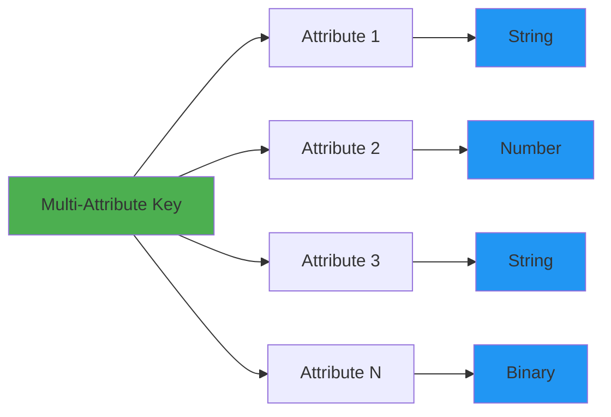

# Multi-Attribute Keys

This guide covers multi-attribute composite keys in DynamoDB, a powerful feature that allows you to create keys from multiple attributes while preserving their native data types. This is an alternative to string concatenation that provides better type safety and more flexible querying.

## Overview

Traditional DynamoDB keys use string concatenation:

```typescript
// Traditional approach: String concatenation
pk: 'TENANT#123#CUSTOMER#456'
sk: 'USA#CA#San Francisco'
```

Multi-attribute keys preserve native types:

```typescript
// Multi-attribute approach: Native types
pk: ['TENANT-123', 'CUSTOMER-456']  // Array of strings
sk: ['USA', 'CA', 'San Francisco']  // Hierarchical structure
```

**Benefits:**
- ✅ Preserve native data types (strings, numbers, binary)
- ✅ Type-safe queries with TypeScript
- ✅ More flexible range queries
- ✅ Better readability and maintainability
- ✅ Automatic validation

## Key Structure



## Creating Multi-Attribute Keys

### Basic Multi-Attribute Key

```typescript
import { multiAttributeKey } from '@ddb-lib/core'

// Create a multi-attribute key
const key = multiAttributeKey('TENANT-123', 'CUSTOMER-456', 'DEPT-A')
// Returns: ['TENANT-123', 'CUSTOMER-456', 'DEPT-A']
```

### Multi-Tenant Keys

Perfect for SaaS applications with tenant isolation:

```typescript
import { multiTenantKey } from '@ddb-lib/core'

// Two-level tenant key
const key = multiTenantKey('TENANT-123', 'CUSTOMER-456')
// Returns: ['TENANT-123', 'CUSTOMER-456']

// Three-level tenant key with department
const key = multiTenantKey('TENANT-123', 'CUSTOMER-456', 'DEPT-A')
// Returns: ['TENANT-123', 'CUSTOMER-456', 'DEPT-A']
```

### Hierarchical Keys

For nested data structures:

```typescript
import { hierarchicalMultiKey } from '@ddb-lib/core'

// Full hierarchy
const key = hierarchicalMultiKey('USA', 'CA', 'San Francisco', 'Downtown')
// Returns: ['USA', 'CA', 'San Francisco', 'Downtown']

// Partial hierarchy
const key = hierarchicalMultiKey('USA', 'CA')
// Returns: ['USA', 'CA']

// Single level
const key = hierarchicalMultiKey('USA')
// Returns: ['USA']
```

### Time-Series Keys

For temporal data with categories:

```typescript
import { timeSeriesMultiKey } from '@ddb-lib/core'

// Basic time-series key
const key = timeSeriesMultiKey('ERROR', new Date('2024-12-02'))
// Returns: ['ERROR', 1733097600000]

// With subcategory
const key = timeSeriesMultiKey('ERROR', 1733097600000, 'DATABASE')
// Returns: ['ERROR', 1733097600000, 'DATABASE']

// For range queries
const startKey = timeSeriesMultiKey('ERROR', new Date('2024-12-01'))
const endKey = timeSeriesMultiKey('ERROR', new Date('2024-12-31'))
```

### Location Keys

For geographic data:

```typescript
import { locationMultiKey } from '@ddb-lib/core'

// Full location
const key = locationMultiKey('USA', 'CA', 'San Francisco', 'SOMA')
// Returns: ['USA', 'CA', 'San Francisco', 'SOMA']

// Partial location (country and state)
const key = locationMultiKey('USA', 'CA')
// Returns: ['USA', 'CA']

// Country only
const key = locationMultiKey('USA')
// Returns: ['USA']
```

### Product Category Keys

For e-commerce and catalogs:

```typescript
import { productCategoryMultiKey } from '@ddb-lib/core'

// Full categorization
const key = productCategoryMultiKey('Electronics', 'Laptops', 'Apple', 'MacBook Pro')
// Returns: ['Electronics', 'Laptops', 'Apple', 'MacBook Pro']

// Category and subcategory
const key = productCategoryMultiKey('Electronics', 'Laptops')
// Returns: ['Electronics', 'Laptops']
```

### Status and Priority Keys

For task management and workflows:

```typescript
import { statusPriorityMultiKey } from '@ddb-lib/core'

// Status and priority
const key = statusPriorityMultiKey('PENDING', 1)
// Returns: ['PENDING', 1]

// With assignee
const key = statusPriorityMultiKey('ACTIVE', 2, 'USER-123')
// Returns: ['ACTIVE', 2, 'USER-123']
```

### Version Keys

For versioned data:

```typescript
import { versionMultiKey } from '@ddb-lib/core'

// Semantic version
const key = versionMultiKey(2, 1, 5)
// Returns: [2, 1, 5]

// With build number
const key = versionMultiKey(2, 1, 5, 'beta-3')
// Returns: [2, 1, 5, 'beta-3']

// Major version only
const key = versionMultiKey(2)
// Returns: [2]
```

## Querying with Multi-Attribute Keys

### Partition Key Queries

Query by multi-attribute partition key:

```typescript
import { TableClient } from '@ddb-lib/client'
import { multiTenantKey } from '@ddb-lib/core'

const client = new TableClient({
  tableName: 'my-table',
  client: new DynamoDBClient({ region: 'us-east-1' })
})

// Query with multi-attribute partition key
const result = await client.query({
  keyCondition: {
    multiPk: multiTenantKey('TENANT-123', 'CUSTOMER-456')
  }
})
```

### Sort Key Queries

Query with multi-attribute sort key conditions:

```typescript
import { locationMultiKey } from '@ddb-lib/core'

// Exact match
const result = await client.query({
  keyCondition: {
    pk: 'TENANT-123',
    multiSk: locationMultiKey('USA', 'CA', 'San Francisco')
  }
})

// Prefix match (all locations in USA)
const result = await client.query({
  keyCondition: {
    pk: 'TENANT-123',
    multiSk: ['USA']  // Matches all USA locations
  }
})

// Prefix match (all locations in California)
const result = await client.query({
  keyCondition: {
    pk: 'TENANT-123',
    multiSk: locationMultiKey('USA', 'CA')  // Matches all CA locations
  }
})
```

### Range Queries

Use comparison operators with multi-attribute keys:

```typescript
import { timeSeriesMultiKey } from '@ddb-lib/core'

// Greater than or equal
const result = await client.query({
  keyCondition: {
    pk: 'SENSOR-001',
    multiSk: {
      gte: timeSeriesMultiKey('ERROR', new Date('2024-12-01'))
    }
  }
})

// Between (time range)
const result = await client.query({
  keyCondition: {
    pk: 'SENSOR-001',
    multiSk: {
      between: [
        timeSeriesMultiKey('ERROR', new Date('2024-12-01')),
        timeSeriesMultiKey('ERROR', new Date('2024-12-31'))
      ]
    }
  }
})

// Less than
const result = await client.query({
  keyCondition: {
    pk: 'SENSOR-001',
    multiSk: {
      lt: timeSeriesMultiKey('ERROR', new Date('2024-12-31'))
    }
  }
})
```

## GSI Configuration

Configure GSIs to use multi-attribute keys:

### Defining GSI Config

```typescript
import type { GSIConfig } from '@ddb-lib/core'

const gsiConfig: GSIConfig = {
  indexName: 'TenantIndex',
  partitionKey: ['tenantId', 'customerId'],  // Multi-attribute PK
  sortKey: 'userId'  // Single-attribute SK
}

// Or with multi-attribute sort key
const gsiConfig: GSIConfig = {
  indexName: 'LocationIndex',
  partitionKey: 'tenantId',  // Single-attribute PK
  sortKey: ['country', 'state', 'city']  // Multi-attribute SK
}
```

### Using with Access Patterns

```typescript
import { multiTenantKey } from '@ddb-lib/core'
import type { AccessPatternDefinitions } from '@ddb-lib/client'

const accessPatterns: AccessPatternDefinitions<any> = {
  getUsersByTenant: {
    index: 'TenantIndex',
    gsiConfig: {
      indexName: 'TenantIndex',
      partitionKey: ['tenantId', 'customerId'],
      sortKey: 'userId'
    },
    keyCondition: (params: { tenantId: string; customerId: string }) => ({
      multiPk: multiTenantKey(params.tenantId, params.customerId)
    })
  }
}

const client = new TableClient({
  tableName: 'my-table',
  client: new DynamoDBClient({ region: 'us-east-1' }),
  accessPatterns
})

// Execute pattern with automatic validation
const users = await client.executePattern('getUsersByTenant', {
  tenantId: 'TENANT-123',
  customerId: 'CUSTOMER-456'
})
```

## Validation

The library automatically validates multi-attribute keys against GSI configuration:

### Type Validation

```typescript
const gsiConfig: GSIConfig = {
  indexName: 'TenantIndex',
  partitionKey: ['tenantId', 'customerId'],  // Expects 2 strings
  sortKey: 'userId'
}

// ✅ Valid: Correct number and types
const key = multiTenantKey('TENANT-123', 'CUSTOMER-456')

// ❌ Error: Wrong number of attributes
const key = multiTenantKey('TENANT-123')  // Missing customerId

// ❌ Error: Wrong type
const key = multiTenantKey(123, 'CUSTOMER-456')  // tenantId should be string
```

### Order Validation

Sort keys must be in the correct order:

```typescript
const gsiConfig: GSIConfig = {
  indexName: 'LocationIndex',
  partitionKey: 'tenantId',
  sortKey: ['country', 'state', 'city']  // Order matters!
}

// ✅ Valid: Correct order
const key = locationMultiKey('USA', 'CA', 'San Francisco')

// ✅ Valid: Partial key (prefix)
const key = locationMultiKey('USA', 'CA')

// ❌ Error: Wrong order
const key = ['CA', 'USA', 'San Francisco']  // state before country
```

## Common Patterns

### Multi-Tenant SaaS

```typescript
import { multiTenantKey } from '@ddb-lib/core'

// Store user data with tenant isolation
await client.put({
  pk: multiTenantKey('TENANT-123', 'CUSTOMER-456'),
  sk: 'USER#alice',
  userId: 'alice',
  name: 'Alice Johnson',
  email: 'alice@example.com'
})

// Query all users for a tenant/customer
const result = await client.query({
  keyCondition: {
    multiPk: multiTenantKey('TENANT-123', 'CUSTOMER-456'),
    sk: { beginsWith: 'USER#' }
  }
})
```

### Geographic Hierarchy

```typescript
import { locationMultiKey } from '@ddb-lib/core'

// Store location-based data
await client.put({
  pk: 'STORE',
  sk: locationMultiKey('USA', 'CA', 'San Francisco', 'Downtown'),
  storeId: 'store-001',
  name: 'Downtown Store',
  address: '123 Main St'
})

// Query all stores in California
const result = await client.query({
  keyCondition: {
    pk: 'STORE',
    multiSk: locationMultiKey('USA', 'CA')  // Prefix match
  }
})

// Query all stores in San Francisco
const result = await client.query({
  keyCondition: {
    pk: 'STORE',
    multiSk: locationMultiKey('USA', 'CA', 'San Francisco')
  }
})
```

### Time-Series with Categories

```typescript
import { timeSeriesMultiKey } from '@ddb-lib/core'

// Store events with category and timestamp
await client.put({
  pk: 'SENSOR-001',
  sk: timeSeriesMultiKey('ERROR', new Date(), 'DATABASE'),
  message: 'Connection timeout',
  severity: 'HIGH'
})

// Query errors in time range
const result = await client.query({
  keyCondition: {
    pk: 'SENSOR-001',
    multiSk: {
      between: [
        timeSeriesMultiKey('ERROR', new Date('2024-12-01')),
        timeSeriesMultiKey('ERROR', new Date('2024-12-31'))
      ]
    }
  }
})

// Query specific error subcategory
const result = await client.query({
  keyCondition: {
    pk: 'SENSOR-001',
    multiSk: timeSeriesMultiKey('ERROR', new Date('2024-12-01'), 'DATABASE')
  }
})
```

### Product Catalog

```typescript
import { productCategoryMultiKey } from '@ddb-lib/core'

// Store products with hierarchical categories
await client.put({
  pk: 'PRODUCT',
  sk: productCategoryMultiKey('Electronics', 'Laptops', 'Apple', 'MacBook Pro'),
  productId: 'prod-001',
  name: 'MacBook Pro 16"',
  price: 2499
})

// Query all laptops
const result = await client.query({
  keyCondition: {
    pk: 'PRODUCT',
    multiSk: productCategoryMultiKey('Electronics', 'Laptops')
  }
})

// Query all Apple products
const result = await client.query({
  keyCondition: {
    pk: 'PRODUCT',
    multiSk: productCategoryMultiKey('Electronics', 'Laptops', 'Apple')
  }
})
```

### Task Management

```typescript
import { statusPriorityMultiKey } from '@ddb-lib/core'

// Store tasks with status and priority
await client.put({
  pk: 'PROJECT-123',
  sk: statusPriorityMultiKey('PENDING', 1, 'USER-alice'),
  taskId: 'task-001',
  title: 'Fix critical bug',
  dueDate: '2024-12-15'
})

// Query high-priority pending tasks
const result = await client.query({
  keyCondition: {
    pk: 'PROJECT-123',
    multiSk: {
      beginsWith: statusPriorityMultiKey('PENDING', 1)
    }
  }
})

// Query all tasks assigned to a user
const result = await client.query({
  keyCondition: {
    pk: 'PROJECT-123',
    multiSk: statusPriorityMultiKey('ACTIVE', 2, 'USER-alice')
  }
})
```

## Migration from String Concatenation

### Before: String Concatenation

```typescript
// Old approach
await client.put({
  pk: 'TENANT#123#CUSTOMER#456',
  sk: 'USA#CA#San Francisco',
  ...data
})

// Query requires exact string match
const result = await client.query({
  keyCondition: {
    pk: 'TENANT#123#CUSTOMER#456',
    sk: { beginsWith: 'USA#CA' }
  }
})
```

### After: Multi-Attribute Keys

```typescript
import { multiTenantKey, locationMultiKey } from '@ddb-lib/core'

// New approach
await client.put({
  pk: multiTenantKey('TENANT-123', 'CUSTOMER-456'),
  sk: locationMultiKey('USA', 'CA', 'San Francisco'),
  ...data
})

// Query with type-safe keys
const result = await client.query({
  keyCondition: {
    multiPk: multiTenantKey('TENANT-123', 'CUSTOMER-456'),
    multiSk: locationMultiKey('USA', 'CA')  // Prefix match
  }
})
```

### Migration Strategy

1. **Add GSI with multi-attribute keys**
2. **Write to both old and new keys**
3. **Migrate existing data**
4. **Switch reads to new keys**
5. **Remove old keys**

```typescript
// Step 1: Write to both formats
await client.put({
  // Old format (for backward compatibility)
  pk: 'TENANT#123#CUSTOMER#456',
  sk: 'USA#CA#San Francisco',
  
  // New format (GSI)
  gsi1pk: multiTenantKey('TENANT-123', 'CUSTOMER-456'),
  gsi1sk: locationMultiKey('USA', 'CA', 'San Francisco'),
  
  ...data
})

// Step 2: Gradually migrate reads to GSI
const result = await client.query({
  keyCondition: {
    multiPk: multiTenantKey('TENANT-123', 'CUSTOMER-456')
  },
  index: 'GSI1'
})

// Step 3: After migration, remove old keys
```

## Best Practices

### 1. Use Helper Functions

```typescript
// ❌ Bad: Manual array construction
const key = ['TENANT-123', 'CUSTOMER-456']

// ✅ Good: Use helper functions
const key = multiTenantKey('TENANT-123', 'CUSTOMER-456')
```

### 2. Provide GSI Config for Validation

```typescript
// ✅ Good: Include GSI config for automatic validation
const accessPatterns: AccessPatternDefinitions<any> = {
  getUsersByTenant: {
    index: 'TenantIndex',
    gsiConfig: {
      indexName: 'TenantIndex',
      partitionKey: ['tenantId', 'customerId'],
      sortKey: 'userId'
    },
    keyCondition: (params) => ({
      multiPk: multiTenantKey(params.tenantId, params.customerId)
    })
  }
}
```

### 3. Use Prefix Queries

```typescript
// ✅ Good: Leverage prefix matching
const result = await client.query({
  keyCondition: {
    pk: 'STORE',
    multiSk: locationMultiKey('USA', 'CA')  // Matches all CA locations
  }
})
```

### 4. Preserve Type Information

```typescript
// ✅ Good: Use numbers for numeric data
const key = versionMultiKey(2, 1, 5)  // [2, 1, 5]

// ❌ Bad: Convert to strings
const key = ['2', '1', '5']  // Loses numeric ordering
```

### 5. Document Key Structure

```typescript
/**
 * Multi-tenant partition key structure:
 * - tenantId: Tenant identifier (string)
 * - customerId: Customer identifier (string)
 * - departmentId: Optional department identifier (string)
 */
const key = multiTenantKey(tenantId, customerId, departmentId)
```

## Next Steps

- Review [Access Patterns](/guides/access-patterns/) for using multi-attribute keys in patterns
- Learn about [Query and Scan](/guides/query-and-scan/) for querying techniques
- See [Examples](/examples/) for complete multi-attribute key implementations
- Check [Best Practices](/best-practices/) for optimization tips

