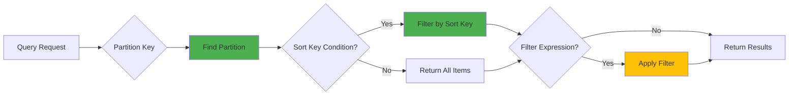

# Query and Scan Operations

This guide covers how to retrieve multiple items from DynamoDB using Query and Scan operations. Understanding when and how to use each operation is critical for building performant applications.

## Overview

DynamoDB provides two operations for retrieving multiple items:

- **Query** - Efficiently retrieve items with a specific partition key
- **Scan** - Read every item in the table (expensive, avoid when possible)

**Key Difference:**
- Query examines only items in a single partition → Fast, cheap
- Scan examines every item in the table → Slow, expensive

## Query Operation

Query is the most efficient way to retrieve multiple items from DynamoDB.

### Query Flow



### Basic Query

Query requires a partition key and optionally a sort key condition:

```typescript
import { TableClient } from '@ddb-lib/client'
import { DynamoDBClient } from '@aws-sdk/client-dynamodb'

const client = new TableClient({
  tableName: 'my-table',
  client: new DynamoDBClient({ region: 'us-east-1' })
})

// Query all items with a specific partition key
const result = await client.query({
  keyCondition: {
    pk: 'USER#123'
  }
})

console.log(`Found ${result.count} items`)
console.log('Items:', result.items)
```

### Sort Key Conditions

Query supports various sort key conditions:

#### Equality

```typescript
// Exact match on sort key
const result = await client.query({
  keyCondition: {
    pk: 'USER#123',
    sk: { eq: 'PROFILE' }
  }
})
```

#### Comparison Operators

```typescript
// Greater than
const result = await client.query({
  keyCondition: {
    pk: 'USER#123',
    sk: { gt: 'ORDER#2024-01-01' }
  }
})

// Greater than or equal
const result = await client.query({
  keyCondition: {
    pk: 'USER#123',
    sk: { gte: 'ORDER#2024-01-01' }
  }
})

// Less than
const result = await client.query({
  keyCondition: {
    pk: 'USER#123',
    sk: { lt: 'ORDER#2024-12-31' }
  }
})

// Less than or equal
const result = await client.query({
  keyCondition: {
    pk: 'USER#123',
    sk: { lte: 'ORDER#2024-12-31' }
  }
})
```

#### Between

```typescript
// Range query
const result = await client.query({
  keyCondition: {
    pk: 'USER#123',
    sk: {
      between: ['ORDER#2024-01-01', 'ORDER#2024-12-31']
    }
  }
})
```

#### Begins With (Prefix Match)

```typescript
// All orders for a user
const result = await client.query({
  keyCondition: {
    pk: 'USER#123',
    sk: { beginsWith: 'ORDER#' }
  }
})

// Orders from a specific month
const result = await client.query({
  keyCondition: {
    pk: 'USER#123',
    sk: { beginsWith: 'ORDER#2024-12' }
  }
})
```

### Filter Expressions

Filter expressions are applied **after** the query retrieves items (they don't reduce RCU):

```typescript
// Query with filter
const result = await client.query({
  keyCondition: {
    pk: 'USER#123',
    sk: { beginsWith: 'ORDER#' }
  },
  filter: {
    status: { eq: 'COMPLETED' },
    total: { gte: 100 }
  }
})
```

**Important:** Filters don't reduce capacity consumption - you pay for all items examined, not just returned.

```typescript
// ❌ Inefficient: Scans 1000 items, returns 10
const result = await client.query({
  keyCondition: { pk: 'USER#123' },
  filter: { status: { eq: 'ACTIVE' } }  // Applied after reading all items
})
// Consumes RCU for 1000 items, returns 10

// ✅ Efficient: Use GSI with status in the key
const result = await client.query({
  keyCondition: {
    pk: 'USER#123',
    sk: { beginsWith: 'STATUS#ACTIVE' }
  },
  index: 'StatusIndex'
})
// Consumes RCU for 10 items only
```

### Querying Global Secondary Indexes (GSI)

Query a GSI by specifying the index name:

```typescript
// Query GSI by email
const result = await client.query({
  keyCondition: {
    pk: 'alice@example.com'  // GSI partition key
  },
  index: 'EmailIndex'
})

// Query GSI with sort key
const result = await client.query({
  keyCondition: {
    pk: 'STATUS#ACTIVE',
    sk: { beginsWith: 'USER#' }
  },
  index: 'StatusIndex'
})
```

### Projection Expressions

Retrieve only specific attributes:

```typescript
// Get only name and email
const result = await client.query({
  keyCondition: {
    pk: 'USER#123',
    sk: { beginsWith: 'ORDER#' }
  },
  projectionExpression: ['orderId', 'total', 'status', 'createdAt']
})

// Reduces data transfer and RCU consumption
```

### Pagination

DynamoDB returns up to 1MB of data per query. Use pagination for larger result sets:

```typescript
let lastKey: any = undefined
const allItems: any[] = []

do {
  const result = await client.query({
    keyCondition: {
      pk: 'USER#123',
      sk: { beginsWith: 'ORDER#' }
    },
    limit: 100,  // Optional: limit items per page
    exclusiveStartKey: lastKey
  })

  allItems.push(...result.items)
  lastKey = result.lastEvaluatedKey

  console.log(`Retrieved ${result.count} items, total: ${allItems.length}`)
} while (lastKey)

console.log(`Total items: ${allItems.length}`)
```

### Paginated Iteration

Use async iteration for cleaner pagination:

```typescript
// Process items one at a time
for await (const item of client.queryPaginated({
  keyCondition: {
    pk: 'USER#123',
    sk: { beginsWith: 'ORDER#' }
  }
})) {
  console.log('Processing order:', item.orderId)
  // Process each item without loading all into memory
}
```

### Sort Order

Control the sort order of results:

```typescript
// Ascending order (default)
const result = await client.query({
  keyCondition: {
    pk: 'USER#123',
    sk: { beginsWith: 'ORDER#' }
  },
  scanIndexForward: true  // A-Z, 0-9, oldest first
})

// Descending order
const result = await client.query({
  keyCondition: {
    pk: 'USER#123',
    sk: { beginsWith: 'ORDER#' }
  },
  scanIndexForward: false  // Z-A, 9-0, newest first
})
```

### Consistent Reads

Query supports strongly consistent reads (only on base table, not GSI):

```typescript
const result = await client.query({
  keyCondition: {
    pk: 'USER#123'
  },
  consistentRead: true  // Latest data, higher cost
})
```

**Note:** GSI queries are always eventually consistent.

### Limit Results

Limit the number of items examined (not returned):

```typescript
// Examine at most 50 items
const result = await client.query({
  keyCondition: {
    pk: 'USER#123',
    sk: { beginsWith: 'ORDER#' }
  },
  limit: 50
})

// If filter is applied, may return fewer than 50 items
```

## Scan Operation

Scan reads every item in the table. **Use sparingly** - scans are expensive and slow.

### When to Use Scan

✅ **Acceptable use cases:**
- One-time data migrations
- Analytics on small tables (<1000 items)
- Admin operations during low-traffic periods
- Exporting all data

❌ **Avoid for:**
- Regular application queries
- User-facing operations
- Large tables
- Frequent operations

### Basic Scan

```typescript
// ⚠️ Warning: Scans entire table
const result = await client.scan()

console.log(`Scanned ${result.scannedCount} items`)
console.log(`Returned ${result.count} items`)
```

The library automatically warns when you use scan:

```
⚠️  DynamoDB Scan operation detected. Scans read every item in the table and are expensive.
Consider using query with an appropriate index for better performance.
```

### Scan with Filter

```typescript
// ⚠️ Still scans entire table, filter applied after
const result = await client.scan({
  filter: {
    status: { eq: 'ACTIVE' },
    createdAt: { gte: '2024-01-01' }
  }
})

// Consumes RCU for ALL items, returns only matching items
```

### Scan Pagination

```typescript
let lastKey: any = undefined
const allItems: any[] = []

do {
  const result = await client.scan({
    limit: 100,
    exclusiveStartKey: lastKey
  })

  allItems.push(...result.items)
  lastKey = result.lastEvaluatedKey
} while (lastKey)
```

### Paginated Scan Iteration

```typescript
// Process all items without loading into memory
for await (const item of client.scanPaginated({
  filter: { status: { eq: 'ACTIVE' } }
})) {
  console.log('Processing item:', item)
}
```

### Parallel Scan

For large tables, use parallel scan to speed up processing:

```typescript
// Divide table into 4 segments and scan in parallel
const segments = 4
const promises = []

for (let segment = 0; segment < segments; segment++) {
  promises.push(
    client.scan({
      segment,
      totalSegments: segments
    })
  )
}

const results = await Promise.all(promises)
const allItems = results.flatMap(r => r.items)

console.log(`Total items: ${allItems.length}`)
```

### Scan with Projection

Reduce data transfer by projecting only needed attributes:

```typescript
const result = await client.scan({
  projectionExpression: ['pk', 'sk', 'status', 'createdAt']
})
```

## Query vs Scan Comparison

| Feature | Query | Scan |
|---------|-------|------|
| **Performance** | Fast (O(log n)) | Slow (O(n)) |
| **Cost** | Low (only partition) | High (entire table) |
| **RCU Usage** | Items in partition | All items in table |
| **Requires** | Partition key | Nothing |
| **Best For** | Known access patterns | Data exports, migrations |
| **Scalability** | Excellent | Poor |
| **Latency** | Predictable | Increases with table size |

### Example Comparison

```typescript
// Table with 1 million items
// User has 100 orders

// ✅ Query: Examines 100 items
const orders = await client.query({
  keyCondition: {
    pk: 'USER#123',
    sk: { beginsWith: 'ORDER#' }
  }
})
// Cost: ~0.5 RCU (assuming 4KB items)
// Time: ~10ms

// ❌ Scan: Examines 1,000,000 items
const orders = await client.scan({
  filter: {
    userId: { eq: '123' },
    type: { eq: 'ORDER' }
  }
})
// Cost: ~500,000 RCU
// Time: ~30 seconds
// Returns same 100 items!
```

## Common Query Patterns

### Time-Range Queries

```typescript
import { PatternHelpers } from '@ddb-lib/core'

// Query events in a time range
const startDate = new Date('2024-12-01')
const endDate = new Date('2024-12-31')

const result = await client.query({
  keyCondition: {
    pk: 'SENSOR#001',
    sk: {
      between: [
        PatternHelpers.timeSeriesKey(startDate, 'day'),
        PatternHelpers.timeSeriesKey(endDate, 'day')
      ]
    }
  }
})
```

### Latest N Items

```typescript
// Get 10 most recent orders
const result = await client.query({
  keyCondition: {
    pk: 'USER#123',
    sk: { beginsWith: 'ORDER#' }
  },
  scanIndexForward: false,  // Newest first
  limit: 10
})
```

### Hierarchical Queries

```typescript
// Query all items in a hierarchy
const result = await client.query({
  keyCondition: {
    pk: PatternHelpers.compositeKey(['ORG', 'org-123', 'TEAM', 'team-456']),
    sk: { beginsWith: 'MEMBER#' }
  }
})
```

### Status-Based Queries with GSI

```typescript
// Query active users (using GSI)
const result = await client.query({
  keyCondition: {
    pk: 'STATUS#ACTIVE',
    sk: { beginsWith: 'USER#' }
  },
  index: 'StatusIndex'
})
```

## Performance Optimization

### 1. Design Keys for Query Patterns

```typescript
// ❌ Bad: Can't query efficiently
// pk: userId, sk: orderId
// Can't get orders by status without scan

// ✅ Good: Include status in sort key
// pk: userId, sk: STATUS#PENDING#ORDER#123
// Can query: sk begins_with 'STATUS#PENDING'
```

### 2. Use GSIs for Alternative Access Patterns

```typescript
// Base table: pk=userId, sk=orderId
// GSI: pk=status, sk=createdAt

// Query orders by status
const pending = await client.query({
  keyCondition: {
    pk: 'STATUS#PENDING'
  },
  index: 'StatusIndex'
})
```

### 3. Avoid Filter Expressions

```typescript
// ❌ Bad: Filter after query (wastes RCU)
const result = await client.query({
  keyCondition: { pk: 'USER#123' },
  filter: { status: { eq: 'ACTIVE' } }
})

// ✅ Good: Include in key
const result = await client.query({
  keyCondition: {
    pk: 'USER#123',
    sk: { beginsWith: 'STATUS#ACTIVE' }
  }
})
```

### 4. Use Projection Expressions

```typescript
// ❌ Bad: Retrieve all attributes
const result = await client.query({
  keyCondition: { pk: 'USER#123' }
})

// ✅ Good: Project only needed attributes
const result = await client.query({
  keyCondition: { pk: 'USER#123' },
  projectionExpression: ['orderId', 'total', 'status']
})
```

### 5. Paginate Large Result Sets

```typescript
// ❌ Bad: Load all items into memory
const result = await client.query({
  keyCondition: { pk: 'USER#123' }
})
// May hit 1MB limit or run out of memory

// ✅ Good: Process with pagination
for await (const item of client.queryPaginated({
  keyCondition: { pk: 'USER#123' }
})) {
  await processItem(item)
}
```

## Error Handling

```typescript
try {
  const result = await client.query({
    keyCondition: {
      pk: 'USER#123',
      sk: { beginsWith: 'ORDER#' }
    }
  })
} catch (error) {
  if (error.name === 'ValidationException') {
    console.error('Invalid query parameters:', error.message)
  } else if (error.name === 'ProvisionedThroughputExceededException') {
    console.error('Throttled - retry with backoff')
  } else if (error.name === 'ResourceNotFoundException') {
    console.error('Table or index not found')
  } else {
    console.error('Query failed:', error)
  }
}
```

## Monitoring Query Performance

Use the stats collector to monitor query performance:

```typescript
const client = new TableClient({
  tableName: 'my-table',
  client: new DynamoDBClient({ region: 'us-east-1' }),
  statsConfig: {
    enabled: true,
    sampleRate: 1.0
  }
})

// Perform queries
await client.query({ keyCondition: { pk: 'USER#123' } })

// Get statistics
const stats = client.getStats()
console.log('Query stats:', stats.operations.query)

// Get recommendations
const recommendations = client.getRecommendations()
for (const rec of recommendations) {
  console.log(`${rec.severity}: ${rec.message}`)
}
```

## Next Steps

- Learn about [Batch Operations](/guides/batch-operations/) for bulk reads
- Explore [Access Patterns](/guides/access-patterns/) for defining reusable queries
- Review [Best Practices](/best-practices/query-vs-scan/) for query optimization
- Avoid [Scan Anti-Pattern](/anti-patterns/table-scans/) in production

