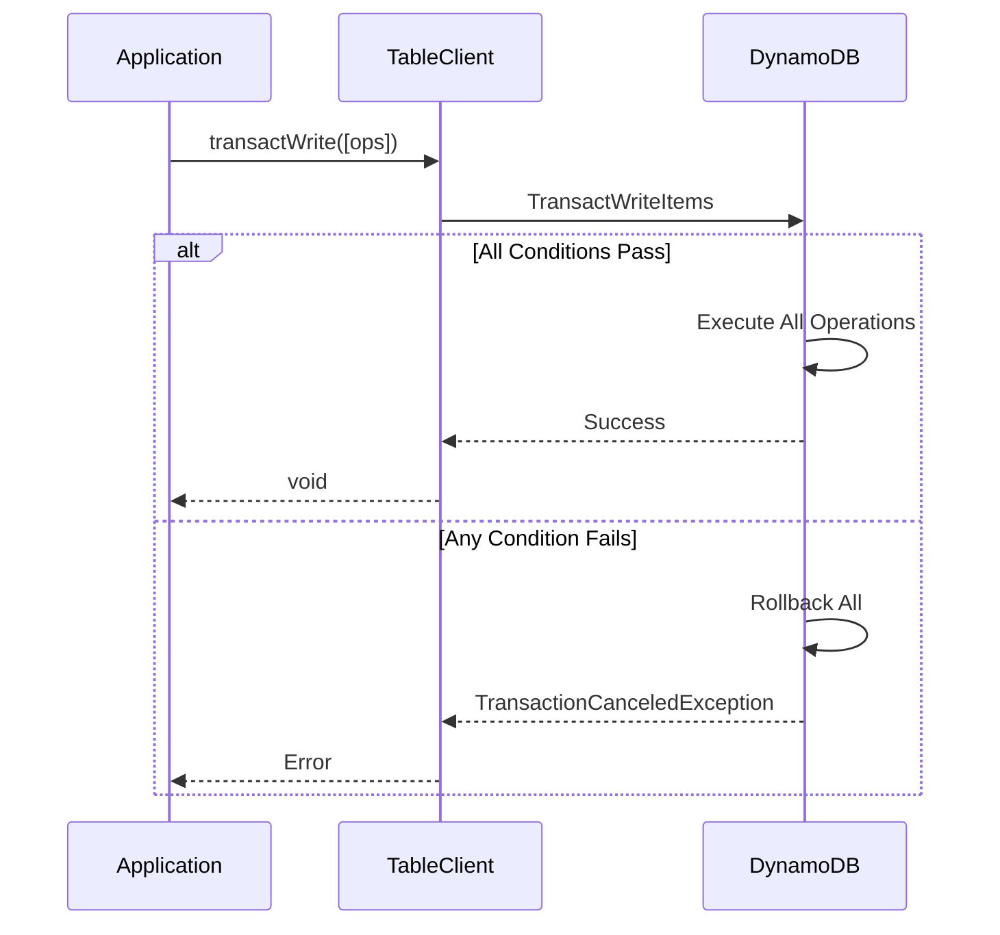

# Transactions

This guide covers DynamoDB transactions, which provide ACID (Atomicity, Consistency, Isolation, Durability) guarantees for multi-item operations. Transactions ensure that all operations succeed or all fail together.

## Overview

DynamoDB provides two transaction operations:

- **TransactWrite** - Atomically write up to 100 items (put, update, delete, conditionCheck)
- **TransactGet** - Atomically read up to 100 items at the same point in time

**ACID Properties:**
- **Atomicity** - All operations succeed or all fail
- **Consistency** - Data remains in a valid state
- **Isolation** - Concurrent transactions don't interfere
- **Durability** - Committed changes are permanent

## TransactWrite Operation

Execute multiple write operations atomically.

### Basic TransactWrite

```typescript
import { TableClient } from '@ddb-lib/client'
import { DynamoDBClient } from '@aws-sdk/client-dynamodb'

const client = new TableClient({
  tableName: 'my-table',
  client: new DynamoDBClient({ region: 'us-east-1' })
})

// All operations succeed or all fail
await client.transactWrite([
  {
    type: 'put',
    item: {
      pk: 'USER#123',
      sk: 'PROFILE',
      name: 'Alice',
      email: 'alice@example.com'
    }
  },
  {
    type: 'update',
    key: { pk: 'ACCOUNT#123', sk: 'BALANCE' },
    updates: {
      balance: 1000,
      updatedAt: new Date().toISOString()
    }
  },
  {
    type: 'delete',
    key: { pk: 'TEMP#123', sk: 'DATA' }
  }
])

console.log('Transaction completed successfully')
```

### Transaction Flow



### Put Operation

Create or replace items within a transaction:

```typescript
await client.transactWrite([
  {
    type: 'put',
    item: {
      pk: 'ORDER#456',
      sk: 'DETAILS',
      orderId: '456',
      userId: '123',
      total: 99.99,
      status: 'PENDING',
      createdAt: new Date().toISOString()
    }
  },
  {
    type: 'put',
    item: {
      pk: 'USER#123',
      sk: 'ORDER#456',
      orderId: '456',
      total: 99.99,
      createdAt: new Date().toISOString()
    }
  }
])
```

### Update Operation

Modify existing items:

```typescript
await client.transactWrite([
  {
    type: 'update',
    key: { pk: 'ORDER#456', sk: 'DETAILS' },
    updates: {
      status: 'PROCESSING',
      processedAt: new Date().toISOString()
    }
  },
  {
    type: 'update',
    key: { pk: 'INVENTORY#789', sk: 'STOCK' },
    updates: {
      quantity: 95,  // Decrement by 5
      lastUpdated: new Date().toISOString()
    }
  }
])
```

### Delete Operation

Remove items atomically:

```typescript
await client.transactWrite([
  {
    type: 'delete',
    key: { pk: 'SESSION#abc123', sk: 'DATA' }
  },
  {
    type: 'delete',
    key: { pk: 'CACHE#abc123', sk: 'ENTRY' }
  }
])
```

### Condition Check

Verify conditions without modifying data:

```typescript
await client.transactWrite([
  // Check that account has sufficient balance
  {
    type: 'conditionCheck',
    key: { pk: 'ACCOUNT#123', sk: 'BALANCE' },
    condition: {
      balance: { gte: 100 }
    }
  },
  // If check passes, deduct from balance
  {
    type: 'update',
    key: { pk: 'ACCOUNT#123', sk: 'BALANCE' },
    updates: {
      balance: 900,  // Deduct 100
      lastTransaction: new Date().toISOString()
    }
  },
  // And create transaction record
  {
    type: 'put',
    item: {
      pk: 'TRANSACTION#tx-789',
      sk: 'DETAILS',
      accountId: '123',
      amount: -100,
      type: 'DEBIT',
      timestamp: new Date().toISOString()
    }
  }
])
```

### Conditional Operations

Add conditions to any operation:

```typescript
await client.transactWrite([
  {
    type: 'put',
    item: {
      pk: 'USER#123',
      sk: 'PROFILE',
      name: 'Alice',
      version: 1
    },
    // Only create if doesn't exist
    condition: {
      pk: { attributeNotExists: true }
    }
  },
  {
    type: 'update',
    key: { pk: 'COUNTER#views', sk: 'PAGE#home' },
    updates: {
      count: 1001
    },
    // Only update if current count is 1000
    condition: {
      count: { eq: 1000 }
    }
  },
  {
    type: 'delete',
    key: { pk: 'TEMP#data', sk: 'OLD' },
    // Only delete if expired
    condition: {
      expiresAt: { lt: Date.now() }
    }
  }
])
```

## TransactGet Operation

Read multiple items atomically at the same point in time.

### Basic TransactGet

```typescript
// Read multiple items with snapshot isolation
const items = await client.transactGet([
  { pk: 'USER#123', sk: 'PROFILE' },
  { pk: 'ACCOUNT#123', sk: 'BALANCE' },
  { pk: 'ORDER#456', sk: 'DETAILS' }
])

// All items are from the same point in time
const [user, account, order] = items

if (user) {
  console.log('User:', user.name)
}
if (account) {
  console.log('Balance:', account.balance)
}
if (order) {
  console.log('Order:', order.orderId)
}
```

### TransactGet with Projection

Retrieve only specific attributes:

```typescript
const items = await client.transactGet(
  [
    { pk: 'USER#123', sk: 'PROFILE' },
    { pk: 'USER#456', sk: 'PROFILE' },
    { pk: 'USER#789', sk: 'PROFILE' }
  ],
  {
    projectionExpression: ['name', 'email', 'status']
  }
)

// Each item contains only: pk, sk, name, email, status
```

### Handling Missing Items

TransactGet returns null for missing items:

```typescript
const items = await client.transactGet([
  { pk: 'USER#123', sk: 'PROFILE' },
  { pk: 'USER#999', sk: 'PROFILE' },  // Doesn't exist
  { pk: 'USER#456', sk: 'PROFILE' }
])

// items = [{ ...user123 }, null, { ...user456 }]

items.forEach((item, index) => {
  if (item) {
    console.log(`Item ${index}:`, item)
  } else {
    console.log(`Item ${index}: Not found`)
  }
})
```

## Common Use Cases

### 1. Money Transfer

Atomically transfer funds between accounts:

```typescript
const fromAccount = await client.get({ pk: 'ACCOUNT#123', sk: 'BALANCE' })
const toAccount = await client.get({ pk: 'ACCOUNT#456', sk: 'BALANCE' })

if (!fromAccount || !toAccount) {
  throw new Error('Account not found')
}

const amount = 100

await client.transactWrite([
  // Check sufficient balance
  {
    type: 'conditionCheck',
    key: { pk: 'ACCOUNT#123', sk: 'BALANCE' },
    condition: {
      balance: { gte: amount }
    }
  },
  // Deduct from source
  {
    type: 'update',
    key: { pk: 'ACCOUNT#123', sk: 'BALANCE' },
    updates: {
      balance: fromAccount.balance - amount,
      updatedAt: new Date().toISOString()
    }
  },
  // Add to destination
  {
    type: 'update',
    key: { pk: 'ACCOUNT#456', sk: 'BALANCE' },
    updates: {
      balance: toAccount.balance + amount,
      updatedAt: new Date().toISOString()
    }
  },
  // Create transaction record
  {
    type: 'put',
    item: {
      pk: 'TRANSACTION#tx-789',
      sk: 'DETAILS',
      from: '123',
      to: '456',
      amount,
      timestamp: new Date().toISOString()
    }
  }
])

console.log('Transfer completed successfully')
```

### 2. Inventory Management

Atomically update inventory and create order:

```typescript
const product = await client.get({ pk: 'PRODUCT#789', sk: 'INVENTORY' })

if (!product) {
  throw new Error('Product not found')
}

const quantity = 5

await client.transactWrite([
  // Check sufficient stock
  {
    type: 'conditionCheck',
    key: { pk: 'PRODUCT#789', sk: 'INVENTORY' },
    condition: {
      stock: { gte: quantity }
    }
  },
  // Decrement inventory
  {
    type: 'update',
    key: { pk: 'PRODUCT#789', sk: 'INVENTORY' },
    updates: {
      stock: product.stock - quantity,
      lastUpdated: new Date().toISOString()
    }
  },
  // Create order
  {
    type: 'put',
    item: {
      pk: 'ORDER#456',
      sk: 'DETAILS',
      productId: '789',
      quantity,
      status: 'PENDING',
      createdAt: new Date().toISOString()
    }
  },
  // Add to user's orders
  {
    type: 'put',
    item: {
      pk: 'USER#123',
      sk: 'ORDER#456',
      orderId: '456',
      productId: '789',
      quantity,
      createdAt: new Date().toISOString()
    }
  }
])
```

### 3. Optimistic Locking

Prevent lost updates with version checking:

```typescript
import { PatternHelpers } from '@ddb-lib/core'

const item = await client.get({ pk: 'DOCUMENT#123', sk: 'CONTENT' })

if (!item) {
  throw new Error('Document not found')
}

try {
  await client.transactWrite([
    {
      type: 'update',
      key: { pk: 'DOCUMENT#123', sk: 'CONTENT' },
      updates: {
        content: 'Updated content',
        version: PatternHelpers.incrementVersion(item.version),
        updatedAt: new Date().toISOString()
      },
      // Only update if version hasn't changed
      condition: {
        version: { eq: item.version }
      }
    }
  ])
  console.log('Document updated successfully')
} catch (error) {
  if (error.name === 'TransactionCanceledException') {
    console.log('Version conflict - document was modified by another user')
    // Retry the operation
  }
}
```

### 4. Idempotent Operations

Use client request tokens for idempotency:

```typescript
import { randomUUID } from 'crypto'

const requestToken = randomUUID()

// First attempt
await client.transactWrite(
  [
    {
      type: 'put',
      item: {
        pk: 'PAYMENT#123',
        sk: 'DETAILS',
        amount: 99.99,
        status: 'COMPLETED',
        requestToken
      }
    }
  ],
  {
    clientRequestToken: requestToken
  }
)

// Retry with same token (safe - won't duplicate)
await client.transactWrite(
  [
    {
      type: 'put',
      item: {
        pk: 'PAYMENT#123',
        sk: 'DETAILS',
        amount: 99.99,
        status: 'COMPLETED',
        requestToken
      }
    }
  ],
  {
    clientRequestToken: requestToken  // Same token = idempotent
  }
)
```

### 5. Multi-Entity Updates

Update related entities atomically:

```typescript
const userId = '123'
const newEmail = 'newemail@example.com'

await client.transactWrite([
  // Update user profile
  {
    type: 'update',
    key: { pk: `USER#${userId}`, sk: 'PROFILE' },
    updates: {
      email: newEmail,
      updatedAt: new Date().toISOString()
    }
  },
  // Update user settings
  {
    type: 'update',
    key: { pk: `USER#${userId}`, sk: 'SETTINGS' },
    updates: {
      notificationEmail: newEmail,
      updatedAt: new Date().toISOString()
    }
  },
  // Update email index
  {
    type: 'put',
    item: {
      pk: `EMAIL#${newEmail}`,
      sk: 'USER',
      userId,
      createdAt: new Date().toISOString()
    }
  },
  // Delete old email index
  {
    type: 'delete',
    key: { pk: 'EMAIL#oldemail@example.com', sk: 'USER' }
  }
])
```

### 6. Consistent Reads Across Items

Read related items at the same point in time:

```typescript
// Get user, account, and recent orders atomically
const [user, account, ...orders] = await client.transactGet([
  { pk: 'USER#123', sk: 'PROFILE' },
  { pk: 'ACCOUNT#123', sk: 'BALANCE' },
  { pk: 'USER#123', sk: 'ORDER#001' },
  { pk: 'USER#123', sk: 'ORDER#002' },
  { pk: 'USER#123', sk: 'ORDER#003' }
])

// All data is from the same snapshot
if (user && account) {
  console.log(`${user.name} has balance: ${account.balance}`)
  console.log(`Recent orders: ${orders.filter(Boolean).length}`)
}
```

## Transaction Limits

### DynamoDB Limits

| Limit | Value |
|-------|-------|
| Max operations per transaction | 100 |
| Max request size | 4 MB |
| Max item size | 400 KB |
| Max tables per transaction | 1 |
| Idempotency window | 10 minutes |

### Cost Considerations

Transactions consume 2x the capacity units:

```typescript
// Regular operations
await client.put(item)  // 1 WCU
await client.get(key)   // 1 RCU

// Transactional operations
await client.transactWrite([{ type: 'put', item }])  // 2 WCU
await client.transactGet([key])  // 2 RCU
```

**When to use transactions:**
- ✅ When atomicity is required (financial operations, inventory)
- ✅ When consistency across items is critical
- ✅ When the 2x cost is acceptable
- ❌ For simple single-item operations
- ❌ When eventual consistency is acceptable

## Error Handling

### Transaction Cancellation

```typescript
try {
  await client.transactWrite([
    {
      type: 'update',
      key: { pk: 'ACCOUNT#123', sk: 'BALANCE' },
      updates: { balance: 900 },
      condition: { balance: { gte: 100 } }
    },
    {
      type: 'put',
      item: { pk: 'TRANSACTION#tx-789', sk: 'DETAILS', amount: -100 }
    }
  ])
} catch (error) {
  if (error.name === 'TransactionCanceledException') {
    console.log('Transaction failed - condition not met')
    console.log('Cancellation reasons:', error.CancellationReasons)
    
    // Check which operation failed
    error.CancellationReasons?.forEach((reason, index) => {
      if (reason.Code === 'ConditionalCheckFailed') {
        console.log(`Operation ${index} condition failed`)
      }
    })
  }
}
```

### Common Errors

```typescript
try {
  await client.transactWrite(operations)
} catch (error) {
  if (error.name === 'TransactionCanceledException') {
    // One or more conditions failed
    console.error('Transaction cancelled:', error.message)
  } else if (error.name === 'ValidationException') {
    // Invalid request (too many items, wrong format, etc.)
    console.error('Invalid transaction:', error.message)
  } else if (error.name === 'ProvisionedThroughputExceededException') {
    // Throttled - retry with backoff
    console.error('Throttled - retry later')
  } else if (error.name === 'TransactionInProgressException') {
    // Duplicate request token with different operations
    console.error('Transaction already in progress')
  } else {
    console.error('Transaction failed:', error)
  }
}
```

## Best Practices

### 1. Keep Transactions Small

```typescript
// ❌ Bad: Large transaction with 100 operations
await client.transactWrite(Array(100).fill({...}))

// ✅ Good: Smaller transactions
await client.transactWrite([
  // Only operations that must be atomic
  { type: 'update', ... },
  { type: 'put', ... },
  { type: 'conditionCheck', ... }
])
```

### 2. Use Condition Checks

```typescript
// ❌ Bad: No validation
await client.transactWrite([
  {
    type: 'update',
    key: { pk: 'ACCOUNT#123', sk: 'BALANCE' },
    updates: { balance: -100 }  // Could go negative!
  }
])

// ✅ Good: Validate with condition check
await client.transactWrite([
  {
    type: 'conditionCheck',
    key: { pk: 'ACCOUNT#123', sk: 'BALANCE' },
    condition: { balance: { gte: 100 } }
  },
  {
    type: 'update',
    key: { pk: 'ACCOUNT#123', sk: 'BALANCE' },
    updates: { balance: newBalance }
  }
])
```

### 3. Handle Retries Carefully

```typescript
// Use idempotency tokens for safe retries
import { randomUUID } from 'crypto'

async function transferMoney(from: string, to: string, amount: number) {
  const requestToken = randomUUID()
  
  const maxRetries = 3
  for (let attempt = 0; attempt < maxRetries; attempt++) {
    try {
      await client.transactWrite(
        [
          // ... transfer operations
        ],
        {
          clientRequestToken: requestToken  // Same token for all retries
        }
      )
      return  // Success
    } catch (error) {
      if (error.name === 'TransactionCanceledException') {
        throw error  // Don't retry condition failures
      }
      if (attempt === maxRetries - 1) {
        throw error  // Max retries reached
      }
      // Exponential backoff
      await new Promise(resolve => setTimeout(resolve, 100 * Math.pow(2, attempt)))
    }
  }
}
```

### 4. Prefer Transactions Over Batch for Atomicity

```typescript
// ❌ Bad: Batch operations (not atomic)
await client.batchWrite([
  { type: 'put', item: order },
  { type: 'update', key: inventoryKey, updates: { stock: newStock } }
])
// If second operation fails, first succeeds = inconsistent state

// ✅ Good: Transaction (atomic)
await client.transactWrite([
  { type: 'put', item: order },
  { type: 'update', key: inventoryKey, updates: { stock: newStock } }
])
// Both succeed or both fail
```

### 5. Monitor Transaction Costs

```typescript
const client = new TableClient({
  tableName: 'my-table',
  client: new DynamoDBClient({ region: 'us-east-1' }),
  statsConfig: {
    enabled: true,
    sampleRate: 1.0
  }
})

// Perform transactions
await client.transactWrite(operations)

// Monitor costs
const stats = client.getStats()
console.log('Transaction WCU:', stats.operations.transactWrite?.totalWCU)

// Get recommendations
const recommendations = client.getRecommendations()
for (const rec of recommendations) {
  if (rec.category === 'transaction') {
    console.log(`${rec.severity}: ${rec.message}`)
  }
}
```

## Transactions vs Batch Operations

| Feature | Transactions | Batch Operations |
|---------|-------------|------------------|
| **Atomicity** | All or nothing | Partial success possible |
| **Max Items** | 100 (write), 100 (read) | 25 (write), 100 (read) |
| **Conditions** | Supported | Not supported |
| **Cost** | 2x capacity units | 1x capacity units |
| **Use Case** | Critical consistency | Bulk operations |
| **Failure Handling** | All rollback | Individual retries |

## Next Steps

- Learn about [Access Patterns](/guides/access-patterns/) for complex queries
- Explore [Monitoring](/guides/monitoring/) to track transaction performance
- Review [Best Practices](/best-practices/) for optimization
- See [Examples](/examples/) for complete transaction patterns

