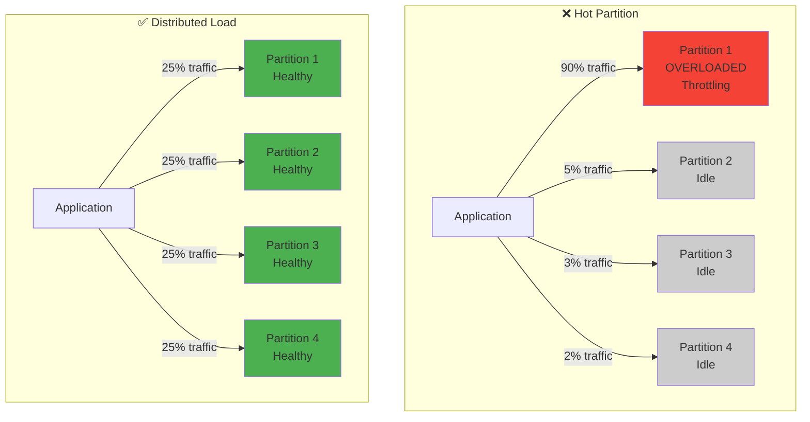

# Hot partitions anti-pattern

## What is it?

A hot partition occurs when a disproportionate amount of read or write traffic is concentrated on a single partition key value. Since DynamoDB distributes data across partitions based on the partition key, having all your traffic hit one partition creates a bottleneck that prevents your application from scaling.

## Why is it a problem?

DynamoDB's performance is based on distributed architecture, but hot partitions undermine this:

- **Throttling**: Individual partitions have throughput limits (3,000 RCU or 1,000 WCU)
- **Performance Degradation**: Requests queue up, causing high latency
- **Scalability Ceiling**: Can't scale beyond single partition limits
- **Wasted Capacity**: Other partitions sit idle while one is overloaded
- **Cascading Failures**: Throttling can cause retries, making the problem worse

### The fundamental issue

Even if your table has 10,000 WCU provisioned, if all writes go to one partition key, you're limited to 1,000 WCU for that partition. The other 9,000 WCU are wasted.

## Visual representation

**Hot Partition Problem**



## Common causes

### 1. low-cardinality partition keys

Using attributes with few possible values as partition keys:

```typescript
// ❌ BAD: Status as partition key
{
  pk: 'STATUS#ACTIVE',  // Most users are active!
  sk: `USER#${userId}`,
  ...userData
}

// All active users (99% of users) in ONE partition
```

### 2. time-based keys without distribution

Using current date/time as partition key:

```typescript
// ❌ BAD: Current date as partition key
{
  pk: `DATE#${new Date().toISOString().split('T')[0]}`,  // Today's date
  sk: `EVENT#${eventId}`,
  ...eventData
}

// All today's events in ONE partition
// Tomorrow, new hot partition is created
```

### 3. popular items

Viral content or trending items:

```typescript
// ❌ BAD: Popular post getting all the traffic
{
  pk: `POST#${viralPostId}`,  // This one post
  sk: `COMMENT#${commentId}`,
  ...commentData
}

// One viral post = one hot partition
```

### 4. global counters

Single counter for entire application:

```typescript
// ❌ BAD: Global counter
{
  pk: 'COUNTER#GLOBAL',
  sk: 'VIEWS',
  count: 1000000
}

// Every view increments the same item
```

## Example of the problem

### ❌ anti-pattern: status-based partitioning

```typescript
import { TableClient } from '@ddb-lib/client'

const table = new TableClient({
  tableName: 'Users',
  // ... config
})

// BAD: All active users in one partition
await table.put({
  pk: 'STATUS#ACTIVE',  // Same for millions of users!
  sk: `USER#${userId}`,
  email: user.email,
  name: user.name,
  status: 'ACTIVE'
})

// Query active users
const activeUsers = await table.query({
  keyCondition: {
    pk: 'STATUS#ACTIVE'  // Hot partition!
  }
})

// This partition gets hammered with:
// - All new user registrations
// - All active user queries
// - All active user updates
```

### ❌ anti-pattern: time-based hot partition

```typescript
// BAD: Current hour as partition key
const currentHour = new Date().toISOString().slice(0, 13)

await table.put({
  pk: `HOUR#${currentHour}`,  // Same for all events this hour
  sk: `EVENT#${eventId}`,
  timestamp: Date.now(),
  ...eventData
})

// All events in the current hour hit the same partition
// Next hour, new hot partition is created
```

## The solution

### ✅ solution 1: use high-cardinality keys

```typescript
// GOOD: User ID as partition key (unique per user)
await table.put({
  pk: `USER#${userId}`,  // Unique partition per user
  sk: 'PROFILE',
  email: user.email,
  name: user.name,
  status: 'ACTIVE'
})

// Load is distributed across all users
```

### ✅ solution 2: distribute with sharding

```typescript
import { PatternHelpers } from '@ddb-lib/core'

// GOOD: Distribute status across shards
const shardCount = 10
const pk = PatternHelpers.distributedKey('STATUS#ACTIVE', shardCount)
// Returns: 'STATUS#ACTIVE#SHARD#7' (random 0-9)

await table.put({
  pk,  // Distributed across 10 partitions
  sk: `USER#${userId}`,
  email: user.email,
  name: user.name,
  status: 'ACTIVE'
})

// Query all shards when needed
const allActiveUsers = []
for (let i = 0; i < shardCount; i++) {
  const result = await table.query({
    keyCondition: {
      pk: `STATUS#ACTIVE#SHARD#${i}`
    }
  })
  allActiveUsers.push(...result.items)
}
```

### ✅ solution 3: add random suffix to time-based keys

```typescript
// GOOD: Distribute time-based data
const currentHour = new Date().toISOString().slice(0, 13)
const shard = Math.floor(Math.random() * 10)

await table.put({
  pk: `HOUR#${currentHour}#SHARD#${shard}`,
  sk: `EVENT#${eventId}`,
  timestamp: Date.now(),
  ...eventData
})

// Load distributed across 10 partitions per hour
```

### ✅ solution 4: use write sharding for counters

```typescript
// GOOD: Distributed counter
const shardCount = 10
const shard = Math.floor(Math.random() * shardCount)

// Increment random shard
await table.update({
  pk: `COUNTER#VIEWS#SHARD#${shard}`,
  sk: 'COUNT',
  updates: {
    count: { increment: 1 }
  }
})

// Read all shards to get total
let totalViews = 0
for (let i = 0; i < shardCount; i++) {
  const result = await table.get({
    pk: `COUNTER#VIEWS#SHARD#${i}`,
    sk: 'COUNT'
  })
  totalViews += result.item?.count || 0
}
```

### ✅ solution 5: use GSI for alternative access

```typescript
// GOOD: Use GSI for status queries
// Main table: pk = USER#{userId}, sk = PROFILE
// GSI: pk = STATUS#{status}#SHARD#{shard}, sk = USER#{userId}

await table.put({
  pk: `USER#${userId}`,
  sk: 'PROFILE',
  status: 'ACTIVE',
  statusShard: `STATUS#ACTIVE#SHARD#${Math.floor(Math.random() * 10)}`,
  ...userData
})

// Query GSI with distributed load
const shard = Math.floor(Math.random() * 10)
const activeUsers = await table.query({
  indexName: 'StatusIndex',
  keyCondition: {
    pk: `STATUS#ACTIVE#SHARD#${shard}`
  }
})
```

## Impact metrics

### Throughput comparison

| Scenario | Partition Strategy | Max Throughput | Throttling |
|----------|-------------------|----------------|------------|
| **Hot Partition** | Single partition | 1,000 WCU | Frequent |
| **Distributed (10 shards)** | 10 partitions | 10,000 WCU | Rare |
| **Distributed (100 shards)** | 100 partitions | 100,000 WCU | Very rare |
| **High-cardinality key** | Millions of partitions | Unlimited* | None |

*Subject to table-level limits

### Latency impact

| Metric | Hot Partition | Distributed |
|--------|--------------|-------------|
| **P50 Latency** | 50ms | 10ms |
| **P99 Latency** | 2,000ms | 25ms |
| **P99.9 Latency** | 10,000ms | 50ms |
| **Error Rate** | 15% | <0.1% |

### Cost impact

Hot partitions waste capacity:

```
Table Capacity: 10,000 WCU
Hot Partition Limit: 1,000 WCU
Wasted Capacity: 9,000 WCU (90%)
Wasted Cost: $4,500/month (at $0.50 per WCU/month)
```

## Detection

The anti-pattern detector can identify hot partitions:

```typescript
import { StatsCollector, AntiPatternDetector } from '@ddb-lib/stats'

const stats = new StatsCollector()
const detector = new AntiPatternDetector(stats)

// After running operations
const issues = detector.detectHotPartitions()

for (const issue of issues) {
  console.log(issue.message)
  // "Partition STATUS#ACTIVE receiving 85% of traffic"
  // "Partition key 'POST#12345' has 1,000 requests/sec (hot partition)"
}
```

### Warning signs

You might have hot partitions if:

- You see "ProvisionedThroughputExceededException" despite having capacity
- Latency is high even with low overall traffic
- Some operations are fast while others are slow
- CloudWatch shows uneven partition metrics
- Increasing table capacity doesn't help

## Choosing shard count

How many shards should you use?

```typescript
// Calculate required shards
const targetThroughput = 5000  // WCU needed
const partitionLimit = 1000     // WCU per partition
const minShards = Math.ceil(targetThroughput / partitionLimit)
// Result: 5 shards minimum

// Add buffer for growth
const recommendedShards = minShards * 2
// Result: 10 shards recommended
```

### Shard count guidelines

| Traffic Level | Recommended Shards | Notes |
|--------------|-------------------|-------|
| Low (<500 req/s) | 5-10 | Minimal overhead |
| Medium (500-2000 req/s) | 10-20 | Good balance |
| High (2000-5000 req/s) | 20-50 | Scales well |
| Very High (>5000 req/s) | 50-100+ | Maximum distribution |

## Trade-offs

Sharding has trade-offs to consider:

### Pros
- ✅ Eliminates hot partitions
- ✅ Enables horizontal scaling
- ✅ Reduces throttling
- ✅ Improves latency

### Cons
- ❌ Queries require multiple requests (scatter-gather)
- ❌ Slightly more complex code
- ❌ Aggregations require reading all shards
- ❌ More storage for shard metadata

### When to shard

**Use sharding when:**
- Traffic exceeds 1,000 WCU or 3,000 RCU per partition key
- You have low-cardinality partition keys
- You need to scale beyond single partition limits
- You're experiencing throttling

**Don't shard when:**
- Traffic is low (<100 req/s per partition)
- You have naturally high-cardinality keys (user IDs, order IDs)
- Query performance is more important than write throughput
- Your access pattern requires strong consistency across items

## Related resources

- [Hot partition distribution pattern](../patterns/hot-partition-distribution.md)
- [Key Design Best Practice](../best-practices/key-design.md)
- [Entity Keys Pattern](../patterns/entity-keys.md)
- [Composite Keys Pattern](../patterns/composite-keys.md)

## Summary

**The Problem**: Concentrating traffic on a single partition key creates a bottleneck that prevents scaling and causes throttling.

**The Solution**: Use high-cardinality partition keys or distribute load across multiple shards using helper functions.

**The Impact**: Proper distribution can increase throughput by 10-100x and eliminate throttling.

Remember: DynamoDB's power comes from its distributed architecture. Hot partitions prevent you from leveraging that power. Design your keys to distribute load evenly across partitions.

