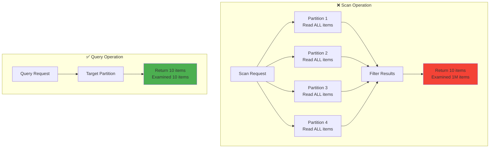

# Table scans anti-pattern

## What is it?

The table scans anti-pattern occurs when developers use the Scan operation to find items in a DynamoDB table when a Query operation would be more appropriate. A scan examines **every single item** in your table, regardless of whether it matches your criteria, and then filters the results afterward.

## Why is it a problem?

Scans are one of the most expensive and slowest operations in DynamoDB:

- **Performance**: Scans have O(n) complexity - they get slower as your table grows
- **Cost**: You pay for reading every item examined, not just items returned
- **Throughput**: Scans consume massive amounts of read capacity
- **Latency**: Response times increase linearly with table size
- **Scalability**: Scans don't benefit from DynamoDB's distributed architecture

### The hidden cost

If you have a table with 1 million items and you scan for 10 specific items:

- **Items examined**: 1,000,000
- **Items returned**: 10
- **RCU consumed**: ~1,000,000 (you pay for all examined items!)
- **Time**: Several seconds to minutes

## Visual representation

**Scan vs Query Operation**



## Example of the problem

### ❌ anti-pattern: using scan

```typescript
import { TableClient } from '@ddb-lib/client'

const table = new TableClient({
  tableName: 'Users',
  // ... config
})

// BAD: Scanning entire table to find active users
const result = await table.scan({
  filter: {
    status: { eq: 'ACTIVE' },
    createdAt: { gt: '2024-01-01' }
  }
})

// This examines EVERY item in the table!
// If you have 1M users, this reads 1M items
// Even if only 100 are active and match the date
```

### Common scan mistakes

```typescript
// BAD: Scanning to find a specific user
const user = await table.scan({
  filter: {
    email: { eq: 'user@example.com' }
  }
})

// BAD: Scanning to get recent orders
const orders = await table.scan({
  filter: {
    userId: { eq: '123' },
    orderDate: { gt: '2024-01-01' }
  }
})

// BAD: Scanning to count items
const count = await table.scan({
  filter: {
    type: { eq: 'ORDER' }
  },
  select: 'COUNT'
})
// Still reads every item to count!
```

## The solution

### ✅ use query with proper keys

```typescript
// GOOD: Query with partition key
const result = await table.query({
  keyCondition: {
    pk: 'STATUS#ACTIVE',
    sk: { beginsWith: 'USER#' }
  },
  filter: {
    createdAt: { gt: '2024-01-01' }
  }
})

// Only reads items in the STATUS#ACTIVE partition
// Filter is applied after reading, but only on relevant items
```

### ✅ design keys for your access patterns

```typescript
// Design your data model to support queries
interface User {
  pk: string    // STATUS#ACTIVE or STATUS#INACTIVE
  sk: string    // USER#{userId}
  email: string
  createdAt: string
  // ... other attributes
}

// Now you can query efficiently
const activeUsers = await table.query({
  keyCondition: {
    pk: 'STATUS#ACTIVE'
  }
})

// Or query a specific user
const user = await table.query({
  keyCondition: {
    pk: 'STATUS#ACTIVE',
    sk: 'USER#123'
  }
})
```

### ✅ use GSI for alternative access patterns

```typescript
// If you need to query by email, create a GSI
// GSI: email (PK), userId (SK)

const userByEmail = await table.query({
  indexName: 'EmailIndex',
  keyCondition: {
    email: 'user@example.com'
  }
})

// Efficient query on GSI instead of table scan
```

### ✅ use get for single items

```typescript
// If you know the exact key, use get
const user = await table.get({
  pk: 'USER#123',
  sk: 'PROFILE'
})

// Single-item read, most efficient operation
```

## Impact metrics

### Performance comparison

| Operation | Items in Table | Items Returned | Items Examined | RCU Consumed | Latency |
|-----------|----------------|----------------|----------------|--------------|---------|
| **Scan** | 1,000,000 | 10 | 1,000,000 | ~1,000,000 | 5-30 seconds |
| **Query** | 1,000,000 | 10 | 10 | ~10 | 10-50ms |
| **Get** | 1,000,000 | 1 | 1 | 1 | 5-20ms |

### Cost impact

Assuming $0.25 per million read requests:

| Operation | Monthly Requests | Items Examined | Monthly Cost |
|-----------|-----------------|----------------|--------------|
| **Scan** | 10,000 | 10 billion | $2,500 |
| **Query** | 10,000 | 100,000 | $0.025 |
| **Savings** | - | - | **$2,499.98 (99.99%)** |

## When scans are acceptable

Scans are appropriate in limited scenarios:

### ✅ acceptable use cases

1. **One-time data migrations**
   ```typescript
   // Migrating data structure (run once)
   const allItems = await table.scan({})
   ```

2. **Analytics on small tables** (<1,000 items)
   ```typescript
   // Small lookup table
   const allCategories = await table.scan({})
   ```

3. **Admin operations during maintenance windows**
   ```typescript
   // Cleanup job during low-traffic period
   const oldItems = await table.scan({
     filter: {
       expiresAt: { lt: Date.now() }
     }
   })
   ```

4. **Exporting entire table for backup**
   ```typescript
   // Full table backup
   const backup = await table.scan({})
   ```

### ❌ never use scans for

- Finding specific items by attribute
- Filtering by non-key attributes in production
- Counting items (use aggregated counters instead)
- Regular application queries
- User-facing operations

## Detection

The anti-pattern detector can identify excessive scan usage:

```typescript
import { StatsCollector, AntiPatternDetector } from '@ddb-lib/stats'

const stats = new StatsCollector()
const detector = new AntiPatternDetector(stats)

// After running operations
const issues = detector.detectExcessiveScans()

for (const issue of issues) {
  console.log(issue.message)
  // "High scan usage detected: 45% of operations are scans"
  // "Scan on table 'Users' examined 1M items but returned only 10"
}
```

### Warning signs

You might have this anti-pattern if:

- Your DynamoDB costs are unexpectedly high
- Queries get slower as your table grows
- You see "ProvisionedThroughputExceededException" errors
- Response times are in seconds instead of milliseconds
- Your read capacity is constantly maxed out

## How to fix

### Step 1: identify your access patterns

```typescript
// What queries do you need to support?
// - Get user by ID
// - Get user by email
// - Get active users
// - Get users created after date
```

### Step 2: design keys and indexes

```typescript
// Main table: pk = USER#{id}, sk = PROFILE
// GSI1: pk = EMAIL#{email}, sk = USER#{id}
// GSI2: pk = STATUS#{status}, sk = CREATED#{timestamp}
```

### Step 3: replace scans with queries

```typescript
// Before: Scan
const users = await table.scan({
  filter: { status: { eq: 'ACTIVE' } }
})

// After: Query on GSI
const users = await table.query({
  indexName: 'StatusIndex',
  keyCondition: {
    pk: 'STATUS#ACTIVE'
  }
})
```

### Step 4: monitor and validate

```typescript
// Verify improvement
const stats = collector.getStats()
console.log(`Scan operations: ${stats.scanCount}`)
console.log(`Query operations: ${stats.queryCount}`)
console.log(`Avg scan latency: ${stats.avgScanLatency}ms`)
console.log(`Avg query latency: ${stats.avgQueryLatency}ms`)
```

## Related resources

- [Query vs Scan Best Practice](../best-practices/query-vs-scan.md)
- [Key Design Best Practice](../best-practices/key-design.md)
- [Entity Keys Pattern](../patterns/entity-keys.md)
- [Composite Keys Pattern](../patterns/composite-keys.md)
- [Query and Scan Guide](../guides/query-and-scan/)

## Summary

**The Problem**: Using Scan when Query would work examines every item in your table, causing slow performance and high costs.

**The Solution**: Design your keys and indexes to support your access patterns, then use Query operations to target specific partitions.

**The Impact**: Switching from Scan to Query can improve performance by 100x and reduce costs by 99%.

Remember: If you find yourself using Scan in production code for user-facing operations, it's almost always a sign that your data model needs improvement.

