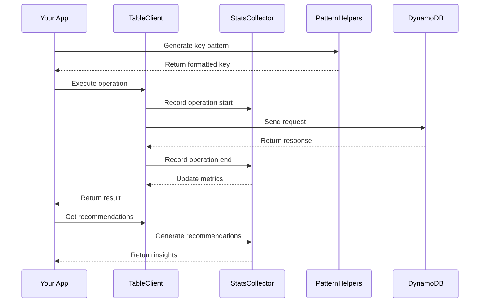
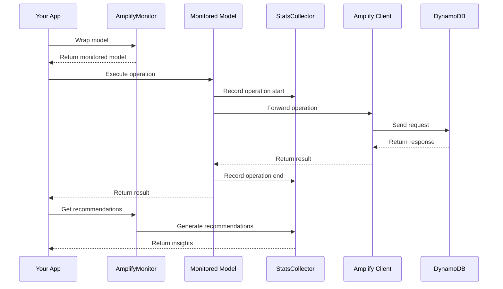

# Architecture

ddb-lib is designed as a modular monorepo with clear separation of concerns. Each package serves a specific purpose and can be used independently or combined with others.

## Design principles

### 1. modularity

Each package is independent and focused on a single responsibility:
- **Core**: Pure utilities with zero dependencies
- **Stats**: Framework-agnostic monitoring
- **Client**: Full-featured DynamoDB client
- **Amplify**: Amplify-specific integration

### 2. zero to minimal dependencies

Packages minimize external dependencies to reduce bundle size and security surface:
- `@ddb-lib/core`: Zero dependencies
- `@ddb-lib/stats`: Only depends on core
- `@ddb-lib/client`: Depends on core, stats, and AWS SDK (peer)
- `@ddb-lib/amplify`: Depends on core, stats, and aws-amplify (peer)

### 3. tree-shakeable

All packages support tree-shaking, ensuring unused code is eliminated from your bundle.

### 4. type safety

Full TypeScript support throughout with strict typing and inference.

## Package architecture

**Package Dependency Graph**

```mermaid
graph TD
    A[Your Application] --> B[@ddb-lib/client]
    A --> C[@ddb-lib/amplify]
    B --> D[@ddb-lib/core]
    B --> E[@ddb-lib/stats]
    C --> D
    C --> E
    E --> D
    B --> F[AWS SDK v3]
    C --> G[aws-amplify]
    
    style A fill:#e3f2fd
    style B fill:#c8e6c9
    style C fill:#c8e6c9
    style D fill:#fff9c4
    style E fill:#fff9c4
    style F fill:#ffccbc
    style G fill:#ffccbc
```

## Package responsibilities

### @ddb-lib/core

**Purpose**: Pure utility functions for DynamoDB patterns

**Responsibilities**:
- Pattern helpers (entity keys, composite keys, time-series, etc.)
- Multi-attribute key utilities
- Expression builders (key conditions, filters, conditions)
- Type guards and validators

**No Dependencies**: Can be used anywhere, even in browser environments

### @ddb-lib/stats

**Purpose**: Performance monitoring and optimization

**Responsibilities**:
- Statistics collection
- Recommendation generation
- Anti-pattern detection
- Performance metrics aggregation

**Framework Agnostic**: Works with any data access layer

### @ddb-lib/client

**Purpose**: Full-featured DynamoDB client

**Responsibilities**:
- All DynamoDB operations (CRUD, query, scan, batch, transactions)
- Automatic statistics collection
- Retry logic with exponential backoff
- Access pattern definitions
- Error handling

**For**: Standalone Node.js applications

### @ddb-lib/amplify

**Purpose**: AWS Amplify Gen 2 integration

**Responsibilities**:
- Wrap Amplify data client with monitoring
- Amplify-specific pattern helpers
- Automatic operation tracking
- Statistics and recommendations for Amplify

**For**: Amplify Gen 2 applications

## Data flow

### Standalone application flow

**Standalone Data Flow**



### Amplify application flow

**Amplify Data Flow**



## Extensibility

The architecture is designed for extensibility:

### Custom data access layers

You can use `@ddb-lib/core` and `@ddb-lib/stats` with your own data access implementation:

```typescript
import { StatsCollector } from '@ddb-lib/stats'
import { PatternHelpers } from '@ddb-lib/core'

class MyCustomClient {
  private stats = new StatsCollector({ enabled: true })
  
  async query(params: any) {
    const start = Date.now()
    const key = PatternHelpers.entityKey('USER', params.userId)
    
    // Your custom logic
    const result = await this.customQuery(key)
    
    // Record statistics
    this.stats.record({
      operation: 'query',
      timestamp: start,
      latencyMs: Date.now() - start,
      itemCount: result.length
    })
    
    return result
  }
}
```

### Custom patterns

Add your own pattern helpers:

```typescript
import { PatternHelpers } from '@ddb-lib/core'

// Extend with custom patterns
export class MyPatternHelpers extends PatternHelpers {
  static customPattern(data: any): string {
    // Your custom logic
    return `CUSTOM#${data.id}`
  }
}
```

## Performance considerations

### Build time

- Hugo builds the documentation site in ~30ms
- TypeScript compilation is fast with project references
- Tree-shaking eliminates unused code

### Runtime

- Core utilities are pure functions (no overhead)
- Statistics collection uses sampling to minimize impact
- Pattern helpers are optimized for common cases

### Bundle size

Approximate sizes (minified + gzipped):
- `@ddb-lib/core`: ~8KB
- `@ddb-lib/stats`: ~15KB
- `@ddb-lib/client`: ~35KB
- `@ddb-lib/amplify`: ~12KB

## Security

- No credentials stored in any package
- Relies on AWS SDK and Amplify for authentication
- Statistics data is sanitized
- No external network calls except to AWS services

## Future architecture

Planned enhancements:
- Schema validation package
- Migration tools package
- Testing utilities package
- CLI tools for analysis
- Dashboard for visualizing statistics
