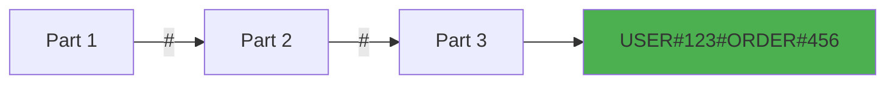
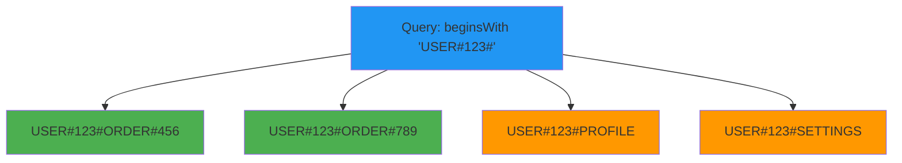

# Composite keys pattern

## What is it?

Composite keys combine multiple attributes into a single partition or sort key using a delimiter. This pattern enables efficient querying across multiple dimensions without requiring additional indexes.

The pattern uses the format: `PART1#PART2#PART3#...`

For example:
- `USER#123#ORDER#456` - Combines user ID and order ID
- `2024#12#SALES` - Combines year, month, and category
- `TENANT#acme#USER#alice` - Combines tenant and user for multi-tenancy

## Why is it important?

### Query flexibility
Composite keys enable hierarchical queries using DynamoDB's `beginsWith` operator:

```typescript
// Query all orders for a user
sk: { beginsWith: 'USER#123#ORDER#' }

// Query all sales in December 2024
sk: { beginsWith: '2024#12#' }
```

### Reduced index requirements
By encoding multiple attributes in keys, you can support multiple access patterns without creating additional GSIs, reducing costs and complexity.

### Hierarchical organization
Composite keys naturally represent hierarchical relationships, making your data model intuitive and efficient.

### Sort order control
You can control the sort order of items by carefully ordering the components in your composite key.

## Visual representation

**Composite Key Structure**



### Hierarchical query example

**Querying with Composite Keys**



## Implementation

The `@ddb-lib/core` package provides helper functions for working with composite keys:

### Creating composite keys

**Creating Composite Keys**

```typescript
import { PatternHelpers } from '@ddb-lib/core'

// Simple composite key
const key1 = PatternHelpers.compositeKey(['USER', '123', 'ORDER', '456'])
console.log(key1) // 'USER#123#ORDER#456'

// Time-based composite key
const key2 = PatternHelpers.compositeKey(['2024', '12', 'SALES', 'region-west'])
console.log(key2) // '2024#12#SALES#region-west'

// Multi-tenant composite key
const key3 = PatternHelpers.compositeKey(['TENANT', 'acme', 'USER', 'alice'])
console.log(key3) // 'TENANT#acme#USER#alice'

// Custom separator
const key4 = PatternHelpers.compositeKey(['A', 'B', 'C'], '|')
console.log(key4) // 'A|B|C'
```

### Parsing composite keys

**Parsing Composite Keys**

```typescript
import { PatternHelpers } from '@ddb-lib/core'

// Parse a composite key
const parts = PatternHelpers.parseCompositeKey('USER#123#ORDER#456')
console.log(parts) // ['USER', '123', 'ORDER', '456']

// Extract specific parts
const [entityType, userId, orderType, orderId] = parts
console.log(userId)    // '123'
console.log(orderId)   // '456'

// Parse with custom separator
const customParts = PatternHelpers.parseCompositeKey('A|B|C', '|')
console.log(customParts) // ['A', 'B', 'C']
```

### Using with TableClient

**Composite Keys with TableClient**

```typescript
import { TableClient } from '@ddb-lib/client'
import { PatternHelpers } from '@ddb-lib/core'

const table = new TableClient({
  tableName: 'MyTable',
  partitionKey: 'pk',
  sortKey: 'sk'
})

// Store user order
await table.put({
  pk: PatternHelpers.entityKey('USER', '123'),
  sk: PatternHelpers.compositeKey(['ORDER', '2024-12-01', '456']),
  total: 99.99,
  status: 'pending'
})

// Query all orders for a user
const allOrders = await table.query({
  keyCondition: {
    pk: PatternHelpers.entityKey('USER', '123'),
    sk: { beginsWith: 'ORDER#' }
  }
})

// Query orders from a specific date
const dateOrders = await table.query({
  keyCondition: {
    pk: PatternHelpers.entityKey('USER', '123'),
    sk: { beginsWith: 'ORDER#2024-12-01#' }
  }
})
```

## Common use cases

### Use case 1: time-series data with categories

**Time-Series with Categories**

```typescript
import { PatternHelpers } from '@ddb-lib/core'

// Store metrics by time and category
await table.put({
  pk: 'METRICS',
  sk: PatternHelpers.compositeKey(['2024', '12', '01', 'CPU', 'server-1']),
  value: 75.5,
  timestamp: Date.now()
})

// Query all CPU metrics for December 1, 2024
const cpuMetrics = await table.query({
  keyCondition: {
    pk: 'METRICS',
    sk: { beginsWith: '2024#12#01#CPU#' }
  }
})

// Query all metrics for December 2024
const decemberMetrics = await table.query({
  keyCondition: {
    pk: 'METRICS',
    sk: { beginsWith: '2024#12#' }
  }
})
```

### Use case 2: multi-tenancy

**Multi-Tenant Application**

```typescript
import { PatternHelpers } from '@ddb-lib/core'

// Store tenant-specific data
await table.put({
  pk: PatternHelpers.compositeKey(['TENANT', 'acme']),
  sk: PatternHelpers.compositeKey(['USER', 'alice', 'PROFILE']),
  name: 'Alice Smith',
  role: 'admin'
})

await table.put({
  pk: PatternHelpers.compositeKey(['TENANT', 'acme']),
  sk: PatternHelpers.compositeKey(['USER', 'bob', 'PROFILE']),
  name: 'Bob Jones',
  role: 'user'
})

// Query all users in a tenant
const tenantUsers = await table.query({
  keyCondition: {
    pk: 'TENANT#acme',
    sk: { beginsWith: 'USER#' }
  }
})

// Query specific user in tenant
const userProfile = await table.query({
  keyCondition: {
    pk: 'TENANT#acme',
    sk: { beginsWith: 'USER#alice#' }
  }
})
```

### Use case 3: hierarchical categories

**Product Categories**

```typescript
import { PatternHelpers } from '@ddb-lib/core'

// Store products in hierarchical categories
await table.put({
  pk: 'CATALOG',
  sk: PatternHelpers.compositeKey(['ELECTRONICS', 'COMPUTERS', 'LAPTOPS', 'product-123']),
  name: 'Gaming Laptop',
  price: 1299.99
})

// Query all laptops
const laptops = await table.query({
  keyCondition: {
    pk: 'CATALOG',
    sk: { beginsWith: 'ELECTRONICS#COMPUTERS#LAPTOPS#' }
  }
})

// Query all computers (laptops, desktops, etc.)
const computers = await table.query({
  keyCondition: {
    pk: 'CATALOG',
    sk: { beginsWith: 'ELECTRONICS#COMPUTERS#' }
  }
})

// Query all electronics
const electronics = await table.query({
  keyCondition: {
    pk: 'CATALOG',
    sk: { beginsWith: 'ELECTRONICS#' }
  }
})
```

### Use case 4: versioned documents

**Document Versioning**

```typescript
import { PatternHelpers } from '@ddb-lib/core'

// Store document versions
await table.put({
  pk: PatternHelpers.entityKey('DOCUMENT', 'doc-123'),
  sk: PatternHelpers.compositeKey(['VERSION', '2024-12-01T10:30:00Z', 'v1']),
  content: 'Document content v1',
  author: 'alice'
})

await table.put({
  pk: PatternHelpers.entityKey('DOCUMENT', 'doc-123'),
  sk: PatternHelpers.compositeKey(['VERSION', '2024-12-01T14:20:00Z', 'v2']),
  content: 'Document content v2',
  author: 'bob'
})

// Query all versions (sorted by timestamp)
const versions = await table.query({
  keyCondition: {
    pk: 'DOCUMENT#doc-123',
    sk: { beginsWith: 'VERSION#' }
  }
})

// Query versions from a specific date
const dateVersions = await table.query({
  keyCondition: {
    pk: 'DOCUMENT#doc-123',
    sk: { beginsWith: 'VERSION#2024-12-01#' }
  }
})
```

## When to use

### ✅ use composite keys when:

- **Hierarchical queries**: You need to query at different levels of a hierarchy
- **Multiple dimensions**: Your access patterns involve multiple attributes
- **Reducing indexes**: You want to avoid creating additional GSIs
- **Sort order matters**: You need items sorted by multiple attributes
- **Time-series data**: You're storing time-based data with categories

### ❌ avoid composite keys when:

- **Simple access patterns**: Single-attribute keys are sufficient
- **Frequent updates**: Key components change frequently (keys are immutable)
- **Complex parsing**: You need to frequently parse and manipulate keys
- **Very long keys**: Too many components make keys unwieldy (DynamoDB has 2KB key limit)

### ⚠️ considerations:

- **Key order matters**: Put the most selective attributes first for efficient queries
- **Separator conflicts**: Ensure your data doesn't contain the separator character
- **Key immutability**: Changing composite keys requires deleting and recreating items
- **Query patterns**: Design keys based on your query patterns, not your data structure

## Best practices

### 1. order components by selectivity

```typescript
// ✅ Good: Most selective first
PatternHelpers.compositeKey(['USER', userId, 'ORDER', orderId])
// Enables: Query all orders for a user

// ❌ Bad: Least selective first
PatternHelpers.compositeKey(['ORDER', orderId, 'USER', userId])
// Can't efficiently query all orders for a user
```

### 2. use consistent separators

```typescript
// ✅ Good: Consistent separator throughout application
const separator = '#'
PatternHelpers.compositeKey(['A', 'B', 'C'], separator)

// ❌ Bad: Mixing separators
PatternHelpers.compositeKey(['A', 'B'], '#')
PatternHelpers.compositeKey(['C', 'D'], '|')
```

### 3. validate components

```typescript
// ✅ Good: Validate before creating keys
function createOrderKey(userId: string, orderId: string): string {
  if (userId.includes('#') || orderId.includes('#')) {
    throw new Error('IDs cannot contain # character')
  }
  return PatternHelpers.compositeKey(['USER', userId, 'ORDER', orderId])
}
```

### 4. document key structure

```typescript
// ✅ Good: Document your key patterns
/**
 * Sort Key Format: ORDER#{timestamp}#{orderId}
 * Enables queries:
 * - All orders: beginsWith('ORDER#')
 * - Orders by date: beginsWith('ORDER#2024-12-01#')
 * - Specific order: equals('ORDER#2024-12-01#456')
 */
const sk = PatternHelpers.compositeKey(['ORDER', timestamp, orderId])
```

### 5. use type-safe builders

```typescript
// ✅ Good: Type-safe key builders
interface OrderKeyParts {
  userId: string
  timestamp: string
  orderId: string
}

function buildOrderKey(parts: OrderKeyParts): string {
  return PatternHelpers.compositeKey([
    'USER',
    parts.userId,
    'ORDER',
    parts.timestamp,
    parts.orderId
  ])
}

function parseOrderKey(key: string): OrderKeyParts {
  const [, userId, , timestamp, orderId] = PatternHelpers.parseCompositeKey(key)
  return { userId, timestamp, orderId }
}
```

## Performance considerations

### Query efficiency

```typescript
// ✅ Efficient: Uses key condition
await table.query({
  keyCondition: {
    pk: 'USER#123',
    sk: { beginsWith: 'ORDER#2024-12#' }
  }
})

// ❌ Inefficient: Uses filter expression
await table.query({
  keyCondition: { pk: 'USER#123' },
  filter: {
    orderDate: { beginsWith: '2024-12' }
  }
})
```

### Key size limits

```typescript
// ⚠️ Watch out: DynamoDB has 2KB limit for keys
// Too many components or long values can exceed this

// ✅ Good: Reasonable key size
PatternHelpers.compositeKey(['USER', '123', 'ORDER', '456'])
// ~20 bytes

// ❌ Bad: Potentially too large
PatternHelpers.compositeKey([
  'VERY_LONG_PREFIX',
  veryLongId,
  'ANOTHER_LONG_PREFIX',
  anotherLongId,
  // ... many more components
])
```

## Related patterns

- [Entity Keys](entity-keys.md) - Foundation for composite keys
- [Time-Series](time-series.md) - Time-based composite keys
- [Hierarchical](hierarchical.md) - Hierarchical composite keys
- [Multi-Attribute Keys](multi-attribute-keys/) - Advanced composite key management

## Additional resources

- [Core Operations Guide](../guides/core-operations/)
- [Query and Scan Guide](../guides/query-and-scan/)
- [Best Practices: Key Design](../best-practices/key-design.md)
- [API Reference: PatternHelpers](../api/core#patternhelpers-class)
