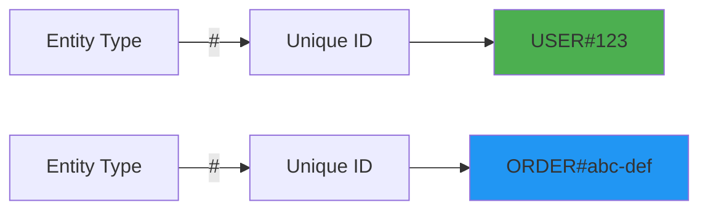
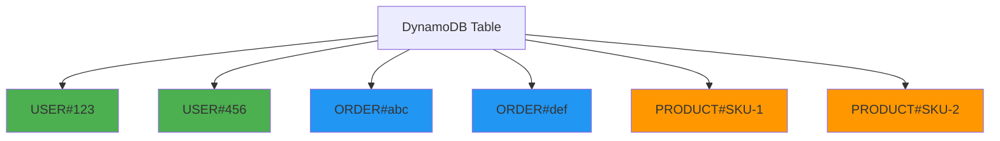

# Entity keys pattern

## What is it?

Entity keys are a foundational pattern for creating type-safe, self-documenting partition and sort keys by prefixing them with the entity type. This pattern is essential for single-table design where multiple entity types coexist in the same DynamoDB table.

The pattern uses a simple format: `ENTITY_TYPE#ID`

For example:
- `USER#123` - A user with ID 123
- `ORDER#abc-def` - An order with ID abc-def
- `PRODUCT#SKU-789` - A product with SKU 789

## Why is it important?

### Type safety
Entity keys prevent accidentally mixing different entity types. When you see `USER#123`, you immediately know it's a user, not an order or product.

### Self-documenting
Keys are human-readable and self-explanatory. This makes debugging, monitoring, and understanding your data model much easier.

### Query efficiency
You can easily query all entities of a specific type by using key conditions with `beginsWith`:

```typescript
// Get all orders for a user
keyCondition: {
  pk: 'USER#123',
  sk: { beginsWith: 'ORDER#' }
}
```

### Single-table design
Entity keys are essential for organizing multiple entity types in a single table while maintaining clarity and preventing collisions.

## Visual representation

**Entity Key Structure**



### Single-table design example

**Multiple Entity Types in One Table**



## Implementation

The `@ddb-lib/core` package provides helper functions for working with entity keys:

### Creating entity keys

**Creating Entity Keys**

```typescript
import { PatternHelpers } from '@ddb-lib/core'

// Create entity keys
const userKey = PatternHelpers.entityKey('USER', '123')
console.log(userKey) // 'USER#123'

const orderKey = PatternHelpers.entityKey('ORDER', 'abc-def')
console.log(orderKey) // 'ORDER#abc-def'

const productKey = PatternHelpers.entityKey('PRODUCT', 'SKU-789')
console.log(productKey) // 'PRODUCT#SKU-789'
```

### Parsing entity keys

**Parsing Entity Keys**

```typescript
import { PatternHelpers } from '@ddb-lib/core'

// Parse an entity key
const parsed = PatternHelpers.parseEntityKey('USER#123')
console.log(parsed)
// { entityType: 'USER', id: '123' }

// Handle IDs with special characters
const complexParsed = PatternHelpers.parseEntityKey('ORDER#2024-01-15#abc')
console.log(complexParsed)
// { entityType: 'ORDER', id: '2024-01-15#abc' }
```

### Using with TableClient

**Entity Keys with TableClient**

```typescript
import { TableClient } from '@ddb-lib/client'
import { PatternHelpers } from '@ddb-lib/core'

const table = new TableClient({
  tableName: 'MyTable',
  partitionKey: 'pk',
  sortKey: 'sk'
})

// Store a user
await table.put({
  pk: PatternHelpers.entityKey('USER', '123'),
  sk: PatternHelpers.entityKey('USER', '123'),
  name: 'Alice',
  email: 'alice@example.com'
})

// Store user's orders
await table.put({
  pk: PatternHelpers.entityKey('USER', '123'),
  sk: PatternHelpers.entityKey('ORDER', 'abc'),
  total: 99.99,
  status: 'pending'
})

// Query all orders for a user
const orders = await table.query({
  keyCondition: {
    pk: PatternHelpers.entityKey('USER', '123'),
    sk: { beginsWith: 'ORDER#' }
  }
})
```

### Single-table design example

**Complete Single-Table Design**

```typescript
import { TableClient } from '@ddb-lib/client'
import { PatternHelpers } from '@ddb-lib/core'

const table = new TableClient({
  tableName: 'AppData',
  partitionKey: 'pk',
  sortKey: 'sk'
})

// User entity
await table.put({
  pk: PatternHelpers.entityKey('USER', '123'),
  sk: PatternHelpers.entityKey('USER', '123'),
  entityType: 'USER',
  name: 'Alice',
  email: 'alice@example.com'
})

// User's profile
await table.put({
  pk: PatternHelpers.entityKey('USER', '123'),
  sk: 'PROFILE',
  bio: 'Software engineer',
  avatar: 'https://...'
})

// User's orders
await table.put({
  pk: PatternHelpers.entityKey('USER', '123'),
  sk: PatternHelpers.entityKey('ORDER', 'order-1'),
  entityType: 'ORDER',
  total: 99.99,
  items: ['item1', 'item2']
})

// Product entity (different partition)
await table.put({
  pk: PatternHelpers.entityKey('PRODUCT', 'SKU-789'),
  sk: PatternHelpers.entityKey('PRODUCT', 'SKU-789'),
  entityType: 'PRODUCT',
  name: 'Widget',
  price: 29.99
})

// Query all data for a user
const userData = await table.query({
  keyCondition: {
    pk: PatternHelpers.entityKey('USER', '123')
  }
})
// Returns: user entity, profile, and all orders
```

## When to use

### ✅ use entity keys when:

- **Single-table design**: You're storing multiple entity types in one table
- **Human-readable keys**: You want keys that are easy to understand and debug
- **Type safety**: You want to prevent mixing different entity types
- **Querying by type**: You need to query all entities of a specific type
- **Monitoring**: You want to easily identify entity types in logs and metrics

### ❌ avoid entity keys when:

- **DynamoDB Streams**: If you're using streams and need to hide entity structure, consider UUIDs
- **External exposure**: If keys are exposed in URLs, consider using opaque identifiers
- **Very high cardinality**: If entity types change frequently, this adds complexity

### ⚠️ considerations:

- **Separator choice**: The `#` separator is conventional but ensure your IDs don't contain it
- **Case sensitivity**: DynamoDB keys are case-sensitive; establish a convention (e.g., UPPERCASE for types)
- **ID format**: Choose a consistent ID format (UUIDs, sequential numbers, etc.)

## Best practices

### 1. use consistent naming

```typescript
// ✅ Good: Consistent uppercase entity types
PatternHelpers.entityKey('USER', '123')
PatternHelpers.entityKey('ORDER', 'abc')
PatternHelpers.entityKey('PRODUCT', 'xyz')

// ❌ Bad: Inconsistent casing
PatternHelpers.entityKey('user', '123')
PatternHelpers.entityKey('Order', 'abc')
PatternHelpers.entityKey('PRODUCT', 'xyz')
```

### 2. store entity type as attribute

```typescript
// ✅ Good: Include entityType for filtering and clarity
await table.put({
  pk: PatternHelpers.entityKey('USER', '123'),
  sk: PatternHelpers.entityKey('USER', '123'),
  entityType: 'USER', // Explicit type attribute
  name: 'Alice'
})
```

### 3. validate ids don't contain separator

```typescript
// ✅ Good: Validate before creating keys
function createUserKey(userId: string): string {
  if (userId.includes('#')) {
    throw new Error('User ID cannot contain # character')
  }
  return PatternHelpers.entityKey('USER', userId)
}
```

### 4. use type guards

```typescript
// ✅ Good: Type-safe entity checking
function isUserKey(key: string): boolean {
  const { entityType } = PatternHelpers.parseEntityKey(key)
  return entityType === 'USER'
}

function isOrderKey(key: string): boolean {
  const { entityType } = PatternHelpers.parseEntityKey(key)
  return entityType === 'ORDER'
}
```

## Common patterns

### Pattern 1: user and related data

```typescript
// User entity
pk: 'USER#123', sk: 'USER#123'

// User's orders
pk: 'USER#123', sk: 'ORDER#abc'
pk: 'USER#123', sk: 'ORDER#def'

// User's profile
pk: 'USER#123', sk: 'PROFILE'

// User's settings
pk: 'USER#123', sk: 'SETTINGS'
```

### Pattern 2: hierarchical relationships

```typescript
// Organization
pk: 'ORG#acme', sk: 'ORG#acme'

// Teams in organization
pk: 'ORG#acme', sk: 'TEAM#engineering'
pk: 'ORG#acme', sk: 'TEAM#sales'

// Users in team
pk: 'TEAM#engineering', sk: 'USER#123'
pk: 'TEAM#engineering', sk: 'USER#456'
```

### Pattern 3: many-to-many relationships

```typescript
// Student enrolled in courses
pk: 'STUDENT#123', sk: 'COURSE#math-101'
pk: 'STUDENT#123', sk: 'COURSE#physics-201'

// Course with enrolled students (inverted)
pk: 'COURSE#math-101', sk: 'STUDENT#123'
pk: 'COURSE#math-101', sk: 'STUDENT#456'
```

## Related patterns

- [Composite Keys](composite-keys.md) - Combine multiple attributes into keys
- [Hierarchical Keys](hierarchical.md) - Model parent-child relationships
- [Multi-Attribute Keys](multi-attribute-keys/) - Advanced composite key management
- [Adjacency List](adjacency-list.md) - Model graph relationships

## Additional resources

- [Single-Table Design Guide](../guides/access-patterns/)
- [Core Operations](../guides/core-operations/)
- [Best Practices: Key Design](../best-practices/key-design.md)
- [API Reference: PatternHelpers](../api/core#patternhelpers-class)
