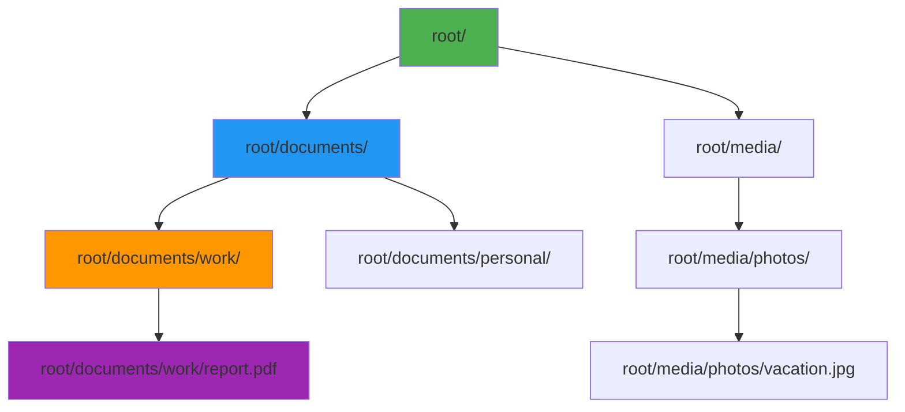
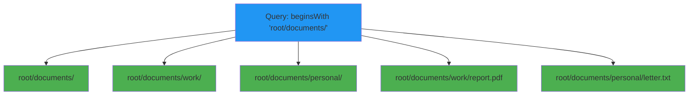

# Hierarchical pattern

## What is it?

The hierarchical pattern is designed for modeling tree-like structures with parent-child relationships in DynamoDB. This pattern uses path-based keys to represent hierarchical data, enabling efficient queries at any level of the hierarchy.

Common examples include:
- File systems and folder structures
- Organization charts
- Category trees
- Menu hierarchies
- Geographic locations (country > state > city)
- Product taxonomies

The pattern typically uses a format like: `root/parent/child/item` or composite keys with hierarchical components.

## Why is it important?

### Efficient hierarchical queries
Hierarchical keys enable querying at any level of the tree structure:

```typescript
// Query all items under a specific path
sk: { beginsWith: 'root/folder1/' }

// Query immediate children only
sk: { beginsWith: 'root/folder1/', not: { contains: '/' } }
```

### Natural tree representation
The pattern naturally represents tree structures in a way that's intuitive and easy to understand.

### Flexible depth
Unlike relational databases with fixed parent-child tables, this pattern supports arbitrary depth without schema changes.

### Ancestor queries
You can efficiently query all ancestors or descendants of any node in the hierarchy.

## Visual representation

**Hierarchical Structure**



### Query example

**Querying a Subtree**



## Implementation

The `@ddb-lib/core` package provides helper functions for working with hierarchical keys:

### Creating hierarchical keys

**Creating Hierarchical Keys**

```typescript
import { PatternHelpers } from '@ddb-lib/core'

// Create hierarchical path
const path1 = PatternHelpers.hierarchicalKey(['root', 'documents', 'work'])
console.log(path1) // 'root/documents/work'

// File in hierarchy
const path2 = PatternHelpers.hierarchicalKey([
  'root',
  'documents',
  'work',
  'report.pdf'
])
console.log(path2) // 'root/documents/work/report.pdf'

// Deep hierarchy
const path3 = PatternHelpers.hierarchicalKey([
  'company',
  'engineering',
  'backend',
  'team-a',
  'alice'
])
console.log(path3) // 'company/engineering/backend/team-a/alice'
```

### Parsing hierarchical keys

**Parsing Hierarchical Keys**

```typescript
import { PatternHelpers } from '@ddb-lib/core'

// Parse hierarchical path
const path = 'root/documents/work/report.pdf'
const parts = PatternHelpers.parseHierarchicalKey(path)
console.log(parts)
// ['root', 'documents', 'work', 'report.pdf']

// Extract parent path
const parentParts = parts.slice(0, -1)
const parentPath = PatternHelpers.hierarchicalKey(parentParts)
console.log(parentPath) // 'root/documents/work'

// Get item name
const itemName = parts[parts.length - 1]
console.log(itemName) // 'report.pdf'

// Get depth
const depth = parts.length
console.log(depth) // 4
```

### Using with TableClient

**Hierarchical Data with TableClient**

```typescript
import { TableClient } from '@ddb-lib/client'
import { PatternHelpers } from '@ddb-lib/core'

const table = new TableClient({
  tableName: 'FileSystem',
  partitionKey: 'pk',
  sortKey: 'sk'
})

// Store folder
await table.put({
  pk: 'FILESYSTEM',
  sk: PatternHelpers.hierarchicalKey(['root', 'documents']),
  type: 'folder',
  name: 'documents',
  createdAt: new Date().toISOString()
})

// Store file in folder
await table.put({
  pk: 'FILESYSTEM',
  sk: PatternHelpers.hierarchicalKey(['root', 'documents', 'report.pdf']),
  type: 'file',
  name: 'report.pdf',
  size: 1024000,
  createdAt: new Date().toISOString()
})

// Query all items under documents folder
const items = await table.query({
  keyCondition: {
    pk: 'FILESYSTEM',
    sk: { beginsWith: 'root/documents/' }
  }
})

// Query immediate children only (not recursive)
const children = await table.query({
  keyCondition: {
    pk: 'FILESYSTEM',
    sk: { beginsWith: 'root/documents/' }
  },
  filter: {
    // Filter to items with exactly one more level
    sk: { 
      not: { 
        contains: 'root/documents/' + '.*/.+' 
      } 
    }
  }
})
```

## Common use cases

### Use case 1: file system

**File System Implementation**

```typescript
import { PatternHelpers } from '@ddb-lib/core'

interface FileSystemItem {
  pk: string
  sk: string
  type: 'file' | 'folder'
  name: string
  size?: number
  mimeType?: string
  createdAt: string
  modifiedAt: string
}

// Create folder
async function createFolder(path: string[], name: string) {
  const fullPath = [...path, name]
  
  await table.put({
    pk: 'FILESYSTEM',
    sk: PatternHelpers.hierarchicalKey(fullPath),
    type: 'folder',
    name,
    createdAt: new Date().toISOString(),
    modifiedAt: new Date().toISOString()
  })
}

// Create file
async function createFile(
  path: string[],
  name: string,
  size: number,
  mimeType: string
) {
  const fullPath = [...path, name]
  
  await table.put({
    pk: 'FILESYSTEM',
    sk: PatternHelpers.hierarchicalKey(fullPath),
    type: 'file',
    name,
    size,
    mimeType,
    createdAt: new Date().toISOString(),
    modifiedAt: new Date().toISOString()
  })
}

// List folder contents
async function listFolder(path: string[]) {
  const folderPath = PatternHelpers.hierarchicalKey(path)
  
  const result = await table.query({
    keyCondition: {
      pk: 'FILESYSTEM',
      sk: { beginsWith: `${folderPath}/` }
    }
  })
  
  // Filter to immediate children only
  const depth = path.length + 1
  return result.items.filter(item => {
    const itemParts = PatternHelpers.parseHierarchicalKey(item.sk)
    return itemParts.length === depth
  })
}

// Get full path contents (recursive)
async function getPathContents(path: string[]) {
  const folderPath = PatternHelpers.hierarchicalKey(path)
  
  return await table.query({
    keyCondition: {
      pk: 'FILESYSTEM',
      sk: { beginsWith: `${folderPath}/` }
    }
  })
}

// Move item
async function moveItem(
  oldPath: string[],
  newPath: string[]
) {
  const oldKey = PatternHelpers.hierarchicalKey(oldPath)
  
  // Get item
  const item = await table.get({
    pk: 'FILESYSTEM',
    sk: oldKey
  })
  
  if (!item) {
    throw new Error('Item not found')
  }
  
  // Create at new location
  await table.put({
    ...item,
    sk: PatternHelpers.hierarchicalKey(newPath),
    modifiedAt: new Date().toISOString()
  })
  
  // Delete from old location
  await table.delete({
    pk: 'FILESYSTEM',
    sk: oldKey
  })
}
```

### Use case 2: organization chart

**Organization Hierarchy**

```typescript
import { PatternHelpers } from '@ddb-lib/core'

// Store employee in org hierarchy
async function addEmployee(
  orgPath: string[],
  employeeId: string,
  data: any
) {
  const fullPath = [...orgPath, employeeId]
  
  await table.put({
    pk: 'ORG',
    sk: PatternHelpers.hierarchicalKey(fullPath),
    employeeId,
    ...data,
    createdAt: new Date().toISOString()
  })
}

// Example: company/engineering/backend/team-a/alice
await addEmployee(
  ['company', 'engineering', 'backend', 'team-a'],
  'alice',
  {
    name: 'Alice Smith',
    title: 'Senior Engineer',
    email: 'alice@company.com'
  }
)

// Get all employees in engineering
const engineeringEmployees = await table.query({
  keyCondition: {
    pk: 'ORG',
    sk: { beginsWith: 'company/engineering/' }
  }
})

// Get direct reports for a manager
async function getDirectReports(managerPath: string[]) {
  const path = PatternHelpers.hierarchicalKey(managerPath)
  const result = await table.query({
    keyCondition: {
      pk: 'ORG',
      sk: { beginsWith: `${path}/` }
    }
  })
  
  // Filter to immediate children
  const depth = managerPath.length + 1
  return result.items.filter(item => {
    const parts = PatternHelpers.parseHierarchicalKey(item.sk)
    return parts.length === depth
  })
}

// Get org chart for a department
const backendTeam = await table.query({
  keyCondition: {
    pk: 'ORG',
    sk: { beginsWith: 'company/engineering/backend/' }
  }
})
```

### Use case 3: category tree

**Product Categories**

```typescript
import { PatternHelpers } from '@ddb-lib/core'

// Create category hierarchy
async function createCategory(
  path: string[],
  categoryData: any
) {
  await table.put({
    pk: 'CATEGORIES',
    sk: PatternHelpers.hierarchicalKey(path),
    ...categoryData,
    createdAt: new Date().toISOString()
  })
}

// Electronics > Computers > Laptops > Gaming
await createCategory(
  ['electronics', 'computers', 'laptops', 'gaming'],
  {
    name: 'Gaming Laptops',
    description: 'High-performance laptops for gaming'
  }
)

// Get all laptop categories
const laptopCategories = await table.query({
  keyCondition: {
    pk: 'CATEGORIES',
    sk: { beginsWith: 'electronics/computers/laptops/' }
  }
})

// Get breadcrumb trail
function getBreadcrumbs(path: string[]) {
  const breadcrumbs = []
  for (let i = 1; i <= path.length; i++) {
    const partialPath = path.slice(0, i)
    breadcrumbs.push({
      path: PatternHelpers.hierarchicalKey(partialPath),
      name: partialPath[partialPath.length - 1]
    })
  }
  return breadcrumbs
}

const breadcrumbs = getBreadcrumbs([
  'electronics',
  'computers',
  'laptops',
  'gaming'
])
// [
//   { path: 'electronics', name: 'electronics' },
//   { path: 'electronics/computers', name: 'computers' },
//   { path: 'electronics/computers/laptops', name: 'laptops' },
//   { path: 'electronics/computers/laptops/gaming', name: 'gaming' }
// ]
```

### Use case 4: geographic hierarchy

**Geographic Locations**

```typescript
import { PatternHelpers } from '@ddb-lib/core'

// Store location in hierarchy
async function addLocation(
  path: string[],
  locationData: any
) {
  await table.put({
    pk: 'LOCATIONS',
    sk: PatternHelpers.hierarchicalKey(path),
    ...locationData
  })
}

// Country > State > City > Neighborhood
await addLocation(
  ['usa', 'california', 'san-francisco', 'mission-district'],
  {
    name: 'Mission District',
    type: 'neighborhood',
    population: 60000
  }
)

// Get all locations in California
const californiaLocations = await table.query({
  keyCondition: {
    pk: 'LOCATIONS',
    sk: { beginsWith: 'usa/california/' }
  }
})

// Get all cities in California (not neighborhoods)
const californiaCities = californiaLocations.items.filter(item => {
  const parts = PatternHelpers.parseHierarchicalKey(item.sk)
  return parts.length === 3 // country/state/city
})

// Get parent location
async function getParentLocation(path: string[]) {
  if (path.length <= 1) {
    return null // No parent
  }
  
  const parentPath = path.slice(0, -1)
  return await table.get({
    pk: 'LOCATIONS',
    sk: PatternHelpers.hierarchicalKey(parentPath)
  })
}
```

## When to use

### ✅ use hierarchical pattern when:

- **Tree structures**: Your data naturally forms a tree or hierarchy
- **Path-based queries**: You need to query by path or subtree
- **Variable depth**: The hierarchy depth varies or is unknown
- **Ancestor/descendant queries**: You need to find all ancestors or descendants
- **Breadcrumb navigation**: You need to show the path to an item

### ❌ avoid hierarchical pattern when:

- **Flat structures**: Your data doesn't have hierarchical relationships
- **Many-to-many**: Items can have multiple parents (use adjacency list instead)
- **Frequent moves**: Items move frequently in the hierarchy (expensive to update)
- **Very deep trees**: Extremely deep hierarchies (>10 levels) become unwieldy

### ⚠️ considerations:

- **Path length limits**: DynamoDB has 2KB key size limit
- **Moving items**: Requires deleting and recreating (can't update keys)
- **Separator conflicts**: Ensure path components don't contain `/`
- **Immediate children**: Filtering immediate children requires additional logic

## Best practices

### 1. validate path components

```typescript
// ✅ Good: Validate before creating keys
function createPath(components: string[]): string {
  for (const component of components) {
    if (component.includes('/')) {
      throw new Error('Path components cannot contain /')
    }
    if (!component) {
      throw new Error('Path components cannot be empty')
    }
  }
  return PatternHelpers.hierarchicalKey(components)
}
```

### 2. store depth as attribute

```typescript
// ✅ Good: Store depth for efficient filtering
await table.put({
  pk: 'FILESYSTEM',
  sk: PatternHelpers.hierarchicalKey(path),
  depth: path.length, // Store depth
  type: 'folder',
  name: path[path.length - 1]
})

// Query immediate children efficiently
const children = await table.query({
  keyCondition: {
    pk: 'FILESYSTEM',
    sk: { beginsWith: 'root/documents/' }
  },
  filter: {
    depth: { eq: 3 } // Only depth 3 items
  }
})
```

### 3. use composite keys for multiple hierarchies

```typescript
// ✅ Good: Support multiple independent hierarchies
await table.put({
  pk: PatternHelpers.entityKey('USER', userId),
  sk: PatternHelpers.hierarchicalKey(['folders', 'work', 'projects']),
  type: 'folder'
})

// Each user has their own hierarchy
```

### 4. implement efficient move operations

```typescript
// ✅ Good: Batch move for subtrees
async function moveSubtree(
  oldPath: string[],
  newPath: string[]
) {
  const oldKey = PatternHelpers.hierarchicalKey(oldPath)
  
  // Get all items in subtree
  const items = await table.query({
    keyCondition: {
      pk: 'FILESYSTEM',
      sk: { beginsWith: `${oldKey}/` }
    }
  })
  
  // Batch write to new location
  const writes = items.items.map(item => {
    const oldParts = PatternHelpers.parseHierarchicalKey(item.sk)
    const relativeParts = oldParts.slice(oldPath.length)
    const newParts = [...newPath, ...relativeParts]
    
    return {
      put: {
        ...item,
        sk: PatternHelpers.hierarchicalKey(newParts)
      }
    }
  })
  
  await table.batchWrite(writes)
  
  // Batch delete old location
  const deletes = items.items.map(item => ({
    delete: {
      pk: item.pk,
      sk: item.sk
    }
  }))
  
  await table.batchWrite(deletes)
}
```

### 5. cache ancestor paths

```typescript
// ✅ Good: Store ancestor paths for efficient queries
await table.put({
  pk: 'FILESYSTEM',
  sk: PatternHelpers.hierarchicalKey(['root', 'docs', 'work', 'file.pdf']),
  type: 'file',
  ancestors: [
    'root',
    'root/docs',
    'root/docs/work'
  ] // Cache for efficient ancestor queries
})
```

## Performance considerations

### Query efficiency

```typescript
// ✅ Efficient: Query with beginsWith
await table.query({
  keyCondition: {
    pk: 'FILESYSTEM',
    sk: { beginsWith: 'root/documents/' }
  }
})

// ❌ Inefficient: Scan with filter
await table.scan({
  filter: {
    sk: { contains: 'documents' }
  }
})
```

### Limiting depth

```typescript
// ✅ Good: Limit hierarchy depth
const MAX_DEPTH = 10

function validateDepth(path: string[]) {
  if (path.length > MAX_DEPTH) {
    throw new Error(`Path depth exceeds maximum of ${MAX_DEPTH}`)
  }
}
```

## Related patterns

- [Composite Keys](composite-keys.md) - Build hierarchical keys
- [Adjacency List](adjacency-list.md) - For graph relationships
- [Entity Keys](entity-keys.md) - Partition hierarchies by entity
- [Multi-Attribute Keys](multi-attribute-keys/) - Complex hierarchical keys

## Additional resources

- [Query and Scan Guide](../guides/query-and-scan/)
- [Best Practices: Key Design](../best-practices/key-design.md)
- [Core Operations](../guides/core-operations/)
- [API Reference: PatternHelpers](../api/core#patternhelpers-class)
