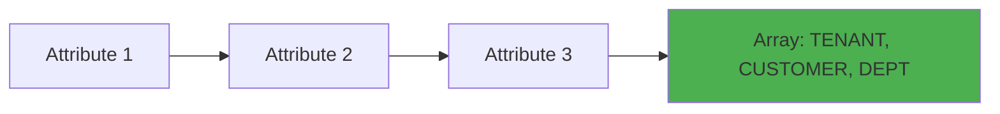
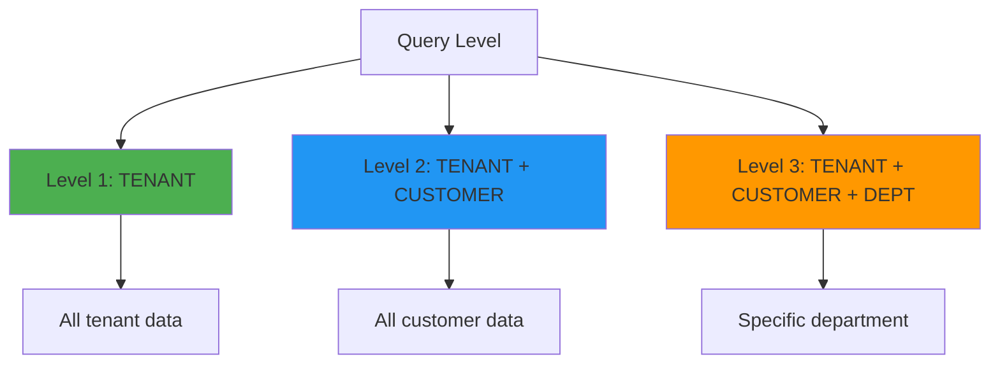

# Multi-attribute keys pattern

## What is it?

The multi-attribute keys pattern uses DynamoDB's native support for composite keys made up of multiple attribute values. Unlike string-based composite keys that concatenate values with delimiters, multi-attribute keys use arrays of values that DynamoDB handles natively.

This pattern is particularly powerful when combined with Global Secondary Indexes (GSIs) that support complex querying across multiple dimensions.

Key characteristics:
- Uses arrays of values: `['TENANT-123', 'CUSTOMER-456', 'DEPT-A']`
- Native DynamoDB support (no string parsing needed)
- Enables hierarchical queries at any level
- Type-safe with numbers, strings, and binary data

## Why is it important?

### Type safety
Multi-attribute keys preserve data types (strings, numbers, binary) without conversion, reducing errors and improving performance.

### Flexible querying
Query at any level of the hierarchy without string manipulation:
- Query all items for a tenant
- Query all items for a tenant + customer
- Query all items for a tenant + customer + department

### Better performance
DynamoDB handles multi-attribute keys natively, avoiding the overhead of string concatenation and parsing.

### Cleaner code
No need to manage delimiters, escaping, or parsing logic in your application code.

## Visual representation

**Multi-Attribute Key Structure**



### Hierarchical queries

**Query Flexibility**



## Implementation

The `@ddb-lib/core` package provides helper functions for working with multi-attribute keys:

### Creating multi-attribute keys

**Creating Multi-Attribute Keys**

```typescript
import { 
  multiAttributeKey,
  multiTenantKey,
  hierarchicalMultiKey,
  timeSeriesMultiKey,
  locationMultiKey
} from '@ddb-lib/core'

// Generic multi-attribute key
const key1 = multiAttributeKey('TENANT-123', 'CUSTOMER-456', 'DEPT-A')
console.log(key1) // ['TENANT-123', 'CUSTOMER-456', 'DEPT-A']

// Multi-tenant key
const key2 = multiTenantKey('TENANT-123', 'CUSTOMER-456')
console.log(key2) // ['TENANT-123', 'CUSTOMER-456']

// With department
const key3 = multiTenantKey('TENANT-123', 'CUSTOMER-456', 'DEPT-A')
console.log(key3) // ['TENANT-123', 'CUSTOMER-456', 'DEPT-A']

// Hierarchical key
const key4 = hierarchicalMultiKey('USA', 'CA', 'San Francisco', 'SOMA')
console.log(key4) // ['USA', 'CA', 'San Francisco', 'SOMA']

// Time-series with category
const key5 = timeSeriesMultiKey('ERROR', new Date('2024-12-01'))
console.log(key5) // ['ERROR', 1733011200000]

// Location-based key
const key6 = locationMultiKey('USA', 'CA', 'San Francisco')
console.log(key6) // ['USA', 'CA', 'San Francisco']
```

### Using with TableClient

**Multi-Attribute Keys with TableClient**

```typescript
import { TableClient } from '@ddb-lib/client'
import { multiTenantKey } from '@ddb-lib/core'

const table = new TableClient({
  tableName: 'MultiTenantData',
  partitionKey: 'pk',
  sortKey: 'sk'
})

// Store item with multi-attribute key
await table.put({
  pk: multiTenantKey('TENANT-123', 'CUSTOMER-456'),
  sk: 'ORDER#2024-001',
  orderData: {
    total: 99.99,
    items: ['item1', 'item2']
  }
})

// Query all orders for a customer
const customerOrders = await table.query({
  keyCondition: {
    pk: multiTenantKey('TENANT-123', 'CUSTOMER-456'),
    sk: { beginsWith: 'ORDER#' }
  }
})

// With department level
await table.put({
  pk: multiTenantKey('TENANT-123', 'CUSTOMER-456', 'DEPT-A'),
  sk: 'INVOICE#2024-001',
  invoiceData: {
    amount: 1500.00
  }
})
```

### GSI configuration for multi-attribute keys

**GSI with Multi-Attribute Keys**

```typescript
// Table schema with multi-attribute GSI
const tableSchema = {
  tableName: 'Products',
  partitionKey: 'pk',
  sortKey: 'sk',
  globalSecondaryIndexes: [
    {
      indexName: 'CategoryIndex',
      partitionKey: 'gsi1pk',  // Multi-attribute: [category, subcategory, brand]
      sortKey: 'gsi1sk',       // Price or other sort attribute
      projectionType: 'ALL'
    },
    {
      indexName: 'LocationIndex',
      partitionKey: 'gsi2pk',  // Multi-attribute: [country, state, city]
      sortKey: 'gsi2sk',       // Timestamp or other sort attribute
      projectionType: 'ALL'
    }
  ]
}
```

## Common use cases

### Use case 1: multi-tenant saas application

**Multi-Tenant Data Isolation**

```typescript
import { multiTenantKey } from '@ddb-lib/core'

// Store tenant-specific data
async function createOrder(
  tenantId: string,
  customerId: string,
  orderData: any
) {
  await table.put({
    pk: multiTenantKey(tenantId, customerId),
    sk: `ORDER#${orderData.orderId}`,
    ...orderData,
    createdAt: new Date().toISOString()
  })
}

// Query all orders for a customer
async function getCustomerOrders(
  tenantId: string,
  customerId: string
) {
  return await table.query({
    keyCondition: {
      pk: multiTenantKey(tenantId, customerId),
      sk: { beginsWith: 'ORDER#' }
    }
  })
}

// Query all data for a tenant (across all customers)
// Requires GSI with tenant as partition key
async function getTenantData(tenantId: string) {
  return await table.query({
    indexName: 'TenantIndex',
    keyCondition: {
      gsi1pk: tenantId
    }
  })
}

// Department-level isolation
async function createDepartmentDocument(
  tenantId: string,
  customerId: string,
  departmentId: string,
  documentData: any
) {
  await table.put({
    pk: multiTenantKey(tenantId, customerId, departmentId),
    sk: `DOC#${documentData.documentId}`,
    ...documentData
  })
}

// Query department documents
async function getDepartmentDocuments(
  tenantId: string,
  customerId: string,
  departmentId: string
) {
  return await table.query({
    keyCondition: {
      pk: multiTenantKey(tenantId, customerId, departmentId),
      sk: { beginsWith: 'DOC#' }
    }
  })
}
```

### Use case 2: geographic hierarchy

**Location-Based Queries**

```typescript
import { locationMultiKey } from '@ddb-lib/core'

// Store location-based data
async function createStore(
  country: string,
  state: string,
  city: string,
  storeData: any
) {
  await table.put({
    pk: locationMultiKey(country, state, city),
    sk: `STORE#${storeData.storeId}`,
    ...storeData,
    // GSI for querying by different levels
    gsi1pk: locationMultiKey(country),
    gsi1sk: `${state}#${city}#${storeData.storeId}`,
    gsi2pk: locationMultiKey(country, state),
    gsi2sk: `${city}#${storeData.storeId}`
  })
}

// Query all stores in a city
async function getCityStores(
  country: string,
  state: string,
  city: string
) {
  return await table.query({
    keyCondition: {
      pk: locationMultiKey(country, state, city),
      sk: { beginsWith: 'STORE#' }
    }
  })
}

// Query all stores in a state
async function getStateStores(
  country: string,
  state: string
) {
  return await table.query({
    indexName: 'StateIndex',
    keyCondition: {
      gsi2pk: locationMultiKey(country, state)
    }
  })
}

// Query all stores in a country
async function getCountryStores(country: string) {
  return await table.query({
    indexName: 'CountryIndex',
    keyCondition: {
      gsi1pk: locationMultiKey(country)
    }
  })
}

// Aggregate sales by region
async function getRegionalSales(
  country: string,
  state?: string,
  city?: string
) {
  let stores
  
  if (city && state) {
    stores = await getCityStores(country, state, city)
  } else if (state) {
    stores = await getStateStores(country, state)
  } else {
    stores = await getCountryStores(country)
  }
  
  return stores.items.reduce((total, store) => {
    return total + (store.totalSales || 0)
  }, 0)
}
```

### Use case 3: product catalog with categories

**Product Categorization**

```typescript
import { productCategoryMultiKey } from '@ddb-lib/core'

// Store product with category hierarchy
async function createProduct(productData: any) {
  await table.put({
    pk: `PRODUCT#${productData.productId}`,
    sk: `PRODUCT#${productData.productId}`,
    ...productData,
    // GSI for category queries
    gsi1pk: productCategoryMultiKey(
      productData.category,
      productData.subcategory,
      productData.brand
    ),
    gsi1sk: productData.price
  })
}

// Query products by category
async function getProductsByCategory(category: string) {
  return await table.query({
    indexName: 'CategoryIndex',
    keyCondition: {
      gsi1pk: productCategoryMultiKey(category)
    }
  })
}

// Query products by category and subcategory
async function getProductsBySubcategory(
  category: string,
  subcategory: string
) {
  return await table.query({
    indexName: 'CategoryIndex',
    keyCondition: {
      gsi1pk: productCategoryMultiKey(category, subcategory)
    }
  })
}

// Query products by brand within subcategory
async function getProductsByBrand(
  category: string,
  subcategory: string,
  brand: string
) {
  return await table.query({
    indexName: 'CategoryIndex',
    keyCondition: {
      gsi1pk: productCategoryMultiKey(category, subcategory, brand)
    }
  })
}

// Query products by price range within category
async function getProductsByPriceRange(
  category: string,
  minPrice: number,
  maxPrice: number
) {
  return await table.query({
    indexName: 'CategoryIndex',
    keyCondition: {
      gsi1pk: productCategoryMultiKey(category),
      gsi1sk: { between: [minPrice, maxPrice] }
    }
  })
}
```

### Use case 4: time-series with categories

**Categorized Time-Series Data**

```typescript
import { timeSeriesMultiKey } from '@ddb-lib/core'

// Store log entry with category
async function logEvent(
  category: string,
  subcategory: string,
  eventData: any
) {
  const timestamp = new Date()
  
  await table.put({
    pk: timeSeriesMultiKey(category, timestamp, subcategory),
    sk: `EVENT#${eventData.eventId}`,
    ...eventData,
    timestamp: timestamp.toISOString()
  })
}

// Query all errors
async function getErrorLogs(
  startTime: Date,
  endTime: Date
) {
  return await table.query({
    keyCondition: {
      pk: timeSeriesMultiKey('ERROR', startTime),
      // Range query on timestamp component
    }
  })
}

// Query specific error subcategory
async function getDatabaseErrors(
  startTime: Date,
  endTime: Date
) {
  return await table.query({
    keyCondition: {
      pk: timeSeriesMultiKey('ERROR', startTime, 'DATABASE')
    }
  })
}

// Aggregate errors by subcategory
async function getErrorStats(
  startTime: Date,
  endTime: Date
) {
  const errors = await getErrorLogs(startTime, endTime)
  const stats = new Map()
  
  for (const error of errors.items) {
    const subcategory = error.pk[2] // Third element is subcategory
    const count = stats.get(subcategory) || 0
    stats.set(subcategory, count + 1)
  }
  
  return Array.from(stats.entries())
    .map(([subcategory, count]) => ({ subcategory, count }))
    .sort((a, b) => b.count - a.count)
}
```

### Use case 5: version management

**Document Versioning**

```typescript
import { versionMultiKey } from '@ddb-lib/core'

// Store document version
async function createDocumentVersion(
  documentId: string,
  major: number,
  minor: number,
  patch: number,
  content: any
) {
  await table.put({
    pk: `DOCUMENT#${documentId}`,
    sk: versionMultiKey(major, minor, patch),
    content,
    createdAt: new Date().toISOString()
  })
}

// Get specific version
async function getDocumentVersion(
  documentId: string,
  major: number,
  minor: number,
  patch: number
) {
  return await table.get({
    pk: `DOCUMENT#${documentId}`,
    sk: versionMultiKey(major, minor, patch)
  })
}

// Get all versions for a major release
async function getMajorVersions(
  documentId: string,
  major: number
) {
  return await table.query({
    keyCondition: {
      pk: `DOCUMENT#${documentId}`,
      sk: { beginsWith: versionMultiKey(major) }
    }
  })
}

// Get latest version
async function getLatestVersion(documentId: string) {
  const result = await table.query({
    keyCondition: {
      pk: `DOCUMENT#${documentId}`
    },
    scanIndexForward: false, // Descending order
    limit: 1
  })
  
  return result.items[0]
}

// Get all versions between two versions
async function getVersionRange(
  documentId: string,
  fromVersion: [number, number, number],
  toVersion: [number, number, number]
) {
  return await table.query({
    keyCondition: {
      pk: `DOCUMENT#${documentId}`,
      sk: {
        between: [
          versionMultiKey(...fromVersion),
          versionMultiKey(...toVersion)
        ]
      }
    }
  })
}
```

## When to use

### ✅ use multi-attribute keys when:

- **Hierarchical data**: Data naturally forms a hierarchy
- **Multi-tenant applications**: Need tenant/customer/department isolation
- **Geographic queries**: Querying by country/state/city
- **Category hierarchies**: Product catalogs, taxonomies
- **Version management**: Semantic versioning, document versions
- **Type preservation**: Need to preserve number types for sorting

### ❌ avoid multi-attribute keys when:

- **Simple keys**: Single attribute is sufficient
- **String-only data**: No benefit over composite string keys
- **Legacy systems**: Existing system uses string-based keys
- **Simple queries**: Don't need hierarchical querying

### ⚠️ considerations:

- **GSI design**: Plan GSIs carefully for different query levels
- **Array handling**: Ensure your client library supports multi-attribute keys
- **Migration**: Converting from string keys requires data migration
- **Complexity**: More complex than simple string keys

## Best practices

### 1. use type-specific helpers

```typescript
// ✅ Good: Use specific helpers for clarity
const tenantKey = multiTenantKey('TENANT-123', 'CUSTOMER-456')
const locationKey = locationMultiKey('USA', 'CA', 'SF')
const versionKey = versionMultiKey(2, 1, 5)

// ❌ Bad: Generic arrays without context
const key1 = ['TENANT-123', 'CUSTOMER-456']
const key2 = ['USA', 'CA', 'SF']
const key3 = [2, 1, 5]
```

### 2. design gsis for each query level

```typescript
// ✅ Good: GSIs for different hierarchy levels
await table.put({
  pk: multiTenantKey(tenantId, customerId, deptId),
  sk: itemId,
  // Query by tenant
  gsi1pk: tenantId,
  gsi1sk: `${customerId}#${deptId}#${itemId}`,
  // Query by tenant + customer
  gsi2pk: multiTenantKey(tenantId, customerId),
  gsi2sk: `${deptId}#${itemId}`
})
```

### 3. document key structure

```typescript
// ✅ Good: Document multi-attribute key structure
/**
 * Partition Key Structure:
 * - Level 1: Tenant ID
 * - Level 2: Customer ID
 * - Level 3: Department ID (optional)
 * 
 * Example: ['TENANT-123', 'CUSTOMER-456', 'DEPT-A']
 * 
 * Query Patterns:
 * - All tenant data: GSI1 with tenantId
 * - All customer data: GSI2 with [tenantId, customerId]
 * - Department data: PK with [tenantId, customerId, deptId]
 */
```

### 4. handle optional levels consistently

```typescript
// ✅ Good: Consistent handling of optional levels
function createKey(
  tenantId: string,
  customerId: string,
  deptId?: string
) {
  return multiTenantKey(tenantId, customerId, deptId)
}

// Returns ['TENANT-123', 'CUSTOMER-456'] or
//         ['TENANT-123', 'CUSTOMER-456', 'DEPT-A']
```

### 5. use numbers for sortable values

```typescript
// ✅ Good: Use numbers for proper sorting
const key = timeSeriesMultiKey('ERROR', timestamp.getTime())
// Sorts correctly: 1733011200000 < 1733097600000

const versionKey = versionMultiKey(2, 1, 5)
// Sorts correctly: [2,1,5] < [2,2,0]

// ❌ Bad: String timestamps don't sort correctly
const key = ['ERROR', timestamp.toString()]
```

## Performance considerations

### Query efficiency

```typescript
// ✅ Efficient: Direct query with multi-attribute key
await table.query({
  keyCondition: {
    pk: multiTenantKey('TENANT-123', 'CUSTOMER-456')
  }
})

// ✅ Efficient: Hierarchical query with GSI
await table.query({
  indexName: 'TenantIndex',
  keyCondition: {
    gsi1pk: 'TENANT-123'
  }
})
```

### Storage efficiency

```typescript
// Multi-attribute keys are stored efficiently by DynamoDB
// No overhead from delimiters or string concatenation
// Numbers stored as numbers (not strings)
```

## Related patterns

- [Composite Keys](composite-keys.md) - String-based alternative
- [Hierarchical](hierarchical.md) - Tree structures
- [Entity Keys](entity-keys.md) - Simple entity identification
- [Time-Series](time-series.md) - Time-based data

## Additional resources

- [Multi-Attribute Keys Guide](../guides/multi-attribute-keys/)
- [Query and Scan Guide](../guides/query-and-scan/)
- [Best Practices: Key Design](../best-practices/key-design.md)
- [API Reference: Multi-Attribute Key Helpers](../api/core#multi-attribute-key-helpers)
