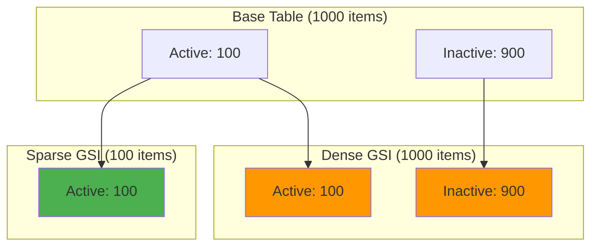
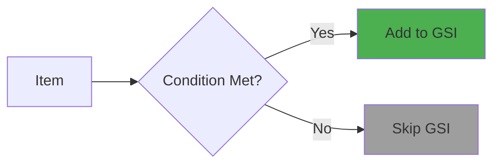

# Sparse indexes pattern

## What is it?

The sparse indexes pattern creates Global Secondary Indexes (GSIs) that only contain a subset of items from the base table. This is achieved by conditionally setting GSI key attributes only when certain criteria are met. Items without GSI keys don't appear in the index.

For example:
- Only index items where `status = 'ACTIVE'`
- Only index items where `isPremium = true`
- Only index items where `emailVerified = true`

This pattern leverages DynamoDB's behavior: items are only included in a GSI if they have values for both the GSI partition key and sort key (if defined).

## Why is it important?

### Reduced storage costs
Sparse indexes only store relevant items, reducing GSI storage costs significantly.

### Improved query performance
Smaller indexes mean faster queries and less data to scan.

### Efficient filtering
Instead of querying all items and filtering, the index only contains items that match your criteria.

### Lower write costs
Items that don't meet the criteria don't consume write capacity on the GSI.

## Visual representation

**Dense vs Sparse Index**



### Conditional indexing

**Sparse Index Creation**



## Implementation

The `@ddb-lib/core` package provides helper functions for working with sparse indexes:

### Creating sparse index values

**Creating Sparse Index Values**

```typescript
import { PatternHelpers } from '@ddb-lib/core'

// Only set GSI key if condition is true
const user = {
  pk: 'USER#123',
  sk: 'USER#123',
  email: 'alice@example.com',
  emailVerified: true,
  isPremium: false
}

// Sparse index for verified users
user.gsi1pk = PatternHelpers.sparseIndexValue(
  user.emailVerified,
  'VERIFIED_USER'
)
// Returns: 'VERIFIED_USER' (because emailVerified is true)

// Sparse index for premium users
user.gsi2pk = PatternHelpers.sparseIndexValue(
  user.isPremium,
  'PREMIUM_USER'
)
// Returns: undefined (because isPremium is false)

console.log(user)
// {
//   pk: 'USER#123',
//   sk: 'USER#123',
//   email: 'alice@example.com',
//   emailVerified: true,
//   isPremium: false,
//   gsi1pk: 'VERIFIED_USER',  // Included in GSI1
//   gsi2pk: undefined          // NOT included in GSI2
// }
```

### Table schema with sparse indexes

**Table Schema Definition**

```typescript
// DynamoDB table with sparse GSIs
const tableSchema = {
  tableName: 'Users',
  partitionKey: 'pk',
  sortKey: 'sk',
  globalSecondaryIndexes: [
    {
      indexName: 'VerifiedUsersIndex',
      partitionKey: 'gsi1pk',  // Only set for verified users
      sortKey: 'gsi1sk',
      projectionType: 'ALL'
    },
    {
      indexName: 'PremiumUsersIndex',
      partitionKey: 'gsi2pk',  // Only set for premium users
      sortKey: 'gsi2sk',
      projectionType: 'ALL'
    },
    {
      indexName: 'ActiveOrdersIndex',
      partitionKey: 'gsi3pk',  // Only set for active orders
      sortKey: 'gsi3sk',
      projectionType: 'KEYS_ONLY'
    }
  ]
}
```

### Using sparse indexes with TableClient

**Sparse Indexes with TableClient**

```typescript
import { TableClient } from '@ddb-lib/client'
import { PatternHelpers } from '@ddb-lib/core'

const table = new TableClient({
  tableName: 'Users',
  partitionKey: 'pk',
  sortKey: 'sk'
})

// Create user with sparse index values
async function createUser(userData: any) {
  await table.put({
    pk: PatternHelpers.entityKey('USER', userData.id),
    sk: PatternHelpers.entityKey('USER', userData.id),
    ...userData,
    // Sparse index: only verified users
    gsi1pk: PatternHelpers.sparseIndexValue(
      userData.emailVerified,
      'VERIFIED_USER'
    ),
    gsi1sk: userData.email,
    // Sparse index: only premium users
    gsi2pk: PatternHelpers.sparseIndexValue(
      userData.isPremium,
      'PREMIUM_USER'
    ),
    gsi2sk: userData.createdAt
  })
}

// Query verified users (only queries sparse index)
async function getVerifiedUsers() {
  return await table.query({
    indexName: 'VerifiedUsersIndex',
    keyCondition: {
      gsi1pk: 'VERIFIED_USER'
    }
  })
}

// Query premium users
async function getPremiumUsers() {
  return await table.query({
    indexName: 'PremiumUsersIndex',
    keyCondition: {
      gsi2pk: 'PREMIUM_USER'
    }
  })
}

// Update user to add to sparse index
async function verifyUserEmail(userId: string) {
  await table.update({
    key: {
      pk: PatternHelpers.entityKey('USER', userId),
      sk: PatternHelpers.entityKey('USER', userId)
    },
    updates: {
      emailVerified: { set: true },
      gsi1pk: { set: 'VERIFIED_USER' },  // Add to sparse index
      gsi1sk: { set: 'user@example.com' }
    }
  })
}

// Update user to remove from sparse index
async function cancelPremium(userId: string) {
  await table.update({
    key: {
      pk: PatternHelpers.entityKey('USER', userId),
      sk: PatternHelpers.entityKey('USER', userId)
    },
    updates: {
      isPremium: { set: false },
      gsi2pk: { remove: true },  // Remove from sparse index
      gsi2sk: { remove: true }
    }
  })
}
```

## Common use cases

### Use case 1: active items only

**Index Only Active Orders**

```typescript
import { PatternHelpers } from '@ddb-lib/core'

// Create order with sparse index
async function createOrder(orderData: any) {
  const isActive = ['pending', 'processing'].includes(orderData.status)
  
  await table.put({
    pk: PatternHelpers.entityKey('USER', orderData.userId),
    sk: PatternHelpers.entityKey('ORDER', orderData.orderId),
    ...orderData,
    // Only index active orders
    gsi1pk: PatternHelpers.sparseIndexValue(
      isActive,
      PatternHelpers.entityKey('USER', orderData.userId)
    ),
    gsi1sk: orderData.createdAt
  })
}

// Query only active orders (sparse index)
async function getActiveOrders(userId: string) {
  return await table.query({
    indexName: 'ActiveOrdersIndex',
    keyCondition: {
      gsi1pk: PatternHelpers.entityKey('USER', userId)
    }
  })
}

// Update order status (remove from sparse index when completed)
async function completeOrder(userId: string, orderId: string) {
  await table.update({
    key: {
      pk: PatternHelpers.entityKey('USER', userId),
      sk: PatternHelpers.entityKey('ORDER', orderId)
    },
    updates: {
      status: { set: 'completed' },
      completedAt: { set: new Date().toISOString() },
      gsi1pk: { remove: true },  // Remove from active orders index
      gsi1sk: { remove: true }
    }
  })
}
```

### Use case 2: expiring items

**Index Items Expiring Soon**

```typescript
import { PatternHelpers } from '@ddb-lib/core'

// Create subscription with sparse index for expiring items
async function createSubscription(subscriptionData: any) {
  const expiresAt = new Date(subscriptionData.expiresAt)
  const now = new Date()
  const daysUntilExpiry = (expiresAt.getTime() - now.getTime()) / (1000 * 60 * 60 * 24)
  
  // Only index if expiring within 30 days
  const isExpiringSoon = daysUntilExpiry > 0 && daysUntilExpiry <= 30
  
  await table.put({
    pk: PatternHelpers.entityKey('USER', subscriptionData.userId),
    sk: PatternHelpers.entityKey('SUBSCRIPTION', subscriptionData.id),
    ...subscriptionData,
    // Sparse index for expiring subscriptions
    gsi1pk: PatternHelpers.sparseIndexValue(
      isExpiringSoon,
      'EXPIRING_SOON'
    ),
    gsi1sk: subscriptionData.expiresAt
  })
}

// Query subscriptions expiring soon
async function getExpiringSoonSubscriptions() {
  return await table.query({
    indexName: 'ExpiringSubscriptionsIndex',
    keyCondition: {
      gsi1pk: 'EXPIRING_SOON'
    }
  })
}

// Send renewal reminders
async function sendRenewalReminders() {
  const expiring = await getExpiringSoonSubscriptions()
  
  for (const subscription of expiring.items) {
    await sendEmail({
      to: subscription.userEmail,
      subject: 'Your subscription is expiring soon',
      body: `Your subscription expires on ${subscription.expiresAt}`
    })
  }
}
```

### Use case 3: feature flags

**Index Users with Feature Enabled**

```typescript
import { PatternHelpers } from '@ddb-lib/core'

// Create user with feature flags
async function createUserWithFeatures(userData: any) {
  await table.put({
    pk: PatternHelpers.entityKey('USER', userData.id),
    sk: PatternHelpers.entityKey('USER', userData.id),
    ...userData,
    features: {
      betaAccess: false,
      advancedAnalytics: true,
      apiAccess: false
    },
    // Sparse index for beta users
    gsi1pk: PatternHelpers.sparseIndexValue(
      userData.features.betaAccess,
      'BETA_USER'
    ),
    gsi1sk: userData.id,
    // Sparse index for analytics users
    gsi2pk: PatternHelpers.sparseIndexValue(
      userData.features.advancedAnalytics,
      'ANALYTICS_USER'
    ),
    gsi2sk: userData.id
  })
}

// Query all beta users
async function getBetaUsers() {
  return await table.query({
    indexName: 'BetaUsersIndex',
    keyCondition: {
      gsi1pk: 'BETA_USER'
    }
  })
}

// Enable feature for user (add to sparse index)
async function enableFeature(userId: string, feature: string) {
  const indexMapping = {
    betaAccess: { pk: 'gsi1pk', value: 'BETA_USER' },
    advancedAnalytics: { pk: 'gsi2pk', value: 'ANALYTICS_USER' }
  }
  
  const index = indexMapping[feature]
  
  await table.update({
    key: {
      pk: PatternHelpers.entityKey('USER', userId),
      sk: PatternHelpers.entityKey('USER', userId)
    },
    updates: {
      [`features.${feature}`]: { set: true },
      [index.pk]: { set: index.value },
      [`${index.pk.replace('pk', 'sk')}`]: { set: userId }
    }
  })
}
```

### Use case 4: priority items

**Index High-Priority Items Only**

```typescript
import { PatternHelpers } from '@ddb-lib/core'

// Create support ticket with sparse index for high priority
async function createTicket(ticketData: any) {
  const isHighPriority = ['urgent', 'critical'].includes(ticketData.priority)
  
  await table.put({
    pk: PatternHelpers.entityKey('CUSTOMER', ticketData.customerId),
    sk: PatternHelpers.entityKey('TICKET', ticketData.id),
    ...ticketData,
    // Only index high-priority tickets
    gsi1pk: PatternHelpers.sparseIndexValue(
      isHighPriority,
      'HIGH_PRIORITY'
    ),
    gsi1sk: ticketData.createdAt
  })
}

// Query high-priority tickets across all customers
async function getHighPriorityTickets() {
  return await table.query({
    indexName: 'HighPriorityIndex',
    keyCondition: {
      gsi1pk: 'HIGH_PRIORITY'
    }
  })
}

// Dashboard: show urgent tickets
async function getUrgentTicketsDashboard() {
  const tickets = await getHighPriorityTickets()
  
  return tickets.items
    .sort((a, b) => 
      new Date(a.createdAt).getTime() - new Date(b.createdAt).getTime()
    )
    .slice(0, 20) // Top 20 oldest urgent tickets
}

// Escalate ticket (add to sparse index)
async function escalateTicket(customerId: string, ticketId: string) {
  await table.update({
    key: {
      pk: PatternHelpers.entityKey('CUSTOMER', customerId),
      sk: PatternHelpers.entityKey('TICKET', ticketId)
    },
    updates: {
      priority: { set: 'urgent' },
      gsi1pk: { set: 'HIGH_PRIORITY' },
      gsi1sk: { set: new Date().toISOString() }
    }
  })
}
```

## When to use

### ✅ use sparse indexes when:

- **Subset queries**: You frequently query a small subset of items
- **Status-based filtering**: Querying by status (active, pending, etc.)
- **Feature flags**: Finding users with specific features enabled
- **Time-based filtering**: Items expiring soon, recently updated, etc.
- **Priority filtering**: High-priority items, VIP users, etc.
- **Cost optimization**: Reducing GSI storage and write costs

### ❌ avoid sparse indexes when:

- **Most items match**: If >50% of items meet the criteria, use a dense index
- **Criteria changes frequently**: High update costs to add/remove from index
- **Multiple criteria**: Need to query by many different conditions (use filter expressions)
- **Simple queries**: Base table queries are sufficient

### ⚠️ considerations:

- **Update complexity**: Adding/removing items from sparse index requires updates
- **Index maintenance**: Must remember to update GSI keys when conditions change
- **Query patterns**: Design sparse indexes based on your most common queries
- **Projection**: Consider KEYS_ONLY or INCLUDE projections to reduce costs further

## Best practices

### 1. use descriptive index values

```typescript
// ✅ Good: Clear, descriptive values
gsi1pk: PatternHelpers.sparseIndexValue(
  user.emailVerified,
  'VERIFIED_USER'
)

gsi2pk: PatternHelpers.sparseIndexValue(
  order.status === 'pending',
  'PENDING_ORDER'
)

// ❌ Bad: Unclear values
gsi1pk: PatternHelpers.sparseIndexValue(user.emailVerified, 'V')
gsi2pk: PatternHelpers.sparseIndexValue(order.status === 'pending', '1')
```

### 2. document sparse index criteria

```typescript
// ✅ Good: Document what items are indexed
/**
 * GSI1: VerifiedUsersIndex
 * Includes: Users where emailVerified === true
 * Purpose: Query all verified users efficiently
 * Keys: gsi1pk = 'VERIFIED_USER', gsi1sk = email
 */

/**
 * GSI2: ActiveOrdersIndex
 * Includes: Orders where status in ['pending', 'processing']
 * Purpose: Query active orders without scanning completed orders
 * Keys: gsi2pk = USER#{userId}, gsi2sk = createdAt
 */
```

### 3. use transactions for consistency

```typescript
// ✅ Good: Use transactions when updating sparse index
async function updateOrderStatus(
  userId: string,
  orderId: string,
  newStatus: string
) {
  const isActive = ['pending', 'processing'].includes(newStatus)
  
  await table.transactWrite([
    {
      update: {
        key: {
          pk: PatternHelpers.entityKey('USER', userId),
          sk: PatternHelpers.entityKey('ORDER', orderId)
        },
        updates: {
          status: { set: newStatus },
          gsi1pk: isActive 
            ? { set: PatternHelpers.entityKey('USER', userId) }
            : { remove: true },
          gsi1sk: isActive
            ? { set: new Date().toISOString() }
            : { remove: true }
        }
      }
    }
  ])
}
```

### 4. combine with other patterns

```typescript
// ✅ Good: Combine sparse indexes with other patterns
await table.put({
  pk: PatternHelpers.entityKey('USER', userId),
  sk: PatternHelpers.entityKey('ORDER', orderId),
  status: 'pending',
  createdAt: new Date().toISOString(),
  // Sparse index for active orders
  gsi1pk: 'ACTIVE_ORDER',
  gsi1sk: PatternHelpers.compositeKey([
    PatternHelpers.timeSeriesKey(new Date(), 'day'),
    orderId
  ]),
  // TTL for automatic cleanup
  ttl: PatternHelpers.ttlTimestamp(
    new Date(Date.now() + 90 * 24 * 60 * 60 * 1000)
  )
})
```

### 5. monitor index size

```typescript
// ✅ Good: Monitor sparse index effectiveness
async function analyzeIndexEfficiency() {
  // Count items in base table
  const baseCount = await table.scan({ select: 'COUNT' })
  
  // Count items in sparse index
  const indexCount = await table.query({
    indexName: 'VerifiedUsersIndex',
    keyCondition: { gsi1pk: 'VERIFIED_USER' },
    select: 'COUNT'
  })
  
  const percentage = (indexCount.count / baseCount.count) * 100
  
  console.log(`Sparse index contains ${percentage.toFixed(2)}% of items`)
  
  if (percentage > 50) {
    console.warn('Consider using a dense index instead')
  }
}
```

## Performance considerations

### Storage costs

```typescript
// Sparse index: Only 10% of items
// Base table: 1M items = $0.25/GB/month
// Sparse GSI: 100K items = $0.025/GB/month
// Savings: 90% reduction in GSI storage costs

// Dense index: All items
// Base table: 1M items = $0.25/GB/month
// Dense GSI: 1M items = $0.25/GB/month
// Total: 2x storage costs
```

### Write costs

```typescript
// Sparse index: Only writes when condition is met
// If 10% of items meet criteria:
// - 90% of writes: 1 WCU (base table only)
// - 10% of writes: 2 WCU (base table + GSI)
// Average: 1.1 WCU per write

// Dense index: Always writes to GSI
// All writes: 2 WCU (base table + GSI)
```

### Query performance

```typescript
// ✅ Sparse index: Query 100K items
const result = await table.query({
  indexName: 'VerifiedUsersIndex',
  keyCondition: { gsi1pk: 'VERIFIED_USER' }
})

// ❌ Dense index with filter: Scan 1M items, return 100K
const result = await table.query({
  indexName: 'AllUsersIndex',
  keyCondition: { gsi1pk: 'USER' },
  filter: { emailVerified: { eq: true } }
})
// Consumes 10x more RCU!
```

## Related patterns

- [Entity Keys](entity-keys.md) - Foundation for sparse index keys
- [Composite Keys](composite-keys.md) - Use in sparse index sort keys
- [Time-Series](time-series.md) - Combine with sparse indexes
- [Hot Partition Distribution](hot-partition-distribution.md) - Alternative for high-volume queries

## Additional resources

- [Best Practices: Capacity Planning](../best-practices/capacity-planning.md)
- [Query and Scan Guide](../guides/query-and-scan/)
- [Core Operations](../guides/core-operations/)
- [API Reference: PatternHelpers](../api/core#patternhelpers-class)
