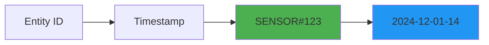
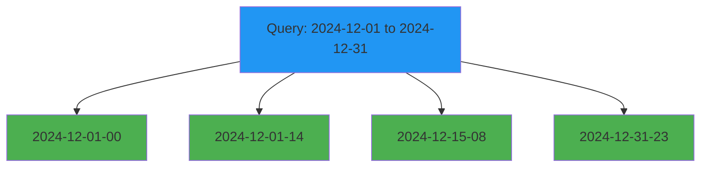

# Time-series pattern

## What is it?

The time-series pattern is designed for storing and querying data that is naturally ordered by time. This pattern uses time-based sort keys to enable efficient range queries across different time granularities (hour, day, month, year).

Common examples include:
- Application logs and events
- Sensor readings and IoT data
- User activity tracking
- Financial transactions
- Metrics and monitoring data

The pattern typically uses a format like: `{year}-{month}-{day}-{hour}` or `{timestamp}#{id}`

## Why is it important?

### Efficient time-range queries
Time-series keys enable efficient queries for specific time ranges without scanning the entire dataset:

```typescript
// Query all events in December 2024
sk: { between: ['2024-12-01', '2024-12-31'] }

// Query events in a specific hour
sk: { beginsWith: '2024-12-01-14' }
```

### Natural sort order
DynamoDB automatically sorts items by sort key, so time-series data is naturally ordered chronologically, making it easy to retrieve the most recent or oldest items.

### Data lifecycle management
Time-based keys make it easy to implement data retention policies using DynamoDB TTL or by archiving old partitions.

### Scalability
By distributing time-series data across multiple partitions (e.g., by device ID or user ID), you can achieve high write throughput.

## Visual representation

**Time-Series Key Structure**



### Time-based queries

**Querying Time Ranges**



## Implementation

The `@ddb-lib/core` package provides helper functions for working with time-series keys:

### Creating time-series keys

**Creating Time-Series Keys**

```typescript
import { PatternHelpers } from '@ddb-lib/core'

const timestamp = new Date('2024-12-01T14:30:00Z')

// Hour granularity
const hourKey = PatternHelpers.timeSeriesKey(timestamp, 'hour')
console.log(hourKey) // '2024-12-01-14'

// Day granularity
const dayKey = PatternHelpers.timeSeriesKey(timestamp, 'day')
console.log(dayKey) // '2024-12-01'

// Month granularity
const monthKey = PatternHelpers.timeSeriesKey(timestamp, 'month')
console.log(monthKey) // '2024-12'

// Combine with entity ID for composite key
const sensorKey = PatternHelpers.compositeKey([
  'SENSOR',
  '123',
  PatternHelpers.timeSeriesKey(timestamp, 'hour')
])
console.log(sensorKey) // 'SENSOR#123#2024-12-01-14'
```

### Storing time-series data

**Storing Sensor Readings**

```typescript
import { TableClient } from '@ddb-lib/client'
import { PatternHelpers } from '@ddb-lib/core'

const table = new TableClient({
  tableName: 'TimeSeriesData',
  partitionKey: 'pk',
  sortKey: 'sk'
})

// Store sensor reading
const timestamp = new Date()
await table.put({
  pk: PatternHelpers.entityKey('SENSOR', 'temp-sensor-1'),
  sk: PatternHelpers.timeSeriesKey(timestamp, 'hour'),
  timestamp: timestamp.toISOString(),
  temperature: 72.5,
  humidity: 45.2,
  location: 'warehouse-a'
})

// Store with more precise timestamp in sort key
await table.put({
  pk: PatternHelpers.entityKey('SENSOR', 'temp-sensor-1'),
  sk: timestamp.toISOString(), // ISO format for precise sorting
  temperature: 72.5,
  humidity: 45.2
})
```

### Querying time-series data

**Querying Time Ranges**

```typescript
import { TableClient } from '@ddb-lib/client'
import { PatternHelpers } from '@ddb-lib/core'

const table = new TableClient({
  tableName: 'TimeSeriesData',
  partitionKey: 'pk',
  sortKey: 'sk'
})

// Query all readings for a sensor in December 2024
const decemberReadings = await table.query({
  keyCondition: {
    pk: PatternHelpers.entityKey('SENSOR', 'temp-sensor-1'),
    sk: { beginsWith: '2024-12' }
  }
})

// Query readings for a specific day
const dayReadings = await table.query({
  keyCondition: {
    pk: PatternHelpers.entityKey('SENSOR', 'temp-sensor-1'),
    sk: { beginsWith: '2024-12-01' }
  }
})

// Query readings for a specific hour
const hourReadings = await table.query({
  keyCondition: {
    pk: PatternHelpers.entityKey('SENSOR', 'temp-sensor-1'),
    sk: { beginsWith: '2024-12-01-14' }
  }
})

// Query readings between two timestamps
const rangeReadings = await table.query({
  keyCondition: {
    pk: PatternHelpers.entityKey('SENSOR', 'temp-sensor-1'),
    sk: { 
      between: ['2024-12-01T00:00:00Z', '2024-12-01T23:59:59Z'] 
    }
  }
})

// Get most recent readings (reverse order, limit)
const recentReadings = await table.query({
  keyCondition: {
    pk: PatternHelpers.entityKey('SENSOR', 'temp-sensor-1')
  },
  scanIndexForward: false, // Reverse chronological order
  limit: 10 // Last 10 readings
})
```

## Common use cases

### Use case 1: application logs

**Application Logging**

```typescript
import { PatternHelpers } from '@ddb-lib/core'

// Store log entries
async function logEvent(
  service: string,
  level: string,
  message: string
) {
  const timestamp = new Date()
  
  await table.put({
    pk: PatternHelpers.compositeKey(['SERVICE', service, 'LOGS']),
    sk: timestamp.toISOString(),
    level,
    message,
    timestamp: timestamp.toISOString()
  })
}

// Query logs for a service in the last hour
const oneHourAgo = new Date(Date.now() - 60 * 60 * 1000)
const recentLogs = await table.query({
  keyCondition: {
    pk: 'SERVICE#api-gateway#LOGS',
    sk: { gte: oneHourAgo.toISOString() }
  }
})

// Query error logs for today
const today = PatternHelpers.timeSeriesKey(new Date(), 'day')
const errorLogs = await table.query({
  keyCondition: {
    pk: 'SERVICE#api-gateway#LOGS',
    sk: { beginsWith: today }
  },
  filter: {
    level: { eq: 'ERROR' }
  }
})
```

### Use case 2: user activity tracking

**User Activity Timeline**

```typescript
import { PatternHelpers } from '@ddb-lib/core'

// Track user activity
async function trackActivity(
  userId: string,
  activityType: string,
  details: any
) {
  const timestamp = new Date()
  
  await table.put({
    pk: PatternHelpers.entityKey('USER', userId),
    sk: PatternHelpers.compositeKey([
      'ACTIVITY',
      timestamp.toISOString()
    ]),
    activityType,
    details,
    timestamp: timestamp.toISOString()
  })
}

// Get user's activity for the last 7 days
const sevenDaysAgo = new Date(Date.now() - 7 * 24 * 60 * 60 * 1000)
const recentActivity = await table.query({
  keyCondition: {
    pk: PatternHelpers.entityKey('USER', '123'),
    sk: { 
      between: [
        `ACTIVITY#${sevenDaysAgo.toISOString()}`,
        `ACTIVITY#${new Date().toISOString()}`
      ]
    }
  }
})

// Get user's most recent activity
const latestActivity = await table.query({
  keyCondition: {
    pk: PatternHelpers.entityKey('USER', '123'),
    sk: { beginsWith: 'ACTIVITY#' }
  },
  scanIndexForward: false,
  limit: 1
})
```

### Use case 3: financial transactions

**Transaction History**

```typescript
import { PatternHelpers } from '@ddb-lib/core'

// Store transaction
async function recordTransaction(
  accountId: string,
  amount: number,
  type: 'debit' | 'credit',
  description: string
) {
  const timestamp = new Date()
  
  await table.put({
    pk: PatternHelpers.entityKey('ACCOUNT', accountId),
    sk: PatternHelpers.compositeKey([
      'TRANSACTION',
      timestamp.toISOString(),
      crypto.randomUUID()
    ]),
    amount,
    type,
    description,
    timestamp: timestamp.toISOString()
  })
}

// Get monthly statement
const startOfMonth = new Date('2024-12-01T00:00:00Z')
const endOfMonth = new Date('2024-12-31T23:59:59Z')

const monthlyTransactions = await table.query({
  keyCondition: {
    pk: PatternHelpers.entityKey('ACCOUNT', 'acc-123'),
    sk: {
      between: [
        `TRANSACTION#${startOfMonth.toISOString()}`,
        `TRANSACTION#${endOfMonth.toISOString()}`
      ]
    }
  }
})

// Calculate monthly balance
const balance = monthlyTransactions.items.reduce((sum, txn) => {
  return sum + (txn.type === 'credit' ? txn.amount : -txn.amount)
}, 0)
```

### Use case 4: iot sensor data with aggregation

**IoT Data with Hourly Aggregates**

```typescript
import { PatternHelpers } from '@ddb-lib/core'

// Store raw sensor reading
async function storeSensorReading(
  sensorId: string,
  value: number
) {
  const timestamp = new Date()
  
  // Store raw reading
  await table.put({
    pk: PatternHelpers.compositeKey(['SENSOR', sensorId, 'RAW']),
    sk: timestamp.toISOString(),
    value,
    timestamp: timestamp.toISOString()
  })
  
  // Store hourly aggregate
  const hourKey = PatternHelpers.timeSeriesKey(timestamp, 'hour')
  await table.update({
    key: {
      pk: PatternHelpers.compositeKey(['SENSOR', sensorId, 'HOURLY']),
      sk: hourKey
    },
    updates: {
      count: { increment: 1 },
      sum: { increment: value },
      min: { min: value },
      max: { max: value }
    }
  })
}

// Query hourly aggregates for a day
const dayAggregates = await table.query({
  keyCondition: {
    pk: 'SENSOR#temp-1#HOURLY',
    sk: { beginsWith: '2024-12-01' }
  }
})

// Calculate daily average
const dailyAverage = dayAggregates.items.reduce((sum, hour) => {
  return sum + (hour.sum / hour.count)
}, 0) / dayAggregates.items.length
```

## When to use

### ✅ use time-series pattern when:

- **Time-ordered data**: Your data is naturally ordered by time
- **Range queries**: You need to query data within time ranges
- **Recent data access**: You frequently access the most recent data
- **High write throughput**: You're writing many time-stamped events
- **Data retention**: You need to archive or delete old data

### ❌ avoid time-series pattern when:

- **Random access**: You primarily access data by non-time attributes
- **No time component**: Your data doesn't have a meaningful timestamp
- **Small datasets**: The overhead isn't worth it for small amounts of data
- **Complex queries**: You need to query by many non-time attributes

### ⚠️ considerations:

- **Hot partitions**: High-frequency writes to the same partition can cause throttling
- **Granularity**: Choose the right time granularity for your query patterns
- **Storage costs**: Time-series data can grow quickly; implement retention policies
- **Clock skew**: Be aware of clock differences across distributed systems

## Best practices

### 1. choose appropriate granularity

```typescript
// ✅ Good: Match granularity to query patterns
// If you query by hour, use hour granularity
PatternHelpers.timeSeriesKey(timestamp, 'hour')

// If you query by day, use day granularity
PatternHelpers.timeSeriesKey(timestamp, 'day')

// ❌ Bad: Too fine-grained for your queries
// Using millisecond precision when you only query by day
```

### 2. distribute high-volume writes

```typescript
// ✅ Good: Distribute writes across partitions
// Use entity ID as partition key
pk: PatternHelpers.entityKey('SENSOR', sensorId)
sk: timestamp.toISOString()

// ❌ Bad: All writes to same partition
pk: 'ALL_SENSORS'
sk: PatternHelpers.compositeKey([sensorId, timestamp.toISOString()])
```

### 3. implement data retention with TTL

```typescript
// ✅ Good: Use TTL for automatic cleanup
const expiresAt = new Date(Date.now() + 30 * 24 * 60 * 60 * 1000) // 30 days

await table.put({
  pk: PatternHelpers.entityKey('SENSOR', sensorId),
  sk: timestamp.toISOString(),
  value: reading,
  ttl: PatternHelpers.ttlTimestamp(expiresAt)
})
```

### 4. use ISO 8601 format for precise sorting

```typescript
// ✅ Good: ISO 8601 sorts correctly
const sk = new Date().toISOString()
// '2024-12-01T14:30:00.000Z'

// ❌ Bad: Ambiguous formats don't sort correctly
const sk = new Date().toString()
// 'Sun Dec 01 2024 14:30:00 GMT-0500'
```

### 5. add unique suffix for same-timestamp items

```typescript
// ✅ Good: Ensure uniqueness with UUID
const sk = PatternHelpers.compositeKey([
  timestamp.toISOString(),
  crypto.randomUUID()
])

// ❌ Bad: Items with same timestamp overwrite each other
const sk = timestamp.toISOString()
```

## Performance considerations

### Query optimization

```typescript
// ✅ Efficient: Query with time range
await table.query({
  keyCondition: {
    pk: 'SENSOR#123',
    sk: { between: [startTime, endTime] }
  }
})

// ❌ Inefficient: Scan with filter
await table.scan({
  filter: {
    sensorId: { eq: '123' },
    timestamp: { between: [startTime, endTime] }
  }
})
```

### Pagination for large results

```typescript
// ✅ Good: Use pagination for large time ranges
let lastKey = undefined
const allResults = []

do {
  const result = await table.query({
    keyCondition: {
      pk: 'SENSOR#123',
      sk: { beginsWith: '2024-12' }
    },
    limit: 100,
    exclusiveStartKey: lastKey
  })
  
  allResults.push(...result.items)
  lastKey = result.lastEvaluatedKey
} while (lastKey)
```

## Related patterns

- [Composite Keys](composite-keys.md) - Combine time with other attributes
- [Hot Partition Distribution](hot-partition-distribution.md) - Distribute high-volume writes
- [Sparse Indexes](sparse-indexes.md) - Index only recent data
- [Entity Keys](entity-keys.md) - Partition by entity for time-series

## Additional resources

- [Query and Scan Guide](../guides/query-and-scan/)
- [Best Practices: Capacity Planning](../best-practices/capacity-planning.md)
- [Anti-Patterns: Hot Partitions](../anti-patterns/hot-partitions.md)
- [API Reference: PatternHelpers](../api/core#patternhelpers-class)
